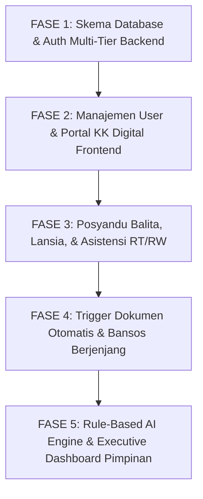

# ROADMAP PENGEMBANGAN ENTERPRISE: BUMI WARGA
### Platform Digital Pelayanan Publik, Demografi Real-Time, & Sistem Pakar Berbasis Bukti
**Pemilik & Pengembang:** Jabar Pintar Digital  
**Wilayah Implementasi Percontohan:** Kelurahan Kebonjati, Kecamatan Andir, Kota Bandung  
**Versi Target:** 2.0-Enterprise  
**Tanggal Penyusunan:** September 2026  

---

## 1. Visi & Prinsip Arsitektur

Platform **Bumi Warga** dirancang untuk mentransformasi birokrasi kelurahan dari sistem arsip dokumen pasif menjadi **Pusat Kendali Pelayanan Publik Spasial, Demografi Real-Time, dan Pengambilan Keputusan Berbasis Bukti (*Evidence-Based Decision Support System*)**.

### Prinsip Utama Sistem:
1. **Zero Hallucination & Strict Consistency**: Seluruh kode mengikuti arsitektur berlapis (*Layered Architecture*: Repository &rarr; Service &rarr; Controller/Route), penamaan konsisten berbahasa Indonesia/Inggris teknis, dan validasi tipe ketat.
2. **Anti-IDOR & Scoped Authorization**: Data sensitif (NIK, KK, data bansos) tidak pernah diekspos sembarangan. Hak akses dibatasi secara ketat berdasarkan tingkatan (*Multi-Tenant Scoping* per RT/RW).
3. **No One Left Behind (Inklusi Digital)**: Warga lansia atau tanpa internet tetap terlayani melalui *Assisted Mode* oleh Ketua RT/RW dan fitur *Bulk Import* kelurahan.
4. **KK-Centric Architecture**: Kartu Keluarga (KK) sebagai entitas sosial dasar, mendukung login Nomor KK dengan *Family Member Profile Switcher*.
5. **Rule-Based AI to ML Evolution**: Memulai dengan algoritma pakar deterministik yang 100% transparan, terukur, dan siap diintegrasikan dengan model AI/LLM untuk pimpinan.

---

## 2. Matriks Otorisasi Hirarki Pengguna (*Tiered RBAC Matrix*)

| Level | Role Identifier | Jabatan / Peran Riil | Otoritas Pembuatan Akun (*Who Can Create*) | Ruang Lingkup Data (*Data Scoping*) |
| :---: | :--- | :--- | :--- | :--- |
| **0** | `superadmin` | Owner Aplikasi (Jabar Pintar Digital) | Master System Genesis | Seluruh sistem, kelurahan, dan server |
| **1** | `admin_kelurahan` *(user: `admin`)* | Lurah / Seklur / Operator Kelurahan | Dibuat oleh `superadmin` | Seluruh Kelurahan Kebonjati |
| **2** | `admin_rw` | Operator / Staf Administrasi RW | Dibuat oleh `admin_kelurahan` | Terikat pada nomor RW bersangkutan |
| **2** | `ketua_rw` | Pimpinan Rukun Warga | Dibuat oleh `admin_kelurahan` | Approval & monitoring wilayah RW |
| **3** | `ketua_rt` | Pimpinan Rukun Tetangga | Dibuat oleh `admin_rw` / `ketua_rw` | Terikat pada nomor RT & RW bersangkutan |
| **3** | `kader_posyandu` | Petugas Kesehatan Posyandu Melati | Dibuat oleh `admin_kelurahan` | Modul Balita & Lansia Posyandu |
| **4** | `warga` | Warga & Anggota Keluarga | Dibuat oleh `ketua_rt` / Registrasi Mandiri | Hanya data pribadi & anggota keluarga 1 KK |

> **Aturan Mutlak Hirarki**: Pengguna hanya dapat membuat akun dengan tingkatan level **di bawahnya** dan **dalam lingkup wilayah yang sama**. Ketua RW 002 tidak dapat membuat akun untuk RT 001/RW 001.

---

## 3. Rincian Fase Pengerjaan Bertahap (*Phased Execution*)

---

### FASE 1: Skema Database & Pondasi Backend Multi-Tier RBAC
*Fokus: Memperluas database dan backend otentikasi tanpa merusak fitur dokumen & notifikasi yang sudah berjalan.*

- **1.1 Pembaruan Skema Tabel `users`**:
  - Kolom `role`: `ENUM('superadmin', 'admin_kelurahan', 'admin_rw', 'ketua_rw', 'ketua_rt', 'kader_posyandu', 'warga')`.
  - Kolom `rt` (VARCHAR 5) dan `rw` (VARCHAR 5) untuk scoping wilayah.
  - Kolom `created_by_user_id` (INT) untuk jejak audit pembuatan akun.
  - Username default `admin` dipetakan ke role `admin_kelurahan`.
- **1.2 Penambahan Tabel `posyandu_lansia` & `posyandu_lansia_pemeriksaan`**:
  - Tabel master lansia (relasi ke NIK warga, status tinggal bersama keluarga vs sebatang kara).
  - Tabel rekam medis lansia: Tensi darah, Gula Darah Sewaktu (GDS), Kolesterol, Asam Urat, Indeks Massa Tubuh (IMT), skor kemandirian ADL/Barthel.
- **1.3 Backend Dual Login (NIK / No KK) & Family Selector API**:
  - Endpoint `POST /api/auth/login` mendukung identifikasi NIK perorangan atau No KK keluarga.
  - Endpoint `GET /api/auth/family-members` untuk mengambil daftar anggota KK saat login No KK.
  - Endpoint `POST /api/auth/select-profile` untuk mengaktifkan sesi atas nama anggota keluarga terpilih.
- **1.4 Middleware Otorisasi Bertingkat (`roleGuard` & `scopeGuard`)**:
  - Middleware `canCreateUser(creatorRole, targetRole, creatorRT, creatorRW, targetRT, targetRW)`.

---

### FASE 2: Antarmuka Manajemen User & Portal KK Digital
*Fokus: Antarmuka modern, aman, dan ramah warga.*

- **2.1 Halaman Manajemen User (`/dashboard/users`)**:
  - Tabel daftar user dengan filter role dan wilayah (RT/RW).
  - Modal tambah user dinamis: Pilihan role hanya menampilkan level di bawah role akun yang sedang login.
  - Reset password & aktivasi/nonaktivasi akun.
- **2.2 Fitur Kartu Keluarga Digital (`/dashboard/kk`)**:
  - Tampilan blangko resmi Kartu Keluarga Republik Indonesia (Kop Garuda, Nomor KK, Kepala Keluarga, Alamat Kebonjati).
  - Tabel interaktif seluruh anggota keluarga dengan status gizi anak, kepemilikan KTP, dan pekerjaan.
  - Tombol cepat: `Ajukan Surat Untuk Anggota Ini`.
- **2.3 Modal Pemilih Anggota Keluarga (*Family Profile Switcher*)**:
  - Tampilan pop-up estetik pasca login Nomor KK menyerupai pemilihan profil streaming, menampilkan nama dan status hubungan (Ayah, Ibu, Anak).

---

### FASE 3: Modul Posyandu Terintegrasi (Balita & Lansia) & Inklusi Offline
*Fokus: Transformasi Posyandu Siklus Hidup Lengkap & Pelayanan Asistensi RT/RW.*

- **3.1 Antarmuka Posyandu Balita & Lansia untuk `kader_posyandu`**:
  - Tab "Balita" (KMS, timbang berat badan, tinggi badan, imunisasi).
  - Tab "Lansia" (Pemeriksaan tensi darah, skrining gula darah, kolesterol, kemandirian geriatri).
  - Indikator otomatis visual (*Z-Score* balita dan batas aman tekanan darah lansia).
- **3.2 Fitur Asistensi Offline oleh Ketua RT**:
  - Form kilat pendaftaran warga offline bagi lansia/warga prasejahtera yang tidak memiliki smartphone.
  - Fitur pengajuan permohonan surat atas nama warga offline oleh Ketua RT.
- **3.3 Modul Import Massal Excel oleh Admin Kelurahan**:
  - Fitur upload file `.xlsx` / `.csv` data kependudukan dengan parser otomatis dan validasi anti-duplikasi NIK.

---

### FASE 4: Otomasi Trigger Dokumen & Penyaluran Bansos Berjenjang
*Fokus: Sinkronisasi data hidup dan akuntabilitas bantuan sosial.*

- **4.1 Event-Driven State Machine Dokumen**:
  - Ketika dokumen berstatus `APPROVED`:
    - *Surat Kematian* &rarr; Otomatis ubah `status_kependudukan` = `'Meninggal'`.
    - *Surat Kelahiran* &rarr; Tambah anggota balita di KK & entri Posyandu Balita.
    - *Surat Pindah* &rarr; Ubah `status_kependudukan` = `'Pindah'`.
    - *SKU* &rarr; Perbarui profil pekerjaan wirausaha / direktori UMKM warga.
    - *SKTM* &rarr; Tambahkan flag kerentanan ekonomi keluarga.
- **4.2 Alur Persetujuan Bansos 3-Tier**:
  - RT mengajukan usulan warga rentan + foto bukti rumah.
  - RW meninjau dan mengesahkan kuota antar-RT.
  - Kelurahan menetapkan SK penerima manfaat.

---

### FASE 5: Rule-Based AI Engine & Executive Command Center
*Fokus: Sistem pakar pendukung keputusan pimpinan berbasis bukti riil.*

- **5.1 Backend Rule-Based AI Engine (`src/services/ai_decision_engine.service.js`)**:
  - Evaluasi risiko stunting balita (WHO Growth Standards Z-Score).
  - Evaluasi risiko kardiovaskular lansia (tensi/gula darah tinggi kronis).
  - Evaluasi Indeks Kerentanan Sosial (IKK) keluarga penerima bansos.
  - Deteksi anomali infrastruktur (klaster aduan fasilitas per RW).
- **5.2 Dashboard Pimpinan (Lurah & Camat)**:
  - Ringkasan Eksekutif Otomatis Berbahasa Indonesia (*Natural Executive Briefing*).
  - Piramida kependudukan dinamis per RT/RW.
  - Peta Spasial (*Heatmap*) sebaran kerentanan stunting, lansia sebatang kara, dan titik aduan Musrenbang.
  - Evaluasi Indeks Kepuasan Masyarakat (IKM) & kecepatan respon aparatur kelurahan.

---

## 4. Matriks Validasi & Jaminan Kualitas (*Quality Assurance*)

| Aspek | Standar Kualitas | Metrik Keberhasilan |
| :--- | :--- | :--- |
| **Keamanan Data** | Anti-IDOR, Bcrypt hash, Role checks di backend | 0 kebocoran data antar-RT/RW |
| **Kompilasi** | Node.js syntax test & Vite frontend build | `node --check server.js` exit 0, `npm run build` exit 0 |
| **Kinerja SQL** | Indexing kunci asing, query optimal | Waktu respon query < 100ms di Hostinger |
| **Integritas Git** | NTFS-safe, index terisolasi, commit atomik | Tidak ada `git fatal index` |

---
*Dokumen ini menjadi acuan tunggal pengerjaan seluruh tim pengembang Jabar Pintar Digital untuk platform Bumi Warga.*
