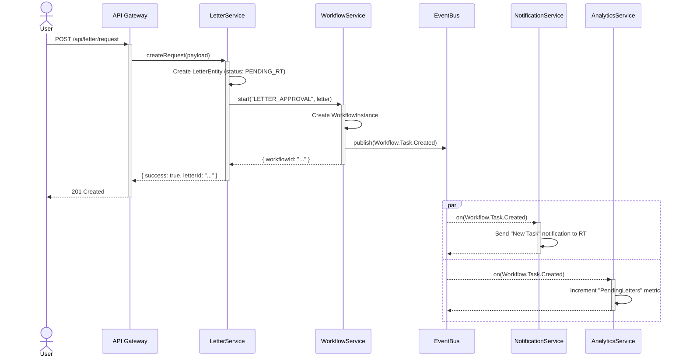

# Sequence Diagram: Letter Request Workflow

**Report ID:** VER-SEQ-001
**Date:** 2026-08-07
**Project:** WK Community OS Enterprise Edition v1.0

---

## 1. Objective

This diagram illustrates the sequence of interactions for the most common cross-domain workflow: a citizen requesting a letter and the subsequent approval and notification process.

## 2. Mermaid Sequence Diagram

## 3. Conclusion

The sequence demonstrates a robust, event-driven architecture. The `LetterService` is only responsible for its core task and correctly delegates orchestration to the `WorkflowService`. The `EventBus` successfully decouples the `Notification` and `Analytics` services from the core business logic, allowing for scalable and maintainable side-effects.

**Final Status: PASS**