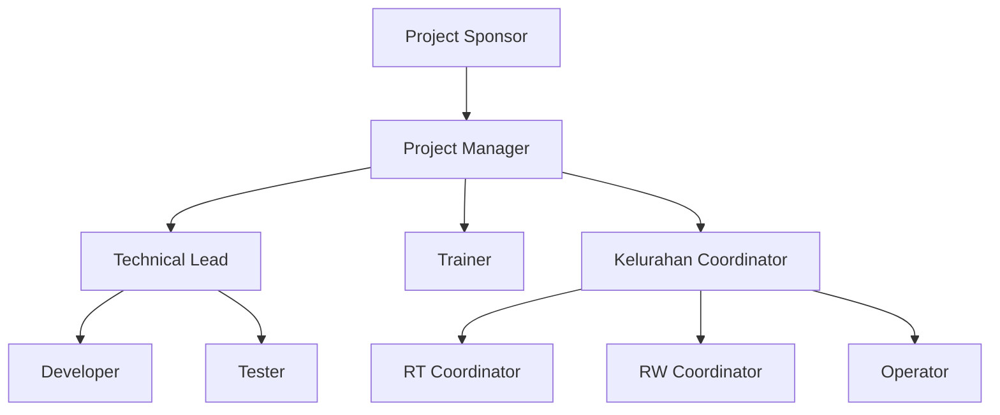

# Project Organization

**Document ID:** PILOT-01-002
**Version:** 1.0
**Date:** 2026-08-04

---

## 1. Overview

This document defines the roles and responsibilities of the implementation team for the Kebonjati Pilot project. A clear organizational structure is essential for effective decision-making, communication, and execution.

## 2. Implementation Team Roles & Responsibilities

| Role | Responsibility |
| :--- | :--- |
| **Project Sponsor** | Provides executive oversight, champions the project, secures resources, and makes final Go/No-Go decisions. |
| **Project Manager** | Manages the overall pilot plan, timeline, resources, and budget. Acts as the primary point of contact and ensures project goals are met. |
| **Technical Lead** | Responsible for all technical aspects of the pilot, including deployment, configuration, troubleshooting, and system integration. |
| **Developer** | Provides technical support for bug fixes and minor adjustments required during the pilot. |
| **Tester** | Executes test cases, validates system functionality, and formally documents issues found during the pilot. |
| **Trainer** | Develops training materials and conducts training sessions for all user groups (Citizens, RT, RW, Kelurahan Staff). |
| **RT Coordinator** | Represents the RTs, facilitates communication, assists with user onboarding, and gathers feedback from RT users. |
| **RW Coordinator** | Represents the RWs, facilitates communication, assists with user onboarding, and gathers feedback from RW users. |
| **Kelurahan Coordinator** | Represents the Kelurahan staff, facilitates user acceptance testing, and ensures the system meets administrative requirements. |
| **Operator** | The day-to-day administrator of the system during the pilot, responsible for user management and first-level support. |

## 3. Reporting Structure

