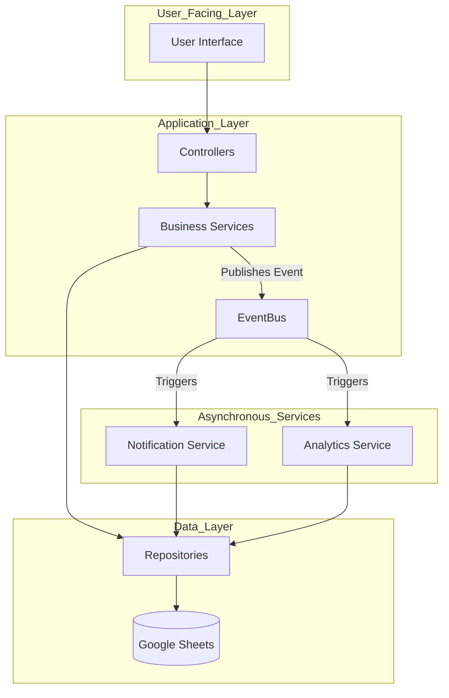

# Architecture Overview

WK Community OS is designed with a modern, modular, and event-driven architecture to ensure scalability, maintainability, and high performance.

---

## 1. Core Principles

*   **Modularity:** The system is divided into independent packages (e.g., `Citizen`, `Letter`, `Complaint`), each responsible for a specific business domain. This promotes separation of concerns and allows for independent development and maintenance.
*   **Layered Architecture:** Within each package, a standard Controller -> Service -> Repository pattern is enforced, separating presentation, business logic, and data access.
*   **Event-Driven Communication:** Packages communicate asynchronously via a central `EventBus`. This decouples the modules, allowing them to evolve independently and improving system resilience. For example, when a `Letter` is approved, it publishes a `Letter.Completed` event, which the `Notification` and `Analytics` packages can subscribe to without the `Letter` package needing to know about them.
*   **Single Source of Truth:** Each business domain has a single package that "owns" its data, preventing data duplication and inconsistencies.
*   **Performance by Design:** Expensive operations like data aggregation and reporting are handled by a dedicated `Analytics` package that runs on a schedule. Dashboards and real-time views read from a pre-calculated cache, ensuring a fast user experience.

## 2. High-Level Data Flow

The following diagram illustrates the high-level data and interaction flow between the key architectural components.

## 3. Package Interaction

Packages are designed to be loosely coupled. The `module.json` file in each package explicitly declares its dependencies.

A typical interaction flow:

1.  A user interacts with the **UI**, which calls an API endpoint handled by a **Controller** in a specific package (e.g., `LetterController`).
2.  The **Controller** validates the request and calls the corresponding **Service** (e.g., `LetterService`).
3.  The **Service** executes the core business logic. It may interact with its own **Repository** to persist data and may call other services (e.g., `WorkflowService`).
4.  Upon completion of a significant action, the **Service** publishes an event to the **EventBus** (e.g., `Letter.Approved`).
5.  Other packages, like `NotificationService` and `AnalyticsService`, are subscribed to this event. They react independently:
    *   `NotificationService` generates and queues a notification for the user.
    *   `AnalyticsService` marks the data for the next aggregation cycle.

## 4. Technology Stack

*   **Backend:** Google Apps Script (JavaScript, V8 Runtime)
*   **Database:** Google Sheets
*   **File Storage:** Google Drive
*   **Templates:** Google Docs
*   **Frontend:** (Not specified, but typically a web framework like Vue.js, React, or a simple HTML/CSS/JS frontend hosted as a web app).