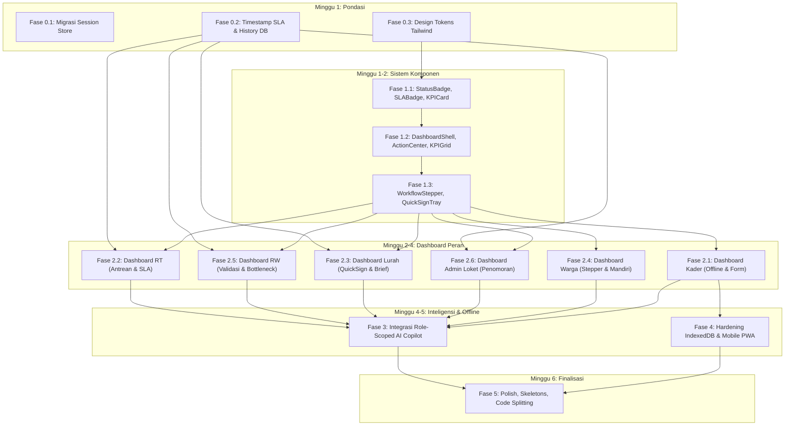

# BUMI WARGA — IMPLEMENTATION ROADMAP
**Ekosistem Pelayanan Administrasi Kependudukan & Kesehatan Digital**  
*Pemerintah Kota Sukabumi | Edisi 2026*  
*Status: Blueprint Eksekusi Berurutan Siap Implementasi (No Coding / Zero Source Code Modification)*  
*Dasar Acuan: `BUMI_WARGA_PRODUCT_DISCOVERY_REPORT.md`, `BUMI_WARGA_UI_UX_PRODUCT_SPECIFICATION.md`, dan Basis Data/API Aktual `d:\wk_prod`*

---

## 1. Ringkasan Eksekutif Roadmap

Roadmap implementasi ini dirancang sebagai panduan eksekusi teknis lintas disiplin (*frontend & backend*) untuk mentransformasi platform **Bumi Warga (WK Community OS)** dari status arsitektur monolitik-fungsional saat ini menuju ekosistem pelayanan publik SPBE kelas enterprise yang andal, aman, dan berorientasi pengguna.

### Parameter Strategis Roadmap:
- **Total Durasi Rekomendasi**: **6 Minggu (Sprints 1–6)** dengan model kerja bertahap paralel terkoordinasi.
- **Prinsip Utama Eksekusi**: **Foundation First &rarr; Design System &rarr; Critical Role Dashboards &rarr; AI Copilot Integration &rarr; Mobile/Offline Hardening &rarr; Performance & Accessibility Polish**.
- **Risiko Terbesar yang Dimigrasi di Awal (Fase 0)**:
  1. *Penyimpanan Sesi Server*: Menghilangkan insiden *memory leak* dan putus sesi massal akibat `MemoryStore` express-session di server produksi Hostinger.
  2. *Integritas Antrean Data Lapangan*: Mencegah hilangnya data balita/lansia akibat batasan kuota 5MB `localStorage` pada antrean luar jaringan (*offline queue*) Kader Posyandu.
  3. *Ketiadaan Parameter Waktu SLA*: Menyediakan skema pencatatan waktu (*timestamps*) berjenjang agar komputasi durasi pelayanan dan peringatan berkas gantung (*aging*) dapat dihitung secara faktual oleh database.

---

## 2. Prinsip Eksekusi & Disiplin Rekayasa

1. **Disiplin Urutan Bertingkat (*Strict Layered Precedence*)**:
   Tidak diizinkan membangun antarmuka canggih (*advanced UI*) atau mengintegrasikan kecerdasan buatan (*AI assistant*) sebelum skema basis data, token desain, dan komponen atom siap pakai telah teruji dan berstatus *Definition of Done*.
2. **Ketergantungan Komponen Modular (*Reusable Atomic Components*)**:
   Setiap elemen visual dashboard wajib diturunkan dari pustaka komponen inti yang terstandarisasi di `frontend/src/components/core/`. Tidak boleh ada penulisan ulang kode styling (*inline styling*) atau pengulangan logika badge status di halaman page.
3. **Pemisahan Klasifikasi Kerja yang Tegas**:
   - `CURRENT`: Kondisi aktual yang sudah berjalan di basis data dan kode.
   - `TARGET`: Target arsitektur baru yang harus dibangun sesuai cetak biru.
   - `UX IMPROVEMENT`: Penataan ulang hierarki visual, kontras, dan interaksi tanpa mengubah alur bisnis.
   - `BUSINESS PROCESS CHANGE`: Perubahan alur otorisasi, penambahan langkah validasi, atau ketentuan regulasi baru.
4. **Batasan Mutlak AI (*Hard AI Boundaries*)**:
   Kecerdasan buatan hanya berperan sebagai sistem pendukung keputusan (*Decision Support System*) yang menyajikan indikator, ringkasan, dan rekomendasi tindak lanjut. **AI dilarang keras mengambil keputusan administratif (menyetujui/menolak surat) atau mengeluarkan diagnosis medis klinis.**
5. **Cakupan 6 Peran Resmi**:
   Fokus eksekusi terkunci mutlak pada 6 peran utama: **Warga**, **Ketua RT**, **Ketua RW**, **Admin Kelurahan**, **Lurah**, dan **Kader Posyandu**.

---

## 3. FASE 0 — DATA & INFRASTRUCTURE FOUNDATION (Minggu 1)
**Tujuan Utama**: Menghilangkan hambatan infrastruktur kritis (*technical blockers*), menjamin persistensi sesi pengguna, serta menyiapkan skema basis data untuk pelacakan SLA.

### A. Deliverables Konkret:
1. **Migrasi Session Store Backend (`CURRENT: BROKEN` &rarr; `TARGET`)**:
   - Menggantikan `MemoryStore` bawaan Express dengan penyimpanan sesi berbasis database persisten (`express-mysql-session`) yang terhubung langsung ke koneksi pool MySQL.
   - Menghilangkan *warning memory leak* pada log server produksi dan mempertahankan sesi aktif warga saat server melakukan restart otomatis.
2. **Penambahan Kolom Pelacak Waktu SLA pada `dokumen_request` (`TARGET`)**:
   - Menambahkan kolom: `rt_received_at`, `rt_processed_at`, `rw_received_at`, `rw_processed_at`, `kelurahan_received_at`, `lurah_signed_at`, `target_deadline_at`, dan `sla_status` (`ON_TIME`, `WARNING`, `BREACHED`).
3. **Pembuatan Tabel Riwayat Mutasi Alur Berkas `dokumen_workflow_history` (`TARGET`)**:
   - Skema tabel untuk mencatat setiap perpindahan status dokumen secara detail: `id`, `dokumen_request_id`, `from_step`, `to_step`, `action_by_user_id`, `actor_role`, `catatan`, `created_at`.
4. **Persiapan Endpoint Data Kontekstual Per Peran untuk AI Engine (`TARGET`)**:
   - Refaktor `ai_engine.service.js` agar mendukung parameter *role-scoped context* (memisahkan kebutuhan ringkasan Warga, RT, RW, Admin, Lurah, Kader).
5. **Konfigurasi Master Design Tokens pada Tailwind CSS (`UX IMPROVEMENT`)**:
   - Konfigurasi palet warna semantik berstandar rasio kontras WCAG 2.1 AA pada `tailwind.config.js` (Primary Green, Info Blue, Warning Amber, Critical Rose, Signature Purple).

### B. Berkas & Area yang Disentuh:
- Backend:
  - `src/app.js` (Inisialisasi session store persisten MySQL).
  - `src/db/auto_patch.js` (DDL `ALTER TABLE dokumen_request` & `CREATE TABLE dokumen_workflow_history`).
  - `src/repositories/dokumen.repository.js` (Pencatatan timestamp pada setiap transisi status).
  - `src/services/ai_engine.service.js` (Penyediaan endpoint agregasi per cakupan peran).
- Frontend:
  - `frontend/tailwind.config.js` (Penetapan semantic color tokens, font scale, dan custom shadow).

### C. Dependencies:
- Akses koneksi pool database MySQL yang stabil (`src/db/pool.js`).

### D. Definition of Done (DoD) Fase 0:
- [ ] Server Node.js berjalan tanpa peringatan `Warning: connect.session() MemoryStore`.
- [ ] Pengguna yang sedang login tidak ter-logout saat proses restart server (`pm2 restart` / node restart).
- [ ] Kueri `INSERT` dan `UPDATE` pada `dokumen_request` otomatis mengisi timestamp per aktor dan mencatat baris riwayat ke `dokumen_workflow_history`.
- [ ] Seluruh token warna semantik Tailwind dapat dipanggil dengan kelas standar (`bg-emerald-50`, `text-amber-900`, dll.).

---

## 4. FASE 1 — DESIGN SYSTEM & CORE COMPONENTS (Minggu 1–2)
**Tujuan Utama**: Membangun fondasi visual modular, sistem status terpadu, dan pustaka komponen independen (*atomic components*) sebelum merombak dashboard peran.

### A. Urutan Komponen yang WAJIB Dibangun Berurutan:
1. **`StatusBadge.jsx` (`UX IMPROVEMENT`)**:
   - Komponen badge status dengan visual 3 dimensi: warna kontras WCAG AA, ikon Lucide unik, dan teks baku bahasa Indonesia.
2. **`SLABadge.jsx` (`TARGET`)**:
   - Lencana hitung mundur waktu pemrosesan (*countdown timer*) dengan detak visual (Hijau &rarr; Kuning &rarr; Merah saat mendekati/melanggar SLA).
3. **`KPICard.jsx` (`UX IMPROVEMENT`)**:
   - Kartu metrik standar: Judul, Nilai Raksasa, Satuan, Tren Kinerja (+/- %), Subteks, dan Ikon Kontekstual.
4. **`KPIGrid.jsx` (`UX IMPROVEMENT`)**:
   - Kontainer grid responsif yang secara otomatis menata 1 kolom di smartphone dan 4 kolom sejajar di desktop.
5. **`ActionCenter.jsx` (`TARGET`)**:
   - Wadah prioritas paling atas di dashboard untuk menampilkan kartu pekerjaan darurat, berkas gantung, dan notifikasi SLA.
6. **`DashboardShell.jsx` (`UX IMPROVEMENT`)**:
   - Pembungkus tata letak baku seluruh halaman: Header Judul Halaman, Navigasi Rekam Jejak (*Breadcrumbs*), dan Baki Aksi Utama (*Action Tray*).
7. **`RoleHeader.jsx` (`UX IMPROVEMENT`)**:
   - Header personalisasi: Salam waktu, Nama Pengguna, Badge Peran Resmi, Informasi Wilayah RT/RW, dan tombol *Family Switcher*.
8. **`AIBriefCard.jsx` (`TARGET`)**:
   - Kartu ringkasan harian cerdas 2–3 kalimat yang menyorot kondisi prioritas operasional peran hari ini.
9. **`InsightCard.jsx` (`TARGET`)**:
   - Kartu temuan analitis terstruktur dengan format standar: *What* (Apa yang terjadi), *Why* (Mengapa penting), *Evidence* (Data pendukung), *Priority* (Tingkat urgensi), dan *Action* (Tindakan rekomendasi).
10. **`WorkflowStepper.jsx` (`TARGET`)**:
    - Diagram visual 4 langkah alur surat (Diajukan &rarr; Pengantar RT &rarr; Rekomendasi RW &rarr; Pengesahan Lurah).
11. **`QuickSignTray.jsx` (`TARGET`)**:
    - Baki aksi melayang (*floating action tray*) untuk penandatanganan dan validasi dokumen massal sekali klik.
12. **`OfflineSyncBanner.jsx` (`TARGET`)**:
    - Bilah status jaringan interaktif yang menampilkan jumlah data mutasi lokal yang tertahan dan tombol sinkronisasi instan.

### B. Berkas & Area yang Disentuh:
- `frontend/src/components/core/*` (Pembuatan 8 komponen inti).
- `frontend/src/components/workflow/*` (Pembuatan komponen stepper dan baki tanda tangan).
- `frontend/src/components/ai/*` (Pembuatan kartu ringkasan AI dan kartu insight).

### C. Dependencies:
- Fase 0 selesai (Design tokens pada `tailwind.config.js` telah aktif).

### D. Definition of Done (DoD) Fase 1:
- [ ] Seluruh 12 komponen telah tersedia di folder masing-masing dengan antarmuka props yang terdokumentasi rapi.
- [ ] Komponen bebas dari error linting dan mendukung rendering responsif (layar ponsel 360px hingga layar desktop 1920px).
- [ ] Seluruh warna teks dan badge telah lolos uji kontras minimum 4.5:1 (WCAG 2.1 Level AA).

---

## 5. FASE 2 — ROLE DASHBOARD IMPLEMENTATION (Minggu 2–4)
**Tujuan Utama**: Merombak antarmuka beranda dan alur kerja utama untuk 6 peran resmi menggunakan komponen Fase 1, diurutkan berdasarkan tingkat urgensi dampak pengguna di lapangan.

### 5.1 Kader Posyandu (Prioritas Tertinggi — Dampak Lapangan & Kebutuhan Offline)
- **Tujuan**: Memastikan pencatatan kesehatan balita dan lansia di area blank spot tidak mengalami kegagalan simpan, dan formulir dapat dioperasikan dengan satu tangan.
- **Pekerjaan Konkret**:
  - Pasang `OfflineSyncBanner` di posisi paling atas dashboard kader.
  - Bangun `MobileTouchForm.jsx` dengan prinsip *100% One-Hand Ergonomics* (seluruh tombol simpan berada di zona jangkauan ibu jari bawah).
  - Terapkan input angka besar (*Numpad Friendly*) untuk Berat Badan dan Tinggi Badan dengan validasi batas kewajaran otomatis (*Sanity Bounds*).
  - Pisahkan tab operasional Posyandu Balita (KMS) dan Posyandu Lansia (Skrining ADL & Penyakit Tidak Menular).
- **Deliverable**: Halaman `frontend/src/pages/PosyanduPage.jsx` terefaktor penuh.

### 5.2 Ketua RT (Prioritas Tinggi — Titik Awal Hambatan Pelayanan)
- **Tujuan**: Mencegah surat warga tertahan berhari-hari di tingkat lingkungan dengan visualisasi batas waktu SLA 4 jam.
- **Pekerjaan Konkret**:
  - Pasang `ActionCenter` antrean prioritas diurutkan berdasarkan sisa waktu SLA terdekat.
  - Pasang `SLABadge` dinamis pada setiap baris antrean surat masuk RT.
  - Implementasikan tombol persetujuan cepat satu sentuhan (*One-Touch Approval*) untuk pengantar RT.
  - Tampilkan widget pelaporan sanggahan bansos lapangan (warga mampu / meninggal dunia).
  - Sederhanakan pencatatan penerimaan iuran kas RT bulanan menjadi form 1 baris.
- **Deliverable**: Integrasi komponen pada dashboard RT di `frontend/src/pages/DashboardHome.jsx` dan `DokumenPage.jsx`.

### 5.3 Lurah (Prioritas Tinggi — Titik Otorisasi Akhir Dokumen)
- **Tujuan**: Mempercepat penerbitan surat resmi berkekuatan hukum dengan baki pengesahan digital massal (*Quick Sign Tray*).
- **Pekerjaan Konkret**:
  - Pasang widget `QuickSignTray` di layar beranda Lurah untuk menandatangani seluruh berkas terverifikasi sekaligus.
  - Tampilkan `AIBriefCard` (Executive Daily Brief) yang merangkum persentase SLA harian dan isu darurat wilayah.
  - Pasang visualisasi radar sebaran risiko stunting dan kemiskinan per RW.
  - Sediakan baki disposisi cepat untuk aduan warga yang berstatus darurat (> 48 jam).
- **Deliverable**: Dashboard eksekutif Lurah pada `DashboardHome.jsx` dan `DokumenPage.jsx`.

### 5.4 Warga Masyarakat (Prioritas Menengah — Pengalaman Pemohon)
- **Tujuan**: Menghilangkan kebingungan posisi berkas dan menyederhanakan akses layanan keluarga.
- **Pekerjaan Konkret**:
  - Pasang `WorkflowStepper` interaktif yang menampilkan posisi riil berkas (Warga &rarr; RT &rarr; RW &rarr; Kelurahan).
  - Pasang `ActionCenter` khusus warga: Peringatan perbaikan foto dokumen yang ditolak loket, instruksi pengambilan paket bansos di RW, dan pengingat iuran RT.
  - Restrukturisasi sidebar warga menjadi 4 domain ramah awam (Layanan Surat, Keluarga Saya, Iuran & Lingkungan, Panduan).
  - Integrasikan tombol unduh PDF resmi ber-QR dan tombol *"Kirim Salinan ke WhatsApp"*.
- **Deliverable**: Halaman beranda warga di `DashboardHome.jsx` dan alur pengajuan surat mandiri di `DokumenPage.jsx`.

### 5.5 Ketua RW (Prioritas Menengah — Verifikasi Berjenjang & Pengawasan)
- **Tujuan**: Mempercepat validasi rekomendasi RW dan memantau kinerja pelayanan seluruh RT di bawah naungannya.
- **Pekerjaan Konkret**:
  - Pasang baki validasi rekomendasi massal (*Batch Approval RW*).
  - Tampilkan grafik radar kecepatan pelayanan antar-RT guna mendeteksi RT yang menjadi titik kemacetan (*bottleneck*).
  - Sediakan panel audit sanggahan bansos lintas-RT sebelum diteruskan ke dinas sosial kelurahan.
  - Tampilkan rekapitulasi konsolidasi kas lingkungan dari seluruh RT binaan.
- **Deliverable**: Dashboard rekapitulasi RW di `DashboardHome.jsx` dan `DataMaturityPage.jsx`.

### 5.6 Admin / Petugas Loket Kelurahan (Prioritas Operasional)
- **Tujuan**: Meningkatkan produktivitas loket dalam penomoran agenda dan verifikasi berkas yuridis.
- **Pekerjaan Konkret**:
  - Pasang antrean kerja terpadu (*Desk Workspace*) dengan dukungan pratinjau KTP/KK pemohon berdampingan dengan formulir draf surat (*Dual-Panel Preview*).
  - Generator nomor registrasi surat otomatis sesuai kode klasifikasi kearsipan daerah.
  - Tombol pemajuan draf bersih ke baki TTE Lurah.
  - Panel pemantau status bot WhatsApp Gateway dan tombol kirim ulang antrean pesan gagal.
- **Deliverable**: Antarmuka verifikasi loket di `DokumenPage.jsx` dan `WhatsAppGatewayPage.jsx`.

### Definition of Done (DoD) Fase 2 Per Peran:
- [ ] Seluruh 6 dashboard peran telah mengadopsi tata letak baru berbasis komponen Fase 1.
- [ ] Sidebar pada `DashboardLayout.jsx` telah bersih dan menerapkan arsitektur *Role &rarr; Domain &rarr; Action*.
- [ ] Tombol aksi utama pada setiap peran dapat dieksekusi tanpa galat dan langsung memperbarui status di database.

---

## 6. FASE 3 — AI COPILOT & DECISION SUPPORT INTEGRATION (Minggu 4–5)
**Tujuan Utama**: Mengaktifkan mesin kecerdasan buatan berbasis aturan (*Rule-Based Decision Support System*) agar menyajikan ringkasan kontekstual dan pertanyaan analitik untuk setiap peran.

### A. Deliverables Konkret:
1. **Endpoint Role-Scoped AI Daily Brief (`TARGET`)**:
   - Pembuatan endpoint backend `GET /api/analytics/daily-brief?role=:role` yang mengembalikan teks ringkasan kontekstual hasil komputasi aturan bisnis faktual.
2. **Penyambungan Komponen `AIBriefCard` & `InsightCard` ke Data Nyata (`TARGET`)**:
   - Menghubungkan kartu visual AI di frontend dengan data agregasi demografi, gizi balita, dan kecepatan berkas dari `ai_engine.service.js`.
3. **Penyediaan Tombol Pintas Pertanyaan Cerdas (*Suggested Questions*) (`TARGET`)**:
   - Menyediakan 3–4 tombol interaktif di bawah ringkasan AI yang jika diklik langsung menampilkan kartu wawasan (*InsightCard*) yang relevan.
4. **Penerapan Batasan Keras Tata Kelola Data AI (*Hard Boundary Enforcement*)**:
   - Memastikan tidak ada fungsi AI yang dapat memicu mutasi status database secara mandiri (*Read-Only Recommendation*).
   - Penyamaran data sensitif (masking NIK dan nomor rekening bank) pada output inferensi AI sesuai standar UU PDP.
5. **Pencatatan Rekomendasi pada Tabel Jejak Audit `ai_recommendation_logs` (`TARGET`)**:
   - Pembuatan tabel dan mekanisme logging untuk setiap rekomendasi prioritas yang disajikan sistem kepada pejabat/pengguna.

### B. Berkas & Area yang Disentuh:
- Backend:
  - `src/services/ai_engine.service.js` (Pengembangan logika inferensi per peran).
  - `src/routes/analytics.routes.js` (Penyediaan rute API daily-brief dan insights).
  - `src/db/auto_patch.js` (Pembuatan tabel `ai_recommendation_logs`).
- Frontend:
  - `frontend/src/components/ai/*` (Integrasi fetch data API ke `AIBriefCard` dan `SuggestedQuestions`).

### C. Dependencies:
- Fase 0 dan Fase 2 selesai (Dashboard peran dan basis data riwayat telah siap).

### D. Definition of Done (DoD) Fase 3:
- [ ] Setiap peran melihat ringkasan *Daily Brief* yang berbeda dan 100% relevan dengan tugas kedinasannya.
- [ ] Seluruh kartu *InsightCard* memuat struktur lengkap: *What, Why, Evidence, Priority, dan Action*.
- [ ] Sistem tidak pernah mengeksekusi tanda tangan surat atau mengeluarkan diagnosis medis klinis secara otomatis.

---

## 7. FASE 4 — MOBILE, PWA & OFFLINE HARDENING (Minggu 5)
**Tujuan Utama**: Memperkuat keandalan aplikasi di peramban gawai (*mobile resilience*) dan menuntaskan migrasi penyimpanan luar jaringan bagi Kader Posyandu.

### A. Deliverables Konkret:
1. **Migrasi Penuh Antrean Luar Jaringan ke IndexedDB API (`TARGET / SOURCE CONFLICT RESOLUTION`)**:
   - Menggantikan implementasi `localStorage` pada `frontend/src/utils/offlineQueue.js` menggunakan pustaka ringan wrapper IndexedDB (`idb`).
   - Menyediakan kapasitas penyimpanan lokal > 250MB yang mendukung penyimpanan berkas foto balita, foto bukti bansos, dan tanda tangan kanvas digital tanpa risiko galat kuota (*QuotaExceededError*).
2. **Implementasi Antrean Pesan Gagal (*Dead-Letter Queue Pattern*) (`TARGET`)**:
   - Menyediakan penanganan mutasi offline yang ditolak oleh validasi server (galat HTTP 4xx) agar dipisahkan ke wadah koreksi khusus tanpa memblokir antrean data lainnya.
3. **Penyempurnaan Ergonomi Sentuhan Seluler (*Touch Target Hardening*) (`UX IMPROVEMENT`)**:
   - Memastikan seluruh tombol aksi tabel dan navigasi mobile memiliki ukuran target sentuh minimal **48x48 pixel** dengan padding yang aman.
4. **Optimasi Bilah Navigasi Bawah (*Bottom Navigation Bar*) (`UX IMPROVEMENT`)**:
   - Menghadirkan bilah navigasi bawah tetap (*fixed bottom nav*) dengan 4 menu utama kontekstual saat aplikasi dibuka melalui layar smartphone.

### B. Berkas & Area yang Disentuh:
- Frontend:
  - `frontend/src/utils/offlineQueue.js` (Arsitektur baru IndexedDB).
  - `frontend/src/components/OfflineIndicator.jsx` (Integrasi badge antrean IndexedDB).
  - `frontend/src/components/mobile/BottomNavigation.jsx` (Navigasi bawah mobile).
  - `public/sw.js` (Caching strategi Network-First untuk data API dinamis dan Cache-First untuk aset statis).

### C. Dependencies:
- Fase 2.1 selesai (Formulir posyandu mobile telah siap terhubung ke antrean IndexedDB).

### D. Definition of Done (DoD) Fase 4:
- [ ] Kader posyandu dapat mematikan data internet (Mode Pesawat), mencatat 30 data balita lengkap dengan foto, dan seluruh data tersimpan utuh di IndexedDB.
- [ ] Saat internet kembali aktif, fungsi `flushOfflineQueue()` berhasil mengirimkan seluruh data ke backend secara otomatis (*FIFO order*).
- [ ] Seluruh tombol pada layar smartphone dapat ditekan nyaman dengan satu ibu jari tanpa insiden salah sentuh.

---

## 8. FASE 5 — POLISH, ACCESSIBILITY & PERFORMANCE (Minggu 6)
**Tujuan Utama**: Mengoptimalkan kecepatan pemuatan aset, mempercantik transisi layar (*perceived performance*), dan menjamin kepatuhan aksesibilitas universal.

### A. Deliverables Konkret:
1. **Penerapan Kerangka Pemuatan Animasi (*Skeleton Loading States*) (`UX IMPROVEMENT`)**:
   - Memasang komponen skeleton denyut (*pulse placeholders*) di seluruh kartu dashboard, tabel dokumen, dan grafik untuk menghilangkan kedipan layar kosong putih (*blank screen flash*).
2. **Standardisasi Status Kosong Edukatif (*Educational Empty States*) (`UX IMPROVEMENT`)**:
   - Menggantikan teks statis *"Data Kosong"* dengan ilustrasi SVG tematik, teks panduan yang jelas, dan tombol aksi berikutnya (*Call-to-Action*).
3. **Optimasi Bundel JavaScript Awal Melalui Code Splitting (`TARGET / PERFORMANCE`)**:
   - Memecah bundel JavaScript monolitik 950 kB pada `frontend/src/App.jsx` menggunakan `React.lazy()` dan `Suspense` untuk rute-rute halaman sekunder (Command Center, Integrasi, Desil, WhatsApp Gateway).
   - Menurunkan ukuran bundel awal (*initial bundle size*) menjadi < 350 kB untuk mempercepat waktu pemuatan pertama di jaringan 3G.
4. **Audit Aksesibilitas Final (WCAG 2.1 AA Compliance) (`UX IMPROVEMENT`)**:
   - Memastikan atribut `aria-label` terpasang di seluruh tombol ikon tanpa teks (lonceng notifikasi, tombol filter, aksi tabel).
   - Memastikan indikator fokus keyboard (`focus:ring-2 focus:ring-emerald-500`) menyala tegas pada seluruh elemen interaktif saat ditekan tombol Tab.

### B. Berkas & Area yang Disentuh:
- `frontend/src/App.jsx` (Implementasi dynamic imports / React.lazy).
- `frontend/src/components/core/SkeletonLoader.jsx` (Komponen placeholder animasi).
- Seluruh berkas halaman di `frontend/src/pages/*` (Penyempurnaan empty state dan aksesibilitas ARIA).

### C. Dependencies:
- Seluruh Fase 0 hingga Fase 4 selesai.

### D. Definition of Done (DoD) Fase 5:
- [ ] Skor Google Lighthouse Performance pada perangkat mobile mencapai **> 85**.
- [ ] Skor Accessibility pada pengujian otomatis peramban mencapai **> 95**.
- [ ] Tidak ada kedipan layar kosong saat berpindah rute halaman.

---

## 9. Matriks Ketergantungan Alur Kerja (*Dependency Matrix*)

Diagram alur dependensi ketat antar-fase implementasi:



---

## 10. Global Definition of Done (Kriteria Keberhasilan Akhir)

Seluruh roadmap implementasi dinyatakan **SELESAI (COMPLETE)** apabila telah memenuhi kriteria penerimaan global berikut:

1. **Stabilitas Arsitektur & Sesi**:
   - Sesi pengguna berjalan di atas MySQL session store tanpa peringatan memori dan tanpa putus koneksi saat reload server.
2. **Kepatuhan Alur & Transparansi SLA**:
   - Seluruh mutasi berkas surat tercatat di tabel `dokumen_workflow_history`. Waktu pemrosesan di tingkat RT, RW, dan Kelurahan dapat dihitung secara faktual, dan lencana `SLABadge` menampilkan hitung mundur waktu kerja yang presisi.
3. **Standarisasi Visual & Desain**:
   - 100% halaman menggunakan pustaka komponen inti di `frontend/src/components/core/` dengan rasio kontras warna standar WCAG AA.
4. **Keandalan Luar Jaringan (*Zero Data Loss in Blank Spot*)**:
   - Kader Posyandu dapat mencatat penimbangan balita dan skrining lansia tanpa internet dengan kapasitas simpan IndexedDB yang andal, dan tersinkronisasi otomatis saat online.
5. **Inteligensi Terkendali (*Safeguarded AI*)**:
   - Mesin inferensi AI menyajikan *Daily Brief* dan *Insight Cards* berbasis bukti data nyata tanpa pernah melanggar wewenang administratif maupun mengeluarkan diagnosis medis klinis.
6. **Performa & Aksesibilitas**:
   - Bundel utama terpecah dengan *dynamic imports*, waktu buka awal < 2 detik di jaringan seluler, dan skor aksesibilitas universal > 90.

---

## 11. Manajemen Risiko & Strategi Mitigasi

| Fase | Potensi Risiko Terbesar | Dampak Teknis / Operasional | Strategi Mitigasi Terencana |
| :--- | :--- | :--- | :--- |
| **Fase 0** | Galat migrasi skema tabel produksi yang sedang berjalan (*table lock*). | Layanan publik mengalami gangguan (*downtime*). | Gunakan kueri `ALTER TABLE` non-blocking di `auto_patch.js` dengan klausa `IF NOT EXISTS` dan uji coba terlebih dahulu pada basis data replika lokal. |
| **Fase 1** | Regresi visual antarmuka lama akibat penggantian kelas Tailwind. | Tampilan halaman tertentu menjadi berantakan (*broken layout*). | Buat komponen baru secara modular di folder terpisah tanpa menimpa komponen lama hingga siap dipasangkan di Fase 2. |
| **Fase 2** | Pengurus RT/RW lansia kebingungan dengan perubahan tata letak dashboard baru. | Hambatan adaptasi dan keluhan operasional di lapangan. | Pertahankan label terminologi yang familier (misal: "Setujui Pengantar RT"), sediakan tur panduan visual singkat, dan pastikan ukuran font jelas terbaca. |
| **Fase 3** | Mesin inferensi AI menghasilkan rekomendasi bias akibat data kelurahan belum lengkap. | Keputusan kebijakan wilayah kurang tepat sasaran. | Terapkan skor kepercayaan data (*Data Fidelity Confidence Score*); jika kelengkapan data < 70%, tampilkan peringatan: *"Data pendukung belum lengkap untuk analisis mendalam"*. |
| **Fase 4** | Terjadi konflik data saat sinkronisasi antrean IndexedDB jika data anak telah diubah oleh kader lain. | Data hasil pemeriksaan tertimpa (*race condition*). | Terapkan strategi *Timestamp-Based Conflict Resolution* (mutasi terbaru dengan NIK dan tanggal pemeriksaan sama digabungkan secara aman). |
| **Fase 5** | Pustaka pihak ketiga (seperti Recharts) gagal dimuat saat diterapkan lazy loading. | Komponen grafik mengalami error layar putih (*render crash*). | Bungkus setiap komponen dinamis dengan komponen batas kesalahan `<ErrorBoundary>` dan `<Suspense fallback={<ChartSkeleton />} />`. |

---

## 12. Checklist Operasional Harian / Mingguan Tim (Scrum / Kanban)

Format checklist operasional yang dapat dipakai oleh tim pengembang dalam sprint mingguan:

### Minggu 1: Infrastructure & Core Tokens
- [ ] Backend: Instalasi pustaka `express-mysql-session` dan konfigurasi pool sesi di `src/app.js`.
- [ ] Backend: Eksekusi skrip patch penambahan 7 kolom SLA pada tabel `dokumen_request`.
- [ ] Backend: Pembuatan tabel relasional `dokumen_workflow_history`.
- [ ] Frontend: Penyelarasan token warna semantik WCAG AA pada `tailwind.config.js`.
- [ ] QA: Pengujian integritas sesi dengan simulasi restart service server.

### Minggu 2: Design System & Komponen Inti
- [ ] Frontend: Pembuatan komponen atom `StatusBadge.jsx` dan `SLABadge.jsx`.
- [ ] Frontend: Pembuatan komponen kartu metrik `KPICard.jsx` dan kontainer `KPIGrid.jsx`.
- [ ] Frontend: Pembuatan komponen pembungkus `DashboardShell.jsx` dan `RoleHeader.jsx`.
- [ ] Frontend: Pembuatan komponen alur kerja `WorkflowStepper.jsx` dan `ActionCenter.jsx`.
- [ ] QA: Pengujian rasio kontras warna dan ketepatan render props di Storybook/Sandbox.

### Minggu 3: Implementasi Dashboard Prioritas Tinggi (Kader, RT, Lurah)
- [ ] Frontend: Restrukturisasi modul `PosyanduPage.jsx` dengan form ramah satu tangan.
- [ ] Frontend: Pemasangan `OfflineSyncBanner` pada akun Kader Posyandu.
- [ ] Frontend: Implementasi baki antrean verifikasi RT dengan countdown SLA di `DokumenPage.jsx`.
- [ ] Frontend: Pemasangan baki pengesahan cepat `QuickSignTray` pada akun Lurah.
- [ ] QA: Uji coba verifikasi surat dari RT dan penandatanganan massal oleh akun Lurah.

### Minggu 4: Implementasi Dashboard Sekunder & Restrukturisasi Sidebar
- [ ] Frontend: Penerapan `WorkflowStepper` dan Action Center pada akun Warga.
- [ ] Frontend: Pembuatan radar kinerja antar-RT pada akun Ketua RW.
- [ ] Frontend: Integrasi meja kerja loket dual-panel preview pada akun Admin Kelurahan.
- [ ] Frontend: Restrukturisasi penuh menu sidebar di `DashboardLayout.jsx` (Role &rarr; Domain &rarr; Action).
- [ ] QA: Verifikasi kelancaran alur surat end-to-end (Warga &rarr; RT &rarr; RW &rarr; Admin &rarr; Lurah).

### Minggu 5: Integrasi AI Decision Support & Hardening Offline
- [ ] Backend: Pembuatan endpoint `GET /api/analytics/daily-brief` terisolasi per peran.
- [ ] Backend: Pembuatan tabel `ai_recommendation_logs` dan middleware masking PII.
- [ ] Frontend: Migrasi berkas `frontend/src/utils/offlineQueue.js` ke IndexedDB API (`idb`).
- [ ] Frontend: Pengujian dead-letter queue untuk mutasi offline yang gagal kirim.
- [ ] QA: Simulasi input posyandu saat koneksi internet dimatikan total (Mode Offline).

### Minggu 6: Polish, Aksesibilitas & Performa Rilis
- [ ] Frontend: Implementasi `React.lazy()` pada rute-rute sekunder di `App.jsx`.
- [ ] Frontend: Pemasangan kerangka animasi `SkeletonLoading` di seluruh dashboard.
- [ ] Frontend: Pemasangan teks ramah dan ilustrasi pada seluruh `EmptyState`.
- [ ] Frontend: Verifikasi navigasi Tab keyboard dan atribut ARIA untuk pembaca layar.
- [ ] DevOps: Pengujian performa Lighthouse dan build bundle size di server staging.

---

## 13. Lampiran Spesifikasi Teknis

### A. Daftar Komponen Final Frontend
1. `src/components/core/StatusBadge.jsx` — Lencana status semantik bersertifikasi WCAG AA.
2. `src/components/core/SLABadge.jsx` — Hitung mundur waktu SLA dengan indikator detak warna.
3. `src/components/core/KPICard.jsx` — Kartu indikator kinerja kunci responsif.
4. `src/components/core/KPIGrid.jsx` — Kontainer grid metrik adaptif 1–4 kolom.
5. `src/components/core/ActionCenter.jsx` — Wadah kartu pekerjaan mendesak dan peringatan berkas.
6. `src/components/core/DashboardShell.jsx` — Pembungkus tata letak halaman standar.
7. `src/components/core/RoleHeader.jsx` — Salam pengguna, badge wilayah, dan family switcher.
8. `src/components/workflow/WorkflowStepper.jsx` — Diagram garis waktu tahapan persetujuan surat.
9. `src/components/workflow/QuickSignTray.jsx` — Baki pengesahan dokumen massal sekali klik.
10. `src/components/ai/AIBriefCard.jsx` — Ringkasan eksekutif harian 2–3 kalimat dari aturan DSS.
11. `src/components/ai/InsightCard.jsx` — Kartu temuan data (What, Why, Evidence, Priority, Action).
12. `src/components/ai/SuggestedQuestions.jsx` — Tombol pintas pertanyaan analitik kontekstual.
13. `src/components/mobile/MobileTouchForm.jsx` — Formulir posyandu ramah satu tangan di zona bawah.
14. `src/components/mobile/OfflineSyncBanner.jsx` — Banner interaktif status antrean IndexedDB.
15. `src/components/mobile/BottomNavigation.jsx` — Bilah navigasi bawah untuk layar smartphone.

### B. Daftar Endpoint Baru / Refaktor Backend
1. `GET /api/analytics/daily-brief` — Mengembalikan ringkasan harian DSS sesuai sesi peran yang login.
2. `POST /api/dokumen/batch-approve` — Persetujuan massal rekomendasi surat oleh Ketua RW.
3. `POST /api/dokumen/batch-sign` — Penandatanganan digital massal dokumen oleh Lurah.
4. `GET /api/analytics/velocity` — Statistik kecepatan pelayanan dan deteksi RT tertahan (*bottleneck*).
5. `POST /api/bansos/audit-sanggahan` — Pengiriman laporan sanggahan ketidaklayakan penerima bansos.
6. `PATCH /api/bansos/audit-sanggahan/:id/review` — Verifikasi tindak lanjut sanggahan oleh kelurahan.
7. `POST /api/posyandu/lansia/:id/pemeriksaan` — Pencatatan rekam medis pemeriksaan lansia dan skor ADL.

### C. Daftar Perubahan Skema Basis Data MySQL
```sql
-- 1. Penambahan Kolom SLA pada Tabel dokumen_request
ALTER TABLE dokumen_request
  ADD COLUMN rt_received_at TIMESTAMP NULL DEFAULT NULL AFTER approved_by_rt,
  ADD COLUMN rt_processed_at TIMESTAMP NULL DEFAULT NULL AFTER rt_received_at,
  ADD COLUMN rw_received_at TIMESTAMP NULL DEFAULT NULL AFTER approved_by_rw,
  ADD COLUMN rw_processed_at TIMESTAMP NULL DEFAULT NULL AFTER rw_received_at,
  ADD COLUMN kelurahan_received_at TIMESTAMP NULL DEFAULT NULL AFTER approved_by_kelurahan,
  ADD COLUMN lurah_signed_at TIMESTAMP NULL DEFAULT NULL AFTER approved_at,
  ADD COLUMN target_deadline_at TIMESTAMP NULL DEFAULT NULL,
  ADD COLUMN sla_status ENUM('ON_TIME', 'WARNING', 'BREACHED') DEFAULT 'ON_TIME',
  ADD INDEX idx_dok_sla_status (sla_status),
  ADD INDEX idx_dok_deadline (target_deadline_at);

-- 2. Pembuatan Tabel Riwayat Alur Kerja dokumen_workflow_history
CREATE TABLE IF NOT EXISTS dokumen_workflow_history (
  id INT AUTO_INCREMENT PRIMARY KEY,
  dokumen_request_id INT NOT NULL,
  from_step VARCHAR(50) NOT NULL,
  to_step VARCHAR(50) NOT NULL,
  action_name VARCHAR(100) NOT NULL,
  actor_user_id INT NOT NULL,
  actor_role VARCHAR(50) NOT NULL,
  catatan TEXT NULL,
  created_at TIMESTAMP DEFAULT CURRENT_TIMESTAMP,
  INDEX idx_hist_dok_id (dokumen_request_id),
  INDEX idx_hist_created (created_at)
) ENGINE=InnoDB DEFAULT CHARSET=utf8mb4 COLLATE=utf8mb4_unicode_ci;

-- 3. Pembuatan Tabel Log Rekomendasi AI ai_recommendation_logs
CREATE TABLE IF NOT EXISTS ai_recommendation_logs (
  id INT AUTO_INCREMENT PRIMARY KEY,
  user_id INT NOT NULL,
  role VARCHAR(50) NOT NULL,
  scope_rt VARCHAR(5) NULL,
  scope_rw VARCHAR(5) NULL,
  insight_category VARCHAR(100) NOT NULL,
  what_summary TEXT NOT NULL,
  why_reason TEXT NOT NULL,
  recommended_action TEXT NOT NULL,
  confidence_score DECIMAL(5,2) DEFAULT 90.00,
  is_acted_upon TINYINT(1) DEFAULT 0,
  created_at TIMESTAMP DEFAULT CURRENT_TIMESTAMP,
  INDEX idx_ai_log_role (role),
  INDEX idx_ai_log_created (created_at)
) ENGINE=InnoDB DEFAULT CHARSET=utf8mb4 COLLATE=utf8mb4_unicode_ci;
```

---

*Roadmap Implementasi ini merupakan dokumen panduan operasional resmi yang mengikat bagi tim pengembang untuk merealisasikan ekosistem digital Bumi Warga sesuai standar kualitas SPBE modern.*

