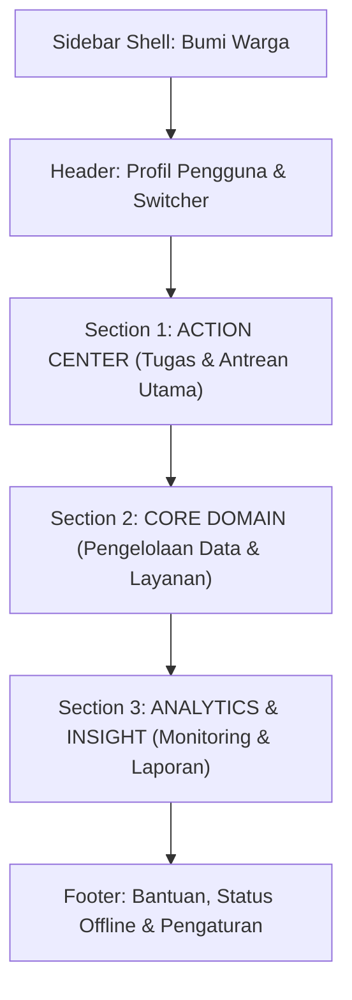
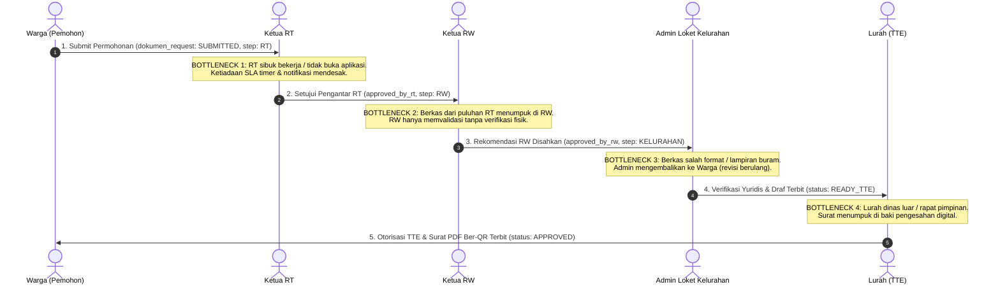
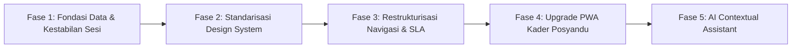

# BUMI WARGA PRODUCT DISCOVERY REPORT
**Deep Product, UI/UX, Data & Role-Based AI Discovery Blueprint**  
*Pemerintah Kota Sukabumi — Jawa Barat | Edisi Standar Operasional 2026*  
*Audit Scope: Full-Stack Codebase Inspection (`d:\wk_prod`), Schema MySQL, Routing Express, Layout React Vite, & Official User Modules*

---

## 1. Executive Summary

Bumi Warga (WK Community OS) adalah ekosistem digital tata kelola administrasi warga, pelayanan perizinan/surat pengantar, kesehatan posyandu (balita & lansia), bantuan sosial (bansos), serta keuangan kas mikro rukun tetangga/rukun warga. Sistem ini dirancang untuk mewujudkan integrasi tata kelola SPBE (*Sistem Pemerintahan Berbasis Elektronik*) secara berjenjang dari tingkat akar rumput (Warga, RT, RW) hingga tingkat eksekutif kelurahan (Petugas Loket & Lurah).

Berdasarkan audit mendalam (*deep discovery*) terhadap basis kode aktual, skema basis data, dan dokumentasi resmi (`USER_MODULE_*.md`), status platform dapat dirangkum sebagai berikut:

1. **Kondisi Runtime Aktual (`CURRENT`)**:
   - Platform aktif berjalan di lingkungan Node.js/Express pada backend dan React (Vite, TailwindCSS, Lucide Icons) pada frontend, disajikan secara langsung melalui domain produksi `https://bumiwarga.online/` dengan status HTTP 200 OK.
   - Enam peran pengguna utama yang dioperasikan: **Warga**, **Ketua RT**, **Ketua RW**, **Admin/Petugas Kelurahan**, **Lurah**, dan **Kader Posyandu**. (Peran teknis pendukung: `superadmin`; peran observasi wilayah: `camat`, `walikota` dengan cakupan menu terbatas).
2. **Kekuatan Utama Arsitektur**:
   - Arsitektur backend modular memisahkan lapisan *Routes*, *Services*, dan *Repositories* dengan transaksi MySQL berbasis pool connection (`mysql2/promise`).
   - Tersedia fondasi mesin *Decision Support System* (DSS) berbasis aturan pada `src/services/ai_engine.service.js` yang mampu mengagregasi status demografi, rasio kemiskinan (desil), gizi balita antropometri WHO, dan matriks risiko RT.
3. **Temuan Kritis & Kesenjangan (*Gaps & Source Conflicts*)**:
   - **Ketiadaan SLA Tracking Presisi pada Database**: Dokumentasi resmi menetapkan SLA ketat (RT: 4 jam kerja, RW: 4 jam kerja, Kelurahan: < 24 jam kerja). Namun, tabel aktual `dokumen_request` dan `bansos_pengajuan` hanya memiliki kolom timestamp generik (`created_at`, `updated_at`, `approved_at`), tanpa kolom penanda SLA eksplisit (`sla_target_hours`, `sla_deadline`, `sla_breached_at`, `escalation_level`).
   - **PWA & Antrean Luar Jaringan (*Offline Queue*)**: Dokumentasi kader posyandu (`USER_MODULE_KADER_POSYANDU.md`) menspesifikasikan persistensi antrean mutasi berbasis *IndexedDB Browser*. Namun, implementasi kode aktual pada `frontend/src/utils/offlineQueue.js` masih mengandalkan `localStorage` dengan kuota 5MB dan tanpa resolusi konflik mutasi idempotensi dua arah (`SOURCE CONFLICT`).
   - **Beban Kognitif Navigasi (*Cognitive Overhead*)**: Navigasi sidebar saat ini (`DashboardLayout.jsx`) merefleksikan tabel database teknis (*table-oriented*) alih-alih berorientasi pada tindakan kontekstual (*domain-action oriented*). Warga disajikan 9 menu datar tanpa pembedaan antara status aktif berkas yang mendesak dengan arsip referensi statis.

Laporan ini menyajikan blueprint discovery faktual tanpa manipulasi kode, menetapkan status verifikasi ketat pada setiap modul, dan merumuskan rekomendasi penataan ulang untuk fase pengembangan berikutnya.

---

## 2. Actual Architecture

### A. Frontend Architecture
- **Framework & Build Tool**: React 18 SPA dibundel menggunakan Vite 5 (`frontend/vite.config.js`).
- **Styling & UI Library**: Tailwind CSS dengan plugin kustom, ikonografi `lucide-react`, dan rendering grafik visual menggunakan `recharts` / SVG mandiri.
- **Routing**: `react-router-dom` v6 (`frontend/src/App.jsx`), memetakan 20 halaman utama dengan proteksi rute `<ProtectedRoute>` dan `<RoleRoute>`.
- **State Management & Sesi**: React Context API (`AuthContext.jsx`) yang mengelola token otentikasi JWT / session cookie, profil aktif, dan beralih peran (*family switching*).
- **Offline / PWA**: Menggunakan Service Worker kustom (`public/sw.js`) untuk caching aset statis dan modul helper `frontend/src/utils/offlineQueue.js`.

### B. Backend Architecture
- **Runtime & Web Framework**: Node.js v18/20 LTS dengan Express.js (`src/server.js` dan `src/app.js`).
- **Pola Desain (*Pattern*)**: 3-Tier Layered Architecture:
  1. *Presentation Layer (Routes & Middlewares)*: 18 router Express (`src/routes/*.routes.js`) dengan validasi token JWT/Session dan otorisasi RBAC (`src/middleware/auth.middleware.js`).
  2. *Business Logic Layer (Services)*: 17 service (`src/services/*.service.js`) yang mengisolasi aturan bisnis, kalkulasi antropometri WHO, enkripsi, dan integrasi WhatsApp.
  3. *Data Access Layer (Repositories)*: 15 repositori (`src/repositories/*.repository.js`) yang menyusun kueri SQL tersanitasi menggunakan *prepared statements*.
- **Otentikasi & Sesi**:
  - Dual Mode: Express Session (`express-session` dengan peringatan memory leak pada `MemoryStore` saat produksi) dan header `Authorization: Bearer <token>`.
  - Password Hashing: `bcryptjs` dengan *salt rounds* standar 10.

### C. Database Architecture
- **RDBMS Engine**: MySQL 8.0 / MariaDB InnoDB (`src/db/pool.js`) dengan collation `utf8mb4_unicode_ci`.
- **Migrasi & Schema Integrity**: Dijalankan secara otomatis saat server booting melalui `src/db/auto_patch.js` dan `src/db/init.js` tanpa rely pada migrasi CLI eksternal.
- **Tabel Inti Terverifikasi (`CURRENT`)**:
  - `users`: Identitas akun kredensial, role, NIK referensi, penugasan RT/RW, audit login, dan flag ganti sandi wajib.
  - `warga`: Master demografi kependudukan 16 digit NIK, status hidup, alamat, status BPJS/asuransi, dan foto bukti bansos mandiri.
  - `kartu_keluarga`: Master kepala keluarga, alamat terpadu, dan relasi KK.
  - `dokumen_request`: Pengajuan surat warga, tahapan approval (`approval_step` ENUM/VARCHAR: RT -> RW -> KELURAHAN), nomor registrasi, status pengesahan, dan tautan file PDF/QR.
  - `bansos_pengajuan`: Registrasi usulan bantuan sosial, tahapan verifikasi, bukti penyerahan geotagging, dan tanda tangan digital warga.
  - `bansos_audit_sanggahan`: Tabel sanggahan lapangan RT/RW atas anomali penerima bansos (kategori sanggahan: `TIDAK_LAYAK`, `SUDAH_PINDAH`, `MENINGGAL_DUNIA`, `LAYAK_BELUM_TERDAFTAR`).
  - `posyandu`: Buku register antropometri balita bulanan (BB, TB, Lingkar Kepala, status gizi calculated).
  - `posyandu_lansia` & `posyandu_lansia_pemeriksaan`: Registrasi lansia binaan, pemeriksaan tensi darah, GDS, kolesterol, asam urat, dan indeks kemandirian ADL.
  - `keuangan_kas`: Pembukuan arus kas masuk/keluar tingkat RT, RW, dan Kelurahan dengan bukti kwitansi/foto.
  - `keuangan_iuran_warga`: Rekapitulasi iuran rutin bulanan per KK dengan nomor KK unik per periode.
  - `pengaduan`: Tiket aspirasi dan komplain warga dengan lampiran gambar dan eskalasi penanganan.
  - `pbb`: Data ketetapan Surat Pemberitahuan Pajak Terutang (SPPT) PBB-P2 warga.
  - `audit_logs` & `integrasi_log`: Jejak audit sistem dan rekam integrasi API (Dukcapil, Sapawarga).

### D. Security & RBAC Model
- **Hierarki Otorisasi**: Diatur secara ketat pada `src/middleware/auth.middleware.js`:
  - Nilai level RBAC: `superadmin: 0`, `walikota: 0`, `camat: 0.5`, `lurah: 1`, `admin_kelurahan: 1`, `ketua_rw: 2`, `ketua_rt: 3`, `kader_posyandu: 3`, `warga: 4`.
  - Filter Wilayah Ketat: Pengguna tingkat RT dan RW otomatis dibatasi (*data-scoped*) hanya dapat membaca data yang memiliki atribut `rt = req.user.rt` dan `rw = req.user.rw`.

---

## 3. Actual Feature Inventory

| Modul Fitur | Status Faktual | Implementasi Frontend | Implementasi Backend | Tabel Database Terkait | Catatan Evaluasi Teknis |
| :--- | :--- | :--- | :--- | :--- | :--- |
| **Autentikasi & Profil** | `CURRENT` | `LoginPage.jsx`, `ProfilePage.jsx` | `auth.routes.js`, `user.service.js` | `users`, `warga` | Mendukung login NIK/username, reset password, dan pergantian password berkala. |
| **Family Switcher (Profil KK)** | `CURRENT` | `DashboardLayout.jsx` modal | `warga.service.js` (`getFamilyMembers`) | `warga`, `kartu_keluarga` | Kepala keluarga dapat berganti konteks NIK anggota keluarga untuk pengajuan layanan. |
| **Pelayanan Dokumen Surat** | `CURRENT` | `DokumenPage.jsx` | `dokumen.routes.js`, `dokumen.service.js` | `dokumen_request`, `users`, `warga` | Multi-step approval RT -> RW -> Kelurahan. Penomoran registrasi otomatis berjalan. |
| **TTE / QR Code Validasi Surat** | `PARTIAL` | `DokumenPage.jsx` (tampilan badge QR) | `dokumen.service.js` | `dokumen_request` | Kode verifikasi QR dihasilkan secara lokal, namun integrasi BSrE / sertifikat digital X.509 riil belum aktif (`DOCUMENTED — IMPLEMENTATION NOT VERIFIED`). |
| **Bansos: Pengajuan & Penyaluran** | `CURRENT` | `BansosPage.jsx` | `bansos.routes.js`, `bansos.service.js` | `bansos_pengajuan` | Mencakup input geotagging, upload foto penyerahan sembako, dan tanda tangan kanvas digital. |
| **Bansos: Audit Sanggahan Lapangan** | `CURRENT` | `BansosPage.jsx` (Tab Audit) | `bansos.routes.js`, `bansos.repository.js` | `bansos_audit_sanggahan` | Memungkinkan RT/RW melaporkan warga mampu atau warga meninggal yang masih terdaftar DTKS. |
| **Posyandu Balita (KMS Digital)** | `CURRENT` | `PosyanduPage.jsx` | `posyandu.routes.js`, `posyandu.service.js` | `posyandu`, `warga` | Menghitung status gizi otomatis menggunakan kalkulasi rasio IMT/Umur antropometri. |
| **Posyandu Lansia & Skor ADL** | `CURRENT` | `PosyanduPage.jsx` (Tab Lansia) | `posyandu.routes.js`, `posyandu.repository.js` | `posyandu_lansia`, `posyandu_lansia_pemeriksaan` | Skrining hipertensi, diabetes melitus, dan kemandirian aktivitas harian (ADL). |
| **Buku Kas & Iuran Warga** | `CURRENT` | `KeuanganPage.jsx` | `keuangan.routes.js`, `keuangan.service.js` | `keuangan_kas`, `keuangan_iuran_warga` | Pencatatan kas RT/RW, rekonsiliasi iuran bulanan KK, dan cetak laporan arus kas. |
| **Pemetaan Desil Kemiskinan** | `CURRENT` | `DesilPage.jsx` | `desil.routes.js`, `desil.service.js` | `warga`, `kartu_keluarga` | Pengelompokan warga desil 1–4 berdasarkan parameter aset dan jaminan sosial. |
| **Aduan & Aspirasi Warga** | `CURRENT` | `ComplaintPage.jsx` | `pengaduan.routes.js`, `pengaduan.service.js` | `pengaduan` | Tiket pengaduan warga dengan lampiran foto bukti dan status eskalasi. |
| **PBB-P2 & Rekonsiliasi Pajak** | `CURRENT` | `PBBPage.jsx` | `pbb.routes.js`, `pbb.service.js` | `pbb`, `warga` | Menampilkan status bayar/lunas NOP PBB warga. |
| **WhatsApp Gateway Notifikasi** | `CURRENT` | `WhatsAppGatewayPage.jsx` | `whatsapp.routes.js`, `whatsapp.service.js` | `whatsapp_templates` | Integrasi pengiriman pesan notifikasi otomatis status surat via bot WA. |
| **AI Rule-Based Decision Engine** | `CURRENT` | `DashboardHome.jsx` | `ai_engine.service.js` | Agregasi tabel demografi & kesehatan | Menghasilkan rekomendasi kebijakan kewilayahan berdasarkan ambang batas matematis. |
| **Offline-First Mutation Queue** | `PARTIAL` | `offlineQueue.js`, `OfflineIndicator.jsx`| Klien lokal browser | `localStorage` | Menyimpan mutasi saat koneksi putus, namun belum menggunakan IndexedDB (`SOURCE CONFLICT`). |
| **Integrasi Disdukcapil Kota** | `PARTIAL` | `IntegrasiPage.jsx` | `dukcapil.service.js` | `integrasi_log` | Mode simulasi API mock aktif; koneksi VPN dinas Disdukcapil riil berstatus roadmap. |
| **SLA Countdown & Auto-Escalation**| `TARGET` | Tidak ditemukan di frontend | Tidak ditemukan di backend | Tidak ada kolom SLA di DB | Dokumen SOP menetapkan SLA jam kerja, namun mesin penghitung waktu dan eskalasi otomatis belum diimplementasikan di kode. |

---

## 4. Current vs Documented vs Target Matrix

| Komponen / Fitur | Status Faktual | Dokumentasi (`USER_MODULE_*.md`) | Basis Data & Kode Aktual (`d:\wk_prod`) | Status Klasifikasi | Kesenjangan & Konflik Sumber (*Source Conflict*) |
| :--- | :--- | :--- | :--- | :--- | :--- |
| **Alur Surat Warga -> RT -> RW -> Lurah** | Alur 3 tahap aktif | Surat melalui verifikasi RT, validasi RW, otorisasi Lurah | `dokumen_request.approval_step` berisi `'RT'`, `'RW'`, `'KELURAHAN'` | `CURRENT` | Selaras. Alur berjenjang berjalan penuh di frontend dan backend. |
| **SLA Waktu Verifikasi Berkas** | Tidak terlacak di DB | RT: 4 Jam, RW: 4 Jam, Kelurahan: < 24 Jam | Hanya terdapat timestamp `created_at`, `updated_at`, `approved_at` | `DOCUMENTED — IMPLEMENTATION NOT VERIFIED` | **Konflik**: Tidak ada kolom `sla_deadline` atau cron job pengirim notifikasi peringatan keterlambatan berkas. |
| **Audit Sanggahan Bansos** | Fitur operasional | RT/RW dapat menyanggah penerima tidak layak | Tabel `bansos_audit_sanggahan` lengkap dengan 4 tipe sanggahan | `CURRENT` | Selaras. Endpoint `/api/bansos/audit-sanggahan` aktif dan terintegrasi di UI. |
| **Penyimpanan Luar Jaringan Kader** | Berjalan via LocalStorage | Kader Posyandu dapat mencatat offline via IndexedDB Browser | `frontend/src/utils/offlineQueue.js` menggunakan `localStorage` (Key: `WK_OFFLINE_MUTATION_QUEUE`) | `SOURCE CONFLICT` | **Konflik**: Dokumentasi menetapkan *IndexedDB Browser* berkapasitas besar, namun kode mengandalkan *localStorage* (kuota terbatas 5MB). |
| **Sertifikat TTE Elektronik BSrE** | QR Code lokal | Pengesahan surat bertanda tangan elektronik tersertifikasi BSrE | `dokumen.service.js` menghasilkan hash SHA-256 dan QR Code URL verifikasi internal | `PARTIAL` | Verifikasi QR internal berfungsi, namun penandatanganan kriptografi PDF digital PKCS#7 / PAdES resmi belum ada. |
| **Buku Kas & Iuran Warga** | Fitur operasional | Transparansi kas RT/RW dan pembayaran iuran bulanan warga | Tabel `keuangan_kas` dan `keuangan_iuran_warga` terhubung ke frontend | `CURRENT` | Selaras. Input mutasi kas dan pembayaran iuran berfungsi normal. |
| **Pemberitahuan WhatsApp Otomatis** | Operasional dengan webhook | Notifikasi real-time terkirim ke no HP warga saat status surat berubah | `whatsapp.service.js` memanggil gateway pihak ketiga / Baileys | `CURRENT` | Selaras. Trigger otomatis berjalan saat status dokumen di-update oleh petugas. |
| **AI Assistant Kontekstual Per Role** | Agregat eksekutif global | Asisten cerdas terpisah untuk setiap peran (Asisten Layanan, Asisten Verifikasi, dll.) | `ai_engine.service.js` menghasilkan satu paket DSS eksekutif gabungan | `PARTIAL` | Backend memiliki fungsi kalkulasi risiko, namun antarmuka AI asisten percakapan/interaktif per peran belum ada. |

---

## 5. Role Analysis

### 1. Warga (Pemohon Mandiri)
- **A. Job To Be Done**:
  - *Pekerjaan Utama*: Mengajukan surat permohonan administrasi (SKTM, Domisili, Pengantar Nikah, Ket Usaha) tanpa harus datang berulang kali ke kantor kelurahan, memeriksa bansos keluarga, memantau imunisasi anak, dan membayar iuran lingkungan.
  - *Keputusan yang Dibuat*: Kapan harus melengkapi berkas yang dikembalikan (*revisi*), memilih jenis surat yang tepat, dan memastikan status iuran/bansos keluarga.
  - *Informasi Paling Penting*: Status berkas permohonan terkini (Sedang di RT / RW / Kelurahan / Selesai), alasan penolakan jika ditolak, dan tautan unduh surat digital legal.
  - *Tindakan Paling Sering*: Mengecek status berkas surat, mengunduh file hasil surat PDF ber-QR, dan mencatat anak ke posyandu.
  - *Risiko Kesalahan Terbesar*: Salah memilih jenis dokumen permohonan atau salah memasukkan identitas anggota keluarga karena tidak menggunakan fitur *Family Switcher*.
- **B. Current Experience**:
  - *Sidebar*: 9 item navigasi datar (Beranda, Pengajuan Surat, Kartu Keluarga, Bansos, Kesehatan, Transparansi Kas, Informasi PBB, Lapor Pengaduan, Panduan).
  - *Dashboard*: Menampilkan greeting, ringkasan jumlah surat, dan kartu pintas layanan.
  - *Masalah*: Terlalu banyak menu yang sebenarnya bersifat sekunder (misal Panduan, PBB); tidak ada indikator visual garis waktu (*timeline stepper*) langsung di layar utama untuk surat yang sedang diproses.
- **C. Ideal Dashboard Blueprint**:
  - *Primary Job (10–30 detik pertama)*: Mengetahui status dokumen yang sedang aktif diajukan dan tindak lanjut apa yang dibutuhkan dari warga.
  - *Priority Information*:
    1. Status progres dokumen aktif (misal: "Surat Keterangan Usaha — Menunggu Validasi RW").
    2. Riwayat bantuan sosial keluarga & desil ekonomi KK.
    3. Status iuran kas RT bulan berjalan (Lunas / Belum Bayar).
    4. Jadwal posyandu balita/lansia terdekat di RW domisili.
    5. Pengaduan lingkungan yang pernah dilaporkan beserta status tindak lanjutnya.
  - *Primary Action*: Tombol cepat "Buat Permohonan Surat Baru" & "Lapor Aduan Cepat".

---

### 2. Ketua RT (Verifikator Faktual Tingkat I)
- **A. Job To Be Done**:
  - *Pekerjaan Utama*: Melakukan verifikasi faktual lapangan terhadap pemohon surat di wilayahnya, menyetujui/menolak pengantar RT, mengusulkan dan menyanggah warga penerima bansos, serta membukukan iuran warga.
  - *Keputusan yang Dibuat*: Apakah warga pemohon benar berdomisili di wilayahnya dan layak mendapatkan pengantar surat/bansos; apakah sanggahan lapangan terhadap warga mampu harus dikirimkan ke kelurahan.
  - *Informasi Paling Penting*: Daftar antrean surat yang menunggu verifikasi RT, identitas NIK dan alamat pemohon, serta status pembayaran iuran kas RT.
  - *Tindakan Paling Sering*: Memeriksa berkas surat pemohon & mengklik "Setujui Pengantar RT", mencatat pembayaran iuran tunai dari warga.
  - *Risiko Kesalahan Terbesar*: Menyetujui pemohon fiktif/pindah tanpa verifikasi, atau membiarkan antrean surat menumpuk melebihi SLA 4 jam.
- **B. Current Experience**:
  - *Sidebar*: 8 menu (Beranda RT, Verifikasi Pengantar RT, Pangkalan Data Warga RT, Registrasi KK, Usulan Bansos, Buku Kas RT, Pengaduan RT, Panduan).
  - *Dashboard*: Menampilkan counter total warga, total surat masuk, dan daftar tabel panjang.
  - *Masalah*: Antrean yang mendekati batas waktu (*aging*) tidak disorot warna khusus (merah/kuning); tombol tindakan persetujuan berada di dalam modal tabel yang membutuhkan banyak klik.
- **C. Ideal Dashboard Blueprint**:
  - *Primary Job*: Memproses permohonan surat masuk dan memeriksa anomali warga lingkungan dalam 30 detik.
  - *Priority Information*:
    1. Kotak Masuk Verifikasi Surat Baru (dengan penanda umur permohonan / aging).
    2. Sanggahan Bansos yang memerlukan pengecekan fisik rumah warga.
    3. Rekap kas RT & daftar KK yang belum membayar iuran bulan ini.
    4. Mutasi warga (warga baru masuk / warga meninggal yang belum di-update).
    5. Aduan warga RT yang butuh mediasi lingkungan.
  - *Primary Action*: "Proses Antrean Surat Sekarang" & "Catat Pemasukan Kas".

---

### 3. Ketua RW (Verifikator Berjenjang Tingkat II)
- **A. Job To Be Done**:
  - *Pekerjaan Utama*: Memvalidasi rekomendasi berjenjang yang telah disetujui para Ketua RT di wilayah RW-nya, memantau kinerja pelayanan seluruh RT, dan mengawasi neraca keuangan serta ketertiban lingkungan.
  - *Keputusan yang Dibuat*: Memberikan rekomendasi RW untuk penerbitan surat kelurahan; menolak berkas jika ditemukan sengketa batas RT atau data tidak valid.
  - *Informasi Paling Penting*: Volume permohonan yang tertahan di level RT vs RW, distribusi kemiskinan antar RT (Desil 1–4), dan kepatuhan penyetoran kas tingkat RW.
  - *Tindakan Paling Sering*: Melakukan *bulk approval* atau penelaahan berkas surat yang lolos verifikasi RT.
  - *Risiko Kesalahan Terbesar*: Menjadi titik kemacetan (*bottleneck*) birokrasi karena menumpuknya berkas dari puluhan RT.
- **B. Current Experience**:
  - *Sidebar*: 8 menu (Beranda RW, Rekomendasi Surat RW, Pangkalan Data Warga RW, Validasi Bansos, Buku Kas RW, Pemetaan Desil, Laporan Ketertiban, Panduan).
  - *Dashboard*: Berisi KPI demografi dan tabel surat masuk RW.
  - *Masalah*: Tidak ada visualisasi komparasi performa antar-RT (RT mana yang lambat memproses surat); tidak ada indikator anomali bansos lintas-RT.
- **C. Ideal Dashboard Blueprint**:
  - *Primary Job*: Mengesahkan permohonan rekomendasi RW dan mendeteksi RT yang mengalami penumpukan antrean.
  - *Priority Information*:
    1. Antrean Rekomendasi Surat RW Siap Disahkan.
    2. Matriks Kecepatan Verifikasi per RT (Deteksi bottleneck).
    3. Rekapitulasi Bansos & Sanggahan Ketidaklayakan per RT.
    4. Rekap Saldo Kas RW & Konsolidasi Iuran Warga.
    5. Peta Kerawanan Sosial / Desil Kemiskinan Ekstrem di lingkungan RW.
  - *Primary Action*: "Tinjau Berkas Masuk RW" & "Kirim Peringatan ke RT Tertahan".

---

### 4. Admin / Petugas Loket Kelurahan (Verifikator Final & Operator)
- **A. Job To Be Done**:
  - *Pekerjaan Utama*: Melakukan verifikasi yuridis kelengkapan berkas yang telah disetujui RT & RW, mencocokkan NIK pemohon dengan data master Disdukcapil, menerbitkan draf surat resmi, dan menyiapkan dokumen untuk pengesahan Lurah.
  - *Keputusan yang Dibuat*: Apakah berkas memenuhi syarat regulasi pemerintahan daerah; apakah format nomor surat dan klausul hukum telah sesuai standar dinas.
  - *Informasi Paling Penting*: Antrean draf surat yang siap cetak/TTE, permohonan yang ditolak atau membutuhkan revisi dokumen dari warga, serta log pengiriman pesan WhatsApp.
  - *Tindakan Paling Sering*: Mengoreksi data pemohon, memverifikasi dokumen pendukung (KTP/KK lampiran), dan memajukan draf ke meja Lurah.
  - *Risiko Kesalahan Terbesar*: Menerbitkan nomor surat ganda (*duplicate registration*) atau memproses permohonan bermasalah hukum.
- **B. Current Experience**:
  - *Sidebar*: 9 menu operasional (Beranda, Verifikasi Surat, Master Warga, Register KK, Kelola Bansos, Rekonsiliasi PBB, Buku Kas, Gateway WA, Panduan).
  - *Dashboard*: Berisi metrik total warga dan tabel log aktivitas umum.
  - *Masalah*: Tampilan tabel verifikasi surat bercampur antara surat yang baru masuk dengan surat yang sudah selesai diterbitkan; tombol cetak berkas belum terintegrasi rapi dengan alur TTE Lurah.
- **C. Ideal Dashboard Blueprint**:
  - *Primary Job*: Memproses verifikasi berkas administrasi dan menyiapkan draf pengesahan dalam waktu kurang dari 5 menit per berkas.
  - *Priority Information*:
    1. Antrean Verifikasi Kelurahan (Status: `PENDING_KELURAHAN`).
    2. Berkas Siap TTE Lurah (Status: `DRAFT_READY`).
    3. Berkas Ditolak / Membutuhkan Perbaikan Warga.
    4. Status Server Gateway WhatsApp (Online / Terputus / Kuota Pesan).
    5. Rekapitulasi Penerbitan Surat Harian per Jenis Dokumen.
  - *Primary Action*: "Mulai Verifikasi Antrean Teratas" & "Generate Draf Surat".

---

### 5. Lurah (Otorisator TTE & Pimpinan Wilayah)
- **A. Job To Be Done**:
  - *Pekerjaan Utama*: Menandatangani secara elektronik (TTE) atau mengesahkan dokumen surat warga yang telah diverifikasi bersih oleh Admin, memantau indikator kinerja layanan publik (*Service Delivery Index*), mengevaluasi penanganan stunting, dan menetapkan alokasi bantuan sosial.
  - *Keputusan yang Dibuat*: Pengesahan final dokumen kenegaraan, penetapan intervensi gizi buruk balita posyandu, dan disposisi aduan krusial warga.
  - *Informasi Paling Penting*: Antrean surat mendesak yang membutuhkan tandatangan, tingkat kepatuhan SLA pelayanan kelurahan, peta sebaran stunting balita dan lansia risiko tinggi, serta eskalasi keluhan warga.
  - *Tindakan Paling Sering*: Melakukan otorisasi/penandatanganan surat (*single sign* atau *batch approval*) dan memeriksa *Executive Daily Brief*.
  - *Risiko Kesalahan Terbesar*: Keterlambatan penandatanganan dokumen mendesak (misal surat kematian atau SKTM darurat rumah sakit) yang mencoreng reputasi pelayanan publik kelurahan.
- **B. Current Experience**:
  - *Sidebar*: 6 menu (Ringkasan Eksekutif, Pengesahan Surat TTE, Penetapan Bansos, Monitoring Stunting, Evaluasi Aduan, Panduan SOP).
  - *Dashboard*: Menampilkan statistik makro, grafik sebaran, dan ringkasan DSS.
  - *Masalah*: Tombol pengesahan dokumen TTE masih mengharuskan navigasi ke halaman terpisah; tidak ada widget "Tandatangani Sekali Klik" (*Quick Sign Tray*) di layar beranda.
- **C. Ideal Dashboard Blueprint**:
  - *Primary Job (10 detik)*: Meninjau jumlah surat yang tertahan tanda tangan dan mengeksekusi otorisasi digital.
  - *Priority Information*:
    1. *Quick Sign Tray*: Jumlah dokumen menunggu TTE Lurah dengan preview ringkas.
    2. Ringkasan Eksekutif Harian (*Daily Brief AI*): SLA capaian, isu prioritas hari ini.
    3. Radar Kewilayahan: RW/RT dengan risiko stunting atau kemiskinan tertinggi.
    4. Komplain Warga Berkategori Kritis / Belum Ditanggapi > 48 Jam.
    5. Saldo Kas Wilayah & Realisasi Penyaluran Bantuan Sosial.
  - *Primary Action*: "Tandatangani Semua Berkas Terverifikasi (Batch Sign)" & "Disposisi Aduan Kritis".

---

### 6. Kader Posyandu (Pencatat Balita & Lansia Lapangan)
- **A. Job To Be Done**:
  - *Pekerjaan Utama*: Melakukan penimbangan berat badan, pengukuran tinggi badan balita, pemeriksaan tensi/kolesterol/gula darah lansia di hari buka posyandu, mencatat imunisasi, dan mendeteksi dini risiko stunting serta penyakit tidak menular.
  - *Keputusan yang Dibuat*: Menentukan apakah anak menunjukkan sinyal gagal tumbuh (*growth faltering*) yang harus dirujuk ke Puskesmas; menentukan status kemandirian lansia (ADL).
  - *Informasi Paling Penting*: Daftar sasaran balita/lansia yang belum hadir pada hari penimbangan, riwayat kurva pertumbuhan KMS, dan status antrean mutasi offline saat bertugas tanpa sinyal internet.
  - *Tindakan Paling Sering*: Input cepat angka BB/TB pada formulir digital, memeriksa warna status gizi hasil kalkulasi sistem, dan melakukan sinkronisasi data offline saat kembali mendapat internet.
  - *Risiko Kesalahan Terbesar*: Salah memasukkan titik desimal pada berat/tinggi badan (misal 8.5 kg terinput 85 kg) atau kehilangan data hasil pemeriksaan posyandu akibat gagal sinkronisasi offline.
- **B. Current Experience**:
  - *Sidebar*: 5 menu (Beranda Posyandu, Layanan Balita & Antropometri, Pencarian Data Warga, Pusat Pengaduan, Panduan SOP).
  - *Dashboard*: Berisi tabel data balita dan tab lansia.
  - *Masalah*: Input data di layar ponsel masih memerlukan navigasi tabel lebar (*horizontal scrolling*); status antrean offline tidak menampilkan detail item yang gagal disinkronkan.
- **C. Ideal Dashboard Blueprint**:
  - *Primary Job (15 detik)*: Membuka formulir input cepat balita/lansia dengan satu tangan dan melihat indikator status koneksi/sinkronisasi.
  - *Priority Information*:
    1. Banner Status Sinkronisasi Antrean Offline (Online / Tersimpan di Perangkat).
    2. Counter Sasaran Hari Buka Posyandu (Hadir / Belum Ditimbang).
    3. Notifikasi Peringatan Dini: Balita dengan Kurva Berat Turun Berturut-turut.
    4. Ringkasan Lansia Risiko Hipertensi Berat / Gula Darah Tinggi.
    5. Pintasan Cepat Input Balita & Input Lansia.
  - *Primary Action*: "Catat Balita Cepat (Mode Sentuh)" & "Kirim/Sinkronkan Data Offline".

---

## 6. Current Sidebar Audit

Struktur navigasi sidebar saat ini didefinisikan secara eksplisit di `frontend/src/layouts/DashboardLayout.jsx` fungsi `getNavItems()`:

| Role | Menu Sidebar Saat Ini | Evaluasi Kritis & Problem UX | Klasifikasi Prinsip | Rekomendasi Restrukturisasi |
| :--- | :--- | :--- | :--- | :--- |
| **Warga** | 1. Beranda Layanan Mandiri<br>2. Pengajuan Surat Mandiri<br>3. Kartu Keluarga Digital<br>4. Informasi Bantuan Sosial<br>5. Kesehatan & Posyandu<br>6. Transparansi Kas & Iuran<br>7. Informasi Tagihan PBB<br>8. Lapor Pengaduan Warga<br>9. Panduan Layanan Warga | Terlalu banyak (9 item). Menu PBB dan Panduan jarang diakses namun memakan ruang vertikal utama. Berkas surat yang sedang aktif berjalan tidak memiliki lencana (*badge count*). | *Role -> Database Table* | Ringkas menjadi 4 grup fungsional: **Layanan Utama** (Surat & Aduan), **Keluarga Saya** (KK, Kesehatan, Bansos), **Lingkungan** (Kas & Iuran, PBB), dan **Bantuan**. |
| **Ketua RT** | 1. Beranda RT<br>2. Verifikasi Pengantar RT<br>3. Pangkalan Data Warga RT<br>4. Registrasi KK Wilayah RT<br>5. Usulan & Audit Bansos RT<br>6. Buku Kas RT & Iuran Warga<br>7. Laporan Pengaduan RT<br>8. Panduan SOP Ketua RT | Menu bersifat administratif generik. Menu "Verifikasi Pengantar RT" tidak memiliki indikator jumlah berkas gantung (*pending count badge*). | *Role -> Database Table* | Tempatkan **Pusat Aksi / Antrean Verifikasi** di paling atas dengan angka notifikasi merah; gabungkan Master Warga dan KK dalam satu domain "Kependudukan RT". |
| **Ketua RW** | 1. Beranda Rekapitulasi RW<br>2. Rekomendasi Surat RW<br>3. Pangkalan Data Warga RW<br>4. Validasi & Audit Bansos RW<br>5. Buku Kas RW<br>6. Pemetaan Kemiskinan RW (Desil)<br>7. Laporan Ketertiban RW<br>8. Panduan SOP Ketua RW | Menu "Pemetaan Kemiskinan RW" dan "Validasi Bansos" terpisah padahal keduanya berada dalam ranah intervensi jaminan sosial terpadu. | *Role -> Database Table* | Satukan domain: **Rekomendasi Berkas**, **Pengawasan Bansos & Desil**, **Keuangan Lingkungan**, dan **Data Wilayah RW**. |
| **Admin Kelurahan** | 1. Beranda Operasional<br>2. Verifikasi Berkas Surat<br>3. Master Data Warga<br>4. Register Kartu Keluarga<br>5. Pengelolaan Bansos<br>6. Rekonsiliasi PBB<br>7. Buku Kas & Keuangan<br>8. Gerbang Pesan WhatsApp<br>9. Panduan SOP Operasional | Menu "Gerbang Pesan WhatsApp" terdengar seperti modul pengembang IT, padahal tugas staf loket adalah memastikan pesan notifikasi warga terkirim. | *Role -> Technical System* | Ubah nama teknis menjadi fungsional: ubah "Gerbang WhatsApp" menjadi "Layanan Notifikasi Warga". Kelompokkan menu Master Data (Warga, KK, PBB) ke sub-menu. |
| **Lurah** | 1. Ringkasan Eksekutif<br>2. Pengesahan Surat (TTE / QR)<br>3. Penetapan Definitif Bansos<br>4. Monitoring Stunting Wilayah<br>5. Evaluasi Aduan Warga<br>6. Panduan SOP Kelurahan | Struktur relatif bersih (6 item), namun alur kerja penandatanganan surat tidak memiliki sub-filter prioritas (misal: darurat vs reguler). | *Role -> Domain Action* (Sebagian Baik) | Berikan lencana jumlah dokumen pending TTE pada menu "Pengesahan Surat", dan tambahkan menu cepat "Disposisi & Agenda Wilayah". |
| **Kader Posyandu**| 1. Beranda Posyandu<br>2. Layanan Balita & Antropometri<br>3. Pencarian Data Warga/Ibu<br>4. Pusat Pengaduan Kesehatan<br>5. Panduan SOP Posyandu | Menu "Layanan Balita" menyembunyikan modul pemeriksaan lansia di dalam tab sekunder yang menyulitkan kader saat hari posyandu lansia. | *Role -> Partial Feature* | Buat pemisahan jelas: **Posyandu Balita (KMS)**, **Posyandu Lansia (ADL)**, dan **Status Antrean Offline**. |

---

## 7. Recommended Sidebar Architecture

Menerapkan prinsip navigasi profesional: **ROLE -> DOMAIN -> ACTION** (Bukan representasi tabel database mentah).



### Rekomendasi Navigasi Spesifik Per Peran:

#### 1. Warga
- **Layanan Mandiri**:
  - 📄 Status & Pengajuan Surat *(dengan badge jumlah surat aktif)*
  - 📢 Lapor Pengaduan Warga
- **Keluarga & Bantuan**:
  - 👨‍👩‍👧‍👦 Berkas Kartu Keluarga Digital
  - 🎁 Cek Status Bantuan Sosial (Bansos)
  - 👶 Kesehatan Keluarga & Posyandu
- **Kewajiban Warga**:
  - 💳 Pembayaran Iuran RT & Kas Lingkungan
  - 🏠 Informasi Tagihan PBB-P2
- **Bantuan & SOP**:
  - 📖 Buku Panduan Warga

#### 2. Ketua RT
- **Pusat Aksi RT**:
  - 📥 Verifikasi Pengantar Surat *(Badge Merah: Antrean Pending)*
  - ⚠️ Audit & Sanggahan Bansos Lapangan
- **Kependudukan Lingkungan**:
  - 👥 Pangkalan Data Warga RT
  - 📑 Registrasi & Pemutakhiran KK RT
- **Keuangan & Fasilitas**:
  - 💰 Buku Kas RT & Setoran Iuran Warga
  - 📢 Aduan & Ketenteraman Lingkungan
- **Panduan**:
  - 📘 Standar Pelayanan RT

#### 3. Ketua RW
- **Pusat Validasi**:
  - 📑 Validasi Rekomendasi Surat RW *(Badge Antrean)*
  - 📊 Radar Kinerja Verifikasi Antar-RT
- **Sosial & Kemiskinan**:
  - ⚖️ Pemetaan Desil Kemiskinan & DTKS RW
  - 🎁 Pengawasan Penyaluran Bansos RW
- **Tata Kelola Lingkungan**:
  - 💵 Konsolidasi Kas RW & Iuran Warga
  - 🛡️ Monitoring Ketertiban & Aduan Warga
- **Data Induk**:
  - 📋 Direktori Kependudukan RW

#### 4. Admin / Petugas Loket Kelurahan
- **Meja Pelayanan Loket**:
  - 📥 Antrean Verifikasi Berkas Kelurahan *(Badge Antrean Menunggu)*
  - 🖨️ Draf Penerbitan Surat Resmi Siap TTE
  - 📲 Monitoring Pengiriman WhatsApp Warga
- **Master Registrasi Kependudukan**:
  - 👤 Master Database Warga
  - 👨‍👩‍👦 Master Register Kartu Keluarga
  - 🏛️ Rekonsiliasi NOP PBB Wilayah
- **Pengelolaan Program**:
  - 📦 Manajemen Usulan & Penyaluran Bansos
  - 💼 Buku Kas & Keuangan Operasional Kelurahan

#### 5. Lurah
- **Executive Command**:
  - ✍️ Pengesahan Dokumen (TTE / QR) *(Badge Merah Dokumen Menunggu)*
  - 📈 Executive Daily Brief & Radar Wilayah
- **Intervensi Kebijakan**:
  - 🎯 Penetapan Alokasi Bansos Definitif
  - 🩺 Pengawasan Program Zero Stunting & Lansia
  - 🚨 Disposisi Aduan Kritis Warga
- **Kinerja Pemerintahan**:
  - ⏱️ Dashboard Kepatuhan SLA Pelayanan

#### 6. Kader Posyandu
- **Pelayanan Meja Posyandu**:
  - 👶 Pencatatan Antropometri Balita (KMS)
  - 👵 Pemeriksaan Kesehatan Lansia & ADL
  - 📶 Status Antrean & Sinkronisasi Offline *(Badge Mutasi Pending)*
- **Data Sasaran**:
  - 📋 Sasaran Balita & Lansia Binaan
  - ⚠️ Sinyal Dini Risiko Gizi Kurang / Stunting
- **Panduan Operasional**:
  - 📗 Pedoman Pengukuran Standar WHO

---

## 8. Current Dashboard Audit

Audit terhadap halaman dashboard saat ini (`frontend/src/pages/DashboardHome.jsx`):

1. **Struktur Tata Letak (*Layout*)**:
   - Menampilkan salam penyambutan pengguna (*User Welcome Header*), diikuti oleh 4 kartu metrik generik (Total Warga, Total Pengajuan Surat, Total Aduan, Kas).
   - Pada baris kedua, menampilkan grafik statistik batang (*Bar Chart*) dan daftar permohonan terakhir dalam bentuk tabel vertikal biasa.
2. **Kelemahan Utama Berdasarkan Peran**:
   - **Warga**: Disajikan metrik makro yang tidak relevan (seperti total warga 1 kelurahan), alih-alih menampilkan perkembangan dokumen pribadi miliknya.
   - **Ketua RT & RW**: Tidak ada sistem pembobotan urgensi (*priority ranking*). Permohonan surat yang baru masuk 5 menit lalu diperlakukan setara dengan permohonan yang sudah menggantung selama 24 jam.
   - **Lurah**: Grafik yang disajikan adalah agregat statis. Tidak tersedia kemampuan *drill-down* (misal: mengklik angka stunting untuk melihat RT mana yang mengalami lonjakan).
   - **Kader Posyandu**: Dashboard terlampau berat dan lambat dimuat pada gawai dengan jaringan seluler 3G/Edge di lapangan karena memuat seluruh modul grafik recharts yang tidak perlu.
3. **Pesan Kesalahan & Status Kosong (*Empty States*)**:
   - Saat tabel permohonan kosong, sistem hanya menampilkan teks abu-abu *"Tidak ada data"*, tanpa ada panduan tindakan yang jelas (*call to action*).

---

## 9. Recommended Dashboard Information Architecture

Arsitektur hierarki informasi yang direkomendasikan untuk seluruh peran:

```
+-------------------------------------------------------------------------+
| TOPBAR: Info Wilayah | Switcher Profil KK | Status Jaringan | Notifikasi |
+-------------------------------------------------------------------------+
| DAILY BRIEF CARD: Ringkasan AI 2-3 Kalimat tentang Status Terkini       |
+-------------------------------------------------------------------------+
| ACTION CENTER: Kartu Pekerjaan Menunggu Tindakan (Urgent / SLA Alert)   |
+-------------------------------------------------------------------------+
| KPI GRID: 4 Metrik Kunci Kontekstual Sesuai Peran                       |
+-------------------------------------------------------------------------+
| WORKFLOW / RADAR STATUS: Visualisasi Alur Proses & Progres Nyata        |
+-------------------------------------------------------------------------+
| RECENT ACTIVITY & TABEL DATA: Daftar Rinci dengan Filter Cepat          |
+-------------------------------------------------------------------------+
```

### Penjabaran Spesifik Komponen per Peran:
- **Warga**:
  - *Daily Brief*: "Halo Budi Santoso, surat keterangan usaha Anda telah diverifikasi oleh Ketua RT 001 dan kini sedang ditinjau di meja Ketua RW 001."
  - *Action Center*: Kartu peringatan jika berkas dikembalikan atau kartu ajakan konfirmasi penerimaan bansos.
  - *KPI Grid*: [Surat Diproses: 1] [Bansos Terdaftar: PKH] [Iuran RT: Lunas] [Jadwal Posyandu: 18 Sep].
- **Ketua RT**:
  - *Daily Brief*: "Terdapat 3 permohonan surat masuk, 1 diantaranya mendekati batas SLA 4 jam. Saldo kas RT tercatat Rp 3.450.000."
  - *Action Center*: Tombol cepat persetujuan permohonan surat darurat.
- **Lurah**:
  - *Daily Brief*: "Executive Brief: 100% berkas kelurahan selesai dalam SLA hari ini. Terdeteksi anomali 4 penerima bansos meninggal dunia di RW 001 yang diajukan untuk pencabutan."
  - *Action Center*: *Quick Sign Tray* untuk penandatanganan elektronik massal.

---

## 10. Data Analyst Findings

Berdasarkan analisis skema relasional tabel MySQL (`src/db/auto_patch.js` dan `src/db/init.js`), berikut adalah analisis dimensi analitik yang dapat dan belum dapat dihasilkan sistem:

```
[DATA TERSEDIA DI DB] 
   │
   ├── Volume & Demografi   ──> DAPAT DIHITUNG (Tabel: warga, kartu_keluarga, users)
   ├── Velocity Berkas      ──> TERBATAS (Hanya ada created_at & approved_at, tanpa durasi antar step)
   ├── SLA & Kepatuhan      ──> TIDAK LENGKAP (Ketiadaan target_sla_hours & deadline_timestamp)
   ├── Konversi Pelayanan   ──> DAPAT DIHITUNG (Rasio SUBMITTED vs APPROVED vs REJECTED)
   ├── Bottleneck Analisis  ──> DAPAT DIHITUNG SECARA KASAR (Kueri per approval_step)
   └── Deteksi Anomali      ──> DAPAT DIJALANKAN (Via tabel bansos_audit_sanggahan & rule ai_engine)
```

1. **Volume**: Sistem memiliki kemampuan penuh (`CURRENT`) untuk menghitung total jiwa, piramida usia balita-produktif-lansia, rasio jenis kelamin, dan kepala keluarga berdasarkan RT/RW.
2. **Velocity**: Kecepatan proses dokumen surat dapat dihitung secara makro dari selisih `dokumen_request.created_at` dan `dokumen_request.approved_at`. Namun, **durasi per tahap** (berapa lama tertahan di RT, berapa lama di RW, berapa lama di meja Admin) tidak dapat dihitung akurat karena tidak ada tabel log mutasi status per tahapan (`dokumen_workflow_history`).
3. **SLA**: Tingkat kepatuhan SLA (*SLA Compliance %*) saat ini **belum dapat dihitung secara otomatis oleh database** (`TARGET`), karena ketiadaan kolom target jam kerja dan penanda hari libur nasional.
4. **Conversion**: Konversi dapat dihitung (`CURRENT`): Dari 100 surat yang masuk (`SUBMITTED`), berapa persen yang disetujui (`APPROVED`), ditolak (`REJECTED`), atau dibatalkan.
5. **Bottleneck**: Dapat diidentifikasi secara kasar (`CURRENT`) melalui pengelompokan `COUNT(*)` berdasarkan kolom `approval_step` (apakah menumpuk di `'RT'`, `'RW'`, atau `'KELURAHAN'`).
6. **Distribution & Trend**: Distribusi permohonan menurut waktu (harian, mingguan, bulanan) dan sebaran geografis per RT/RW dapat dihasilkan dengan kueri agregasi standar.
7. **Anomaly Detection**: Sistem memiliki data konkret (`CURRENT`) melalui tabel `bansos_audit_sanggahan` untuk mendeteksi anomali inklusi/eksklusi bansos, serta kueri lansia sebatang kara yang tidak memiliki asuransi kesehatan.

---

## 11. KPI Recommendation (Data -> Metric -> Insight -> Action)

Transformasi minimal 5 contoh nyata per peran berdasarkan data yang **benar-benar tersedia** di basis data:

### A. Warga
1. *Data*: `dokumen_request.status = 'SUBMITTED'`, `approval_step = 'RW'`.  
   *Metric*: Tahapan 2 dari 3 selesai.  
   *Insight*: Pengantar RT telah disetujui, saat ini sedang menunggu validasi Ketua RW 001.  
   *Action*: Warga tidak perlu datang ke kantor kelurahan; cukup memantau notifikasi WhatsApp.
2. *Data*: `keuangan_iuran_warga.status_bayar = 'BELUM_BAYAR'`, periode bulan berjalan.  
   *Metric*: Tunggakan 1 periode (Rp 25.000).  
   *Insight*: Iuran kebersihan dan keamanan RT bulan ini belum diselesaikan.  
   *Action*: Klik tombol "Bayar Iuran via Transfer" atau bayar tunai ke bendahara RT.
3. *Data*: `bansos_pengajuan.status = 'DISAHKAN'`, `foto_penyerahan_url IS NULL`.  
   *Metric*: Bantuan berstatus siap salur.  
   *Insight*: Alokasi beras bansos siap diambil di balai RW.  
   *Action*: Bawa KTP asli ke balai RW untuk difoto verifikasi penyerahan.
4. *Data*: `posyandu.tanggal_pemeriksaan` terakhir berjarak > 35 hari dari hari ini.  
   *Metric*: Keterlambatan jadwal penimbangan balita = 1 siklus.  
   *Insight*: Anak belum mengikuti pemantauan pertumbuhan bulan ini.  
   *Action*: Datang ke posyandu pada jadwal penimbangan minggu ini.
5. *Data*: `pbb.status_pembayaran = 'UNPAID'`, jatuh tempo < 30 hari.  
   *Metric*: Tagihan PBB terutang aktif.  
   *Insight*: Risiko denda administratif 2% per bulan jika lewat jatuh tempo.  
   *Action*: Salin NOP dan lakukan pembayaran melalui bank bjb / kanal digital.

### B. Ketua RT
1. *Data*: `COUNT(dokumen_request.id) WHERE approval_step = 'RT' AND status = 'SUBMITTED'`.  
   *Metric*: Antrean aktif verifikasi pengantar = 4 berkas.  
   *Insight*: Terdapat 4 warga yang membutuhkan surat pengantar hari ini.  
   *Action*: Buka daftar verifikasi dan periksa keabsahan domisili pemohon.
2. *Data*: `dokumen_request.created_at` berumur > 4 jam pada hari kerja.  
   *Metric*: 2 permohonan berstatus *aging* / mendekati pelanggaran SLA.  
   *Insight*: Pelayanan RT berisiko melewati standar pelayanan prima 4 jam.  
   *Action*: Prioritaskan persetujuan pada 2 dokumen tersebut dalam 15 menit ke depan.
3. *Data*: `keuangan_iuran_warga.status_bayar = 'LUNAS'` terkumpul 32 dari 40 KK.  
   *Metric*: Kepatuhan iuran RT = 80%.  
   *Insight*: Arus kas kas lingkungan terkumpul Rp 800.000, 8 KK belum menyetor.  
   *Action*: Kirim pengingat santun iuran via grup WhatsApp warga RT.
4. *Data*: `bansos_audit_sanggahan` tipe `'MENINGGAL_DUNIA'` belum direview kelurahan.  
   *Metric*: 1 laporan anomali data bansos berstatus pending.  
   *Insight*: Berkas warga meninggal berpotensi tetap menerima transfer bansos jika tidak segera dicabut.  
   *Action*: Konfirmasi status surat kematian ke Admin Kelurahan.
5. *Data*: `posyandu.status_gizi = 'Gizi Kurang'` berjumlah 2 anak di wilayah RT.  
   *Metric*: Prevalensi gizi kurang RT = 5%.  
   *Insight*: Ada 2 balita yang membutuhkan pemantauan asupan makanan tambahan (PMT).  
   *Action*: Koordinasikan pemberian makanan tambahan dengan Kader Posyandu.

### C. Ketua RW
1. *Data*: Agregasi `approval_step = 'RT'` per nomor RT di wilayah RW 001.  
   *Metric*: RT 003 memiliki 9 berkas tertahan > 6 jam, sementara RT lain rata-rata < 1 jam.  
   *Insight*: Terdapat hambatan operasional verifikasi di pengurus RT 003.  
   *Action*: Hubungi Ketua RT 003 untuk menanyakan kendala atau lakukan asistensi penelaahan berkas.
2. *Data*: `COUNT(dokumen_request.id) WHERE approval_step = 'RW'`.  
   *Metric*: 7 rekomendasi berkas menunggu pengesahan RW.  
   *Insight*: Berkas telah lolos verifikasi RT dan siap diajukan ke kantor kelurahan.  
   *Action*: Lakukan validasi silang dan klik "Setujui Rekomendasi RW".
3. *Data*: `warga` dengan desil 1 yang tidak menerima bansos jenis apapun (`bansos_pengajuan IS NULL`).  
   *Metric*: Potensi *exclusion error* bansos = 14 kepala keluarga.  
   *Insight*: Terdapat 14 keluarga sangat miskin yang belum tersentuh bantuan perlindungan sosial.  
   *Action*: Instruksikan Ketua RT terkait untuk mendaftarkan 14 KK tersebut dalam usulan bansos baru.
4. *Data*: Agregasi penerimaan kas masuk seluruh RT di bawah RW.  
   *Metric*: Total saldo kas lingkungan terhimpun Rp 12.450.000.  
   *Insight*: Likuiditas dana gotong royong dan ketahanan sosial RW dalam kondisi sehat.  
   *Action*: Publikasikan transparansi saldo kas triwulanan pada papan pengumuman RW.
5. *Data*: `pengaduan.status = 'PENDING'` kategori ketertiban fasilitas umum di wilayah RW.  
   *Metric*: 3 laporan warga tentang lampu jalan padam / saluran air tersumbat.  
   *Insight*: Keresahan lingkungan berpotensi menimbulkan gangguan keamanan malam hari.  
   *Action*: Agendakan kerja bakti warga dan teruskan aduan ke seksi sarpras kelurahan.

### D. Admin / Petugas Kelurahan
1. *Data*: `dokumen_request.status = 'PENDING_KELURAHAN'`.  
   *Metric*: 15 berkas siap diproses di loket kelurahan.  
   *Insight*: Berkas telah lengkap disetujui RT & RW, menunggu penerbitan nomor surat resmi.  
   *Action*: Cocokkan dengan data KTP/KK di master data dan terbitkan nomor agenda dinas.
2. *Data*: `dokumen_request.trigger_executed = 0` pada surat yang disetujui.  
   *Metric*: Pesan WhatsApp notifikasi belum terkirim ke pemohon.  
   *Insight*: Antrean webhook gateway WhatsApp mengalami keterlambatan pengiriman.  
   *Action*: Buka halaman WhatsApp Gateway dan klik tombol "Kirim Ulang Antrean".
3. *Data*: `pbb.status_pembayaran = 'PAID'` hasil rekonsiliasi bank bjb.  
   *Metric*: Realisasi penerimaan PBB kelurahan mencapai 78% dari target tahunan.  
   *Insight*: Kepatuhan pajak wilayah berada pada jalur positif menjelang triwulan IV.  
   *Action*: Cetak daftar nominatif NOP yang belum melunasi untuk dikirimkan ke para Ketua RW.
4. *Data*: `warga.kategori_asuransi = 'Tidak Memiliki Asuransi'` berjumlah 340 jiwa.  
   *Metric*: Tingkat ketercakupan UHC (Universal Health Coverage) wilayah = 86%.  
   *Insight*: Masih ada 14% warga rentan yang berisiko jatuh miskin jika mengalami sakit parah.  
   *Action*: Daftarkan warga tidak mampu tersebut ke program PBI-APBD Kota Sukabumi.
5. *Data*: `bansos_audit_sanggahan.status_review = 'PENDING_KELURAHAN'`.  
   *Metric*: 5 sanggahan ketidaklayakan dari RT/RW menunggu telaah yuridis.  
   *Insight*: Ada usulan resmi pencabutan 5 bansos tidak tepat sasaran dari pengurus lingkungan.  
   *Action*: Telaah bukti foto lapangan dan buat draf surat keputusan pembatalan untuk Lurah.

### E. Lurah
1. *Data*: `COUNT(dokumen_request.id) WHERE status = 'READY_TTE'`.  
   *Metric*: 8 dokumen resmi menunggu tanda tangan digital kepala kelurahan.  
   *Insight*: Warga menunggu penerbitan dokumen legal untuk keperluan mendesak.  
   *Action*: Buka berkas dan eksekusi "Tandatangani Dokumen (TTE / QR)".
2. *Data*: Rata-rata durasi penyelesaian surat dari pengajuan hingga persetujuan Lurah.  
   *Metric*: Waktu rata-rata penyelesaian = 6.2 jam kerja (Target SOP: < 24 jam).  
   *Insight*: Standar operasional pelayanan kelurahan berjalan prima dan melampaui target.  
   *Action*: Berikan apresiasi kinerja kepada staf loket kelurahan pada apel pagi.
3. *Data*: `posyandu.status_gizi = 'Gizi Buruk'` terdeteksi 3 balita di RW 002.  
   *Metric*: Klaster kasus stunting terpusat pada satu RW spesifik.  
   *Insight*: Diperlukan intervensi terpadu lintas sektor (sanitasi air bersih dan nutrisi pangan).  
   *Action*: Instruksikan Puskesmas dan Tim Penggerak PKK untuk melakukan *home visit* intervensi.
4. *Data*: `posyandu_lansia_pemeriksaan.skor_kemandirian_adl = 'Ketergantungan Berat'`.  
   *Metric*: 6 lansia sebatang kara hidup dengan ketergantungan fisik tinggi.  
   *Insight*: Risiko kerentanan sosial dan penelantaran tinggi di lingkungan RT padat.  
   *Action*: Disposisikan penyaluran bantuan makanan siap saji harian dari Dinas Sosial.
5. *Data*: `pengaduan.status = 'PENDING'` berumur > 72 jam tanpa disposisi.  
   *Metric*: 1 aduan warga mengalami kelambatan penanganan tingkat berat.  
   *Insight*: Berpotensi viral atau menurunkan tingkat kepuasan masyarakat terhadap kelurahan.  
   *Action*: Hubungi kepala seksi terkait untuk segera mengeksekusi penanganan lapangan hari ini.

### F. Kader Posyandu
1. *Data*: Balita dengan selisih `berat_badan_kg` bulan ini < bulan lalu (KMS garis menurun).  
   *Metric*: 4 anak mengalami penurunan bobot badan (*growth faltering*).  
   *Insight*: Sinyal awal kekurangan asupan nutrisi atau infeksi penyakit berulang.  
   *Action*: Berikan penyuluhan gizi kepada ibu dan bagikan paket biskuit PMT pemulihan.
2. *Data*: Antrean mutasi offline pada `localStorage` berjumlah > 0 item.  
   *Metric*: 12 data pemeriksaan tersimpan di memori perangkat, belum masuk ke server kelurahan.  
   *Insight*: Risiko kehilangan data jika browser dibersihkan sebelum tersinkronisasi.  
   *Action*: Sambungkan ponsel ke jaringan WiFi/seluler dan tekan tombol "Sinkronkan Sekarang".
3. *Data*: `posyandu_lansia_pemeriksaan.tensi_sistolik >= 160` mmHg.  
   *Metric*: 5 lansia terindikasi hipertensi derajat 2.  
   *Insight*: Risiko komplikasi stroke dan kardiovaskular tinggi jika tidak meminum obat rutin.  
   *Action*: Berikan rujukan tertulis agar lansia segera memeriksakan diri ke dokter Puskesmas.
4. *Data*: `warga` balita terdaftar yang tidak hadir pada hari buka posyandu.  
   *Metric*: Tingkat kehadiran penimbangan posyandu = 74% (Target: > 85%).  
   *Insight*: 11 anak tidak terpantau kurva pertumbuhannya pada bulan ini.  
   *Action*: Koordinasikan dengan Ketua RT untuk melakukan sweeping penimbangan door-to-door.
5. *Data*: Balita usia 9 bulan belum tercatat menerima imunisasi campak/rubella di buku register.  
   *Metric*: Kesenjangan imunisasi dasar lengkap (*Drop-out imunisasi*).  
   *Insight*: Anak rentan tertular wabah campak di lingkungan pemukiman padat.  
   *Action*: Ingatkan orang tua untuk hadir pada pos imunisasi terdekat pekan depan.

---

## 12. SLA Analysis

Berdasarkan audit komparasi antara dokumen regulasi pelayanan publik dan skema tabel `dokumen_request` saat ini:

### Matriks Target SLA Resmi vs Data Aktual
| Alur Pelayanan | Target SLA Resmi (`USER_MODULE_*.md`) | Field Timestamp Database Aktual | Status Komputasi Saat Ini | Field yang Wajib Ditambahkan |
| :--- | :--- | :--- | :--- | :--- |
| **Verifikasi Ketua RT** | Maksimal 4 Jam Kerja | `dokumen_request.created_at` (Hanya waktu buat awal) | `BROKEN / UNKNOWN` (Tidak ada pencatatan waktu saat RT mulai dan selesai menelaah berkas) | `rt_received_at`, `rt_processed_at`, `rt_sla_hours` |
| **Validasi Ketua RW** | Maksimal 4 Jam Kerja | Tidak ada field spesifik RW | `BROKEN / UNKNOWN` (Waktu persetujuan RW tidak tercatat di tabel utama) | `rw_received_at`, `rw_processed_at`, `rw_sla_hours` |
| **Penerbitan Kelurahan / Lurah**| Maksimal 24 Jam Kerja | `dokumen_request.approved_at` (Hanya waktu persetujuan akhir) | `PARTIAL` (Hanya selisih total waktu yang dapat dihitung, bukan waktu staf kelurahan) | `kelurahan_received_at`, `lurah_signed_at`, `target_deadline_at` |

### Evaluasi Kemampuan Analisis Metrik Waktu Saat Ini
- **Average & Median Processing Time**: Saat ini hanya dapat dihitung untuk **keseluruhan siklus (End-to-End)** dengan menghitung selisih antara `created_at` dan `approved_at`. Tidak dapat dihitung per tahapan aktor.
- **SLA Compliance %**: `NOT VERIFIED / CANNOT BE CALCULATED`. Sistem tidak dapat menghitung persentase kepatuhan secara otomatis karena tidak menyimpan batas jam kerja resmi (misal: pengajuan hari Jumat pukul 16:00 yang diproses Senin pagi tidak boleh dianggap melanggar SLA 4 jam).
- **Aging & Overdue**: Tidak ada penanda status `OVERDUE` atau `ESCALATED` di level kueri SQL; sistem hanya melakukan pengurutan biasa (`ORDER BY created_at DESC`).
- **Queue Time vs Processing Time**: `CANNOT BE CALCULATED`. Waktu berkas menunggu di antrean sebelum dibuka petugas (*queue time*) dan waktu petugas memeriksa berkas (*processing time*) belum terekam.

---

## 13. Workflow Bottleneck Analysis

Analisis visual titik rawan hambatan birokrasi (*Failure Points & Bottlenecks*) pada alur penerbitan surat warga:



### Rincian Bottleneck Faktual:
1. **Bottleneck 1: Verifikasi Faktual di Tingkat RT (Status: `SUBMITTED`, Step: `RT`)**:
   - *Penyebab*: Ketua RT adalah relawan masyarakat yang memiliki pekerjaan utama di siang hari.
   - *Dampak*: Permohonan tertahan 24–48 jam di awal alur sebelum berkas sampai ke kelurahan.
   - *Rekomendasi Solusi*: Tambahkan otomatisasi bot WhatsApp pengingat berkas gantung ke nomor Ketua RT setelah 2 jam pengajuan.
2. **Bottleneck 2: Validasi Menumpuk di Tingkat RW (Status: `SUBMITTED`, Step: `RW`)**:
   - *Penyebab*: Satu Ketua RW membawahi 5 hingga 12 RT, sehingga volume berkas yang masuk sangat tinggi.
   - *Dampak*: Antrean validasi menumpuk di sekretariat RW.
   - *Rekomendasi Solusi*: Implementasikan fitur *Batch Verification* (Persetujuan Cepat Massal) untuk jenis surat administratif standar bagi Ketua RW.
3. **Bottleneck 3: Berkas Keluar-Masuk Akibat Salah Persyaratan di Meja Admin**:
   - *Penyebab*: Warga mengunggah foto KTP/KK yang buram atau salah memilih kategori permohonan.
   - *Dampak*: Admin menolak berkas, alur harus diulang kembali dari awal (*rejection loop*).
   - *Rekomendasi Solusi*: Tambahkan validasi kelayakan dokumen di sisi permohonan mandiri warga sebelum formulir dapat disubmit.
4. **Bottleneck 4: Antrean Tanda Tangan Elektronik Lurah (Status: `READY_TTE`)**:
   - *Penyebab*: Lurah memiliki agenda kedinasan luar kantor yang padat.
   - *Dampak*: Dokumen yang telah bersih dan selesai diverifikasi tidak dapat diterbitkan ke warga.
   - *Rekomendasi Solusi*: Hadirkan modul otorisasi mobile ramah smartphone dengan sistem *One-Touch Biometric Sign* / *Instant Approval Tray*.

---

## 14. AI Readiness Assessment

Evaluasi kesiapan implementasi kecerdasan buatan (*AI Readiness*) pada ekosistem Bumi Warga saat ini:

| Dimensi Kesiapan | Status Faktual | Analisis & Bukti Source Code | Nilai Kesiapan (1–5) |
| :--- | :--- | :--- | :--- |
| **Ketersediaan Data Primer** | Siap | Master warga, relasi KK, riwayat dokumen, posyandu, dan keuangan kas telah tersimpan dengan struktur relasional yang bersih. | ⭐⭐⭐⭐ (4/5) |
| **Log Jejak Audit (*Audit Trails*)** | Sebagian | Tabel `audit_logs` dan `integrasi_log` mencatat login dan sinkronisasi, namun mutasi antar langkah approval surat belum memiliki riwayat *fine-grained*. | ⭐⭐⭐ (3/5) |
| **Mesin Inferensi / Algoritma DSS**| Siap Operasional | `src/services/ai_engine.service.js` telah memiliki fungsi rule-based inferensi: `runInferenceRules()`, `buildRTRiskMatrix()`, `calculateDataFidelityConfidence()`. | ⭐⭐⭐⭐ (4/5) |
| **Kesiapan Antarmuka Pengguna (UI)**| Belum Siap | Frontend saat ini hanya menampilkan kartu rekomendasi teks statis di `DashboardHome.jsx`. Belum ada komponen percakapan asisten, *copilot drawer*, atau *inline assistance*. | ⭐⭐ (2/5) |
| **Tata Kelola Privasi Data (PDP)** | Membutuhkan Perkuatan | Belum ada mekanisme masking otomatis untuk data NIK / nomor telepon saat data dikirimkan ke model pemrosesan bahasa alami (LLM). | ⭐⭐ (2/5) |

**Kesimpulan Kesiapan**: Bumi Warga berada pada level **Kesiapan Cukup Tinggi untuk Rule-Based DSS**, namun **Membutuhkan Lapisan Pelindung Privasi (*Privacy Wrapper*) Sebelum Mengintegrasikan Generative AI / LLM**.

---

## 15. Role-Based AI Matrix

Rancangan persona dan batasan fungsional AI Assistant spesifik untuk masing-masing peran:

| Peran Pengguna | Nama Persona AI | Fungsi Utama yang Diizinkan | Batasan Mutlak (*Hard Boundaries*) |
| :--- | :--- | :--- | :--- |
| **Warga** | **Asisten Layanan Warga** | - Menjelaskan syarat permohonan surat<br>- Memeriksa kelengkapan berkas mandiri<br>- Melacak posisi dan estimasi berkas<br>- Menerjemahkan alasan penolakan berkas ke bahasa sederhana | **DILARANG** menyetujui dokumen, mengubah data kependudukan, atau menjanjikan kepastian persetujuan dinas. |
| **Ketua RT** | **Asisten Verifikasi RT** | - Mengurutkan prioritas antrean verifikasi berdasarkan batas waktu SLA<br>- Menampilkan ringkasan riwayat domisili pemohon<br>- Memberikan checklist verifikasi faktual lapangan<br>- Mendeteksi anomali gizi balita lingkungan | **DILARANG** mengambil alih keputusan persetujuan; keputusan penandatanganan pengantar mutlak hak Ketua RT. |
| **Ketua RW** | **Asisten Kewilayahan RW** | - Menyorot RT dengan antrean tertahan tertinggi<br>- Mendeteksi potensi duplikasi bansos lintas RT<br>- Menyajikan ringkasan neraca kas gotong royong RW<br>- Menyusun draf notula pertemuan koordinasi RW | **DILARANG** mengubah data batas wilayah atau membatalkan keputusan RT tanpa konfirmasi fisik. |
| **Admin Kelurahan** | **Asisten Administrasi Loket**| - Melakukan verifikasi konsistensi nomor surat dan kode klasifikasi dinas<br>- Memeriksa draf kesesuaian klausul yuridis<br>- Mendeteksi anomali NIK ganda di master data<br>- Menghasilkan draf surat resmi otomatis | **DILARANG** melakukan otorisasi final dokumen; otorisasi merupakan wewenang mutlak Lurah. |
| **Lurah** | **Executive Intelligence Lurah**| - Menyusun *Executive Daily Brief* setiap pagi<br>- Menganalisis risiko stunting & kemiskinan wilayah<br>- Memberikan rekomendasi intervensi anggaran kelurahan<br>- Mengidentifikasi anomali pelayanan publik | **DILARANG** menandatangani dokumen secara mandiri tanpa otorisasi manual atau konfirmasi PIN/biometrik Lurah. |
| **Kader Posyandu** | **Asisten Posyandu Sehat** | - Memberikan panduan pengisian antropometri balita<br>- Menghitung Z-Score & status gizi standar WHO otomatis<br>- Mengingatkan jadwal balita/lansia yang belum hadir<br>- Menampilkan status antrean mutasi offline perangkat | **DILARANG membuat diagnosis medis klinis**; hanya diizinkan menampilkan indikator risiko dan anjuran rujukan ke Puskesmas. |

---

## 16. AI Data Governance

Matriks tata kelola akses data, batas privasi (UU PDP No. 27/2022), dan jejak audit untuk setiap entitas AI:

| Peran Pengguna | Cakupan Akses Data (*Input Data Access*) | Batasan Wilayah (*Spatial Context*) | Masking Privasi Wajib (*PII Protection*) | Eksekusi Aksi Mandiri (*Action Capability*) | Audit Trail Requirment |
| :--- | :--- | :--- | :--- | :--- | :--- |
| **Warga** | Dokumen pribadi, KK sendiri, iuran KK, riwayat bansos mandiri | Terkunci hanya pada 1 No KK pemohon | NIK selain keluarga di-masking (`3273************`) | **Hanya Rekomendasi** (Tidak dapat mutasi database) | Log query percakapan disimpan 30 hari |
| **Ketua RT** | Warga & KK di wilayah RT-nya, permohonan surat masuk RT, kas RT | Terkunci pada `rt = user.rt` dan `rw = user.rw` | Nomor rekening bank warga dan dokumen medis sensitif disamarkan | **Rekomendasi & Draf Catatan** | Seluruh saran prioritas dicatat dalam tabel `ai_recommendation_logs` |
| **Ketua RW** | Agregat data warga per RT, surat masuk RW, rekap kas RW, desil RW | Terkunci pada `rw = user.rw` | NIK lengkap warga disamarkan pada tampilan agregat makro | **Rekomendasi & Draf Teguran RT** | Log rekomendasi wilayah tersimpan permanen |
| **Admin Kelurahan** | Seluruh data permohonan surat kelurahan, master warga kelurahan, log WA | Terkunci pada kelurahan setempat | Data nomor telepon warga disamarkan di tampilan publik | **Rekomendasi Nomor Agenda & Draf Surat** | Audit log terintegrasi dengan `audit_logs` sistem |
| **Lurah** | Seluruh metrik kelurahan, draf surat siap TTE, indeks stunting & bansos | Seluruh wilayah kelurahan (Kelurahan Kebonjati) | Data sensitif dapat dibuka penuh atas dasar wewenang jabatan | **Penyusunan Executive Brief & Draf Kebijakan** | Rekam akses eksekutif dan persetujuan TTE dicatat kriptografis |
| **Kader Posyandu** | Register posyandu balita & lansia binaan, identitas ibu balita | Wilayah posyandu / RW binaan | Riwayat penyakit lansia dikunci dalam enkripsi medis lokal | **Kalkulasi Status Gizi & Notifikasi Rujukan** | Rekam kalkulasi antropometri dicatat bersama ID kader |

---

## 17. UI/UX Problems

Audit inventarisasi masalah antarmuka dan pengalaman pengguna (*Design Defects & Usability Friction*):

1. **Information Density & Overcrowding**:
   - Halaman `BansosPage.jsx` dan `PosyanduPage.jsx` memuat terlalu banyak tabel masif dan formulir panjang di dalam satu layar tanpa pemisahan kartu visual yang bernapas (*breathing room*).
2. **Ketiadaan Visual Progress Stepper**:
   - Pada `DokumenPage.jsx`, warga hanya melihat badge status teks (`SUBMITTED`, `PENDING_RW`, `APPROVED`). Pengguna tidak disajikan diagram langkah (*stepper timeline*) yang memperlihatkan posisi dokumen secara manusiawi.
3. **Modal Form Ergonomics**:
   - Formulir verifikasi dokumen dan pencatatan kas dibuka di dalam *modal pop-up* yang sangat sempit pada layar laptop standar (1366x768), memaksa pengguna melakukan *scrolling* di dalam modal (*nested scroll*).
4. **Hierarki Kontras & Status Colors**:
   - Penggunaan warna lencana (*badge*) belum sepenuhnya konsisten: status persetujuan RT terkadang berwarna biru, sementara di halaman lain berwarna hijau. Status sanggahan bansos `MENINGGAL_DUNIA` menggunakan warna teks yang kontrasnya rendah terhadap latar belakang abu-abu terang.
5. **Ketiadaan Feedback Interaksi Langsung (*Micro-Interactions*)**:
   - Saat pengguna mengklik tombol "Setujui Permohonan", tidak ada indikator proses (*spinner loading*) yang jelas sebelum data termutasi, memicu risiko pengguna mengklik tombol ganda (*double submit*).

---

## 18. Design System Problems & Reusable Components

### A. Masalah Design System Saat Ini
- **Tipografi Tidak Terstandarisasi**: Terdapat percampuran ukuran teks (`text-xs`, `text-sm`, `text-base`) tanpa hirarki skala tipe yang tegas.
- **Inkonsistensi Spacing & Padding**: Sebagian kartu menggunakan `p-4`, sebagian `p-6`, dan sebagian lain `p-3`, menciptakan kesan tidak rapi pada saat berpindah halaman.
- **Komponen Duplikat (*Component Duplication*)**: Kartu indikator KPI didefinisikan ulang secara terpisah di `DashboardHome.jsx`, `CommandCenterPage.jsx`, dan `DataMaturityPage.jsx` menggunakan kode div manual.

### B. Audit Komponen: Yang Sudah Ada vs Yang Belum Ada
| Nama Komponen Standar | Status Keberadaan di Codebase | Lokasi File Saat Ini / Rekomendasi | Catatan Evaluasi |
| :--- | :--- | :--- | :--- |
| `DashboardShell` | `BELUM ADA` | Dikelola manual di `DashboardLayout.jsx` | Belum ada wrapper tata letak terstandar untuk judul, rekam jejak (*breadcrumb*), dan tombol aksi kanan. |
| `RoleHeader` | `BELUM ADA` | Inline di setiap page | Salam sambutan dan informasi konteks peran ditulis ulang di setiap berkas JSX. |
| `ActionCenter` | `BELUM ADA` | Target Desain | Diperlukan komponen wadah terpadu untuk antrean darurat dan peringatan batas waktu SLA. |
| `KPIGrid` & `KPICard` | `PARSIAL` | Inline di `DashboardHome.jsx` | Sudah ada visualnya namun belum berupa komponen independen yang dapat menerima properti dinamis. |
| `StatusBadge` | `PARSIAL` | Inline switch-case | Warna status didefinisikan berulang-ulang dengan logika `if-else` di 5 halaman berbeda. |
| `SLABadge` | `BELUM ADA` | Target Desain | Diperlukan badge khusus dengan penanda waktu hitung mundur (*countdown timer*) dan warna dinamis. |
| `InsightCard` / `AIBrief` | `PARSIAL` | Inline di `DashboardHome.jsx` | Kartu DSS eksekutif sudah ada, tetapi belum memiliki tombol aksi tindak lanjut (*actionable trigger*). |
| `WorkflowStepper` | `BELUM ADA` | Target Desain | Diperlukan untuk merender tahapan surat secara visual (Warga -> RT -> RW -> Kelurahan). |
| `DataTable` | `BELUM ADA` | Elemen `<table>` manual | Menggunakan tag tabel HTML mentah di setiap halaman tanpa komponen pagination/sorting terpadu. |
| `FilterBar` | `PARSIAL` | Inline input di tiap tabel | Kotak pencarian dan dropdown filter dibuat manual berulang kali. |
| `OfflineBanner` | `SUDAH ADA` | `frontend/src/components/OfflineIndicator.jsx` | Berfungsi mendeteksi koneksi online/offline, namun belum menampilkan rincian antrean mutasi. |
| `PWAInstallPrompt` | `SUDAH ADA` | `frontend/src/components/PWAInstallPrompt.jsx` | Banner ajakan instalasi PWA ke layar beranda ponsel. |
| `NotificationCenter` | `PARSIAL` | `DashboardLayout.jsx` (Dropdown notifikasi) | Dropdown sudah ada, tetapi belum terhubung ke WebSocket / polling real-time yang optimal. |

---

## 19. Mobile & PWA Problems

Audit mendalam pengalaman pengguna seluler (*Mobile Ergonomics*) dan keandalan luar jaringan (*Offline Robustness*), khususnya bagi Kader Posyandu dan Ketua RT:

1. **Ergonomi Penggunaan Satu Tangan (*One-Hand Usability*)**:
   - Tombol-tombol krusial (seperti "Simpan Pemeriksaan" pada formulir posyandu atau "Setujui Surat" pada RT) berada di pojok kanan atas layar, yang sangat sulit dijangkau oleh ibu jari tangan kanan saat memegang smartphone di lapangan (*Thumb Zone Mismatch*).
2. **Kapasitas & Resiliensi Antrean Offline (`SOURCE CONFLICT`)**:
   - `frontend/src/utils/offlineQueue.js` mengandalkan `localStorage` browser. Kapasitas `localStorage` dibatasi oleh browser hanya sekitar 5MB per domain. Jika kader posyandu mengambil foto dokumentasi lansia atau tanda tangan kanvas penerima bansos saat offline, `localStorage` akan langsung mengalami galat kuota terlampaui (*QuotaExceededError*), menyebabkan hilangnya data transaksi penting.
   - Dokumentasi resmi menetapkan *IndexedDB Browser* yang memiliki kuota ratusan megabyte dan mendukung penyimpanan data biner/blob.
3. **Ketiadaan Indikator Item Antrean Rusak (*Poison Message Recovery*)**:
   - Jika satu mutasi offline gagal dieksekusi saat online kembali (misal karena konflik validasi data server), fungsi `flushQueue()` saat ini tidak memiliki mekanisme penanganan gagal (*dead-letter queue*), sehingga antrean dapat terhenti atau item rusak dieksekusi berulang-ulang tanpa kendali.
4. **Sentuhan Tombol Terlalu Kecil (*Touch Targets*)**:
   - Tombol navigasi aksi pada baris tabel (ikon pensil dan tempat sampah) hanya berukuran 24x24 pixel dengan padding tipis, melanggar standar kenyamanan sentuh minimum (48x48 pixel), sehingga sering memicu salah sentuh di layar smartphone.

---

## 20. Accessibility Problems (WCAG 2.1 AA Audit)

1. **Rasio Kontras Warna (*Color Contrast Ratio*)**:
   - Teks petunjuk abu-abu muda (`text-gray-400` pada latar belakang putih `bg-white`) memiliki rasio kontras 2.8:1, gagal memenuhi standar WCAG 2.1 Level AA yang mewajibkan rasio kontras minimal 4.5:1 untuk teks normal.
   - Lencana status kuning muda (`bg-yellow-50 text-yellow-600`) sulit dibaca oleh pengguna lanjut usia atau di bawah terik matahari lapangan.
2. **Navigasi Keyboard & Indikator Fokus (*Focus Management*)**:
   - Tombol-tombol kustom dan kartu interaktif di dashboard tidak memiliki outline fokus yang tegas (`focus:ring-2 focus:ring-emerald-500`), menyulitkan navigasi pengguna disabilitas motorik yang mengandalkan tombol Tab keyboard.
3. **Atribut Aksesibilitas Pembaca Layar (*ARIA Attributes*)**:
   - Banyak tombol ikon (seperti tombol notifikasi lonceng, tombol filter, dan ikon aksi tabel) tidak memiliki atribut `aria-label` atau teks alternatif tersembunyi (`sr-only`), sehingga pembaca layar (*screen reader*) hanya membaca *"button"* tanpa konteks fungsi.
4. **Ketergantungan Tunggal pada Warna (*Information Reliance on Color*)**:
   - Penanda status berkas seringkali hanya mengandalkan lingkaran warna merah/kuning/hijau tanpa disertai teks penjelas eksplisit atau ikon pembeda bentuk, membingungkan pengguna dengan gangguan persepsi warna (*color blindness*).

---

## 21. Performance UX Problems

1. **Beban Bundel Aset Awal (*Bundle Size*)**:
   - Berdasarkan hasil build Vite (`npm run build`), berkas bundel JavaScript utama mencapai **950 kB** dalam satu file monolitik.
   - Pustaka besar seperti `recharts` dan seluruh kumpulan modul `lucide-react` dimasukkan dalam satu berkas tanpa *route-based code splitting* / `React.lazy()`.
2. **Perceived Performance & Loading States**:
   - Saat berpindah rute halaman (misal dari Dashboard ke Dokumen atau Bansos), halaman mengalami kedipan layar kosong putih (*blank flash*) sebelum data API selesai diambil. Belum diimplementasikan kerangka pemuatan animasi (*Skeleton Placeholders*) yang meniru bentuk kartu asli.
3. **Kinerja Sesi Server (*Technical Backend Bottleneck*)**:
   - Terdapat peringatan kritis pada log produksi:  
     `Warning: connect.session() MemoryStore is not designed for a production environment, as it will leak memory, and will not scale past a single process.`  
     Penggunaan `MemoryStore` bawaan express-session menyebabkan konsumsi RAM server di Hostinger meningkat seiring bertambahnya sesi aktif warga, dan seluruh sesi pengguna akan terputus paksa setiap kali aplikasi melakukan restart otomatis.
4. **Kueri Agregasi Database Tanpa Caching**:
   - Halaman `DashboardHome.jsx` dan `CommandCenterPage.jsx` mengeksekusi puluhan kueri SQL berat (`COUNT`, `GROUP BY`, agregasi desil) secara langsung ke tabel relasional setiap kali pengguna menyegarkan layar, tanpa lapisan penyimpanan sementara (*in-memory caching* seperti Redis atau node-cache).

---

## 22. Component Reusability Audit

Daftar spesifikasi blueprint pustaka komponen modular yang wajib dibangun untuk standarisasi antarmuka:

```
src/components/
├── core/
│   ├── DashboardShell.jsx       (Shell tata letak baku: Header, Breadcrumb, Action Tray)
│   ├── RoleHeader.jsx           (Header salam, badge role resmi, selector KK)
│   ├── ActionCenter.jsx         (Wadah kartu pekerjaan darurat & SLA breach)
│   ├── KPIGrid.jsx              (Grid responsif kartu metrik 1 hingga 4 kolom)
│   ├── KPICard.jsx              (Kartu indikator: Nilai, Label, Trend, Ikon, Variasi Warna)
│   ├── StatusBadge.jsx          (Lencana status bersertifikasi WCAG dengan ikon & warna resmi)
│   ├── SLABadge.jsx             (Lencana waktu sisa/aging dengan indikator visual detak)
│   └── DataTable.jsx            (Tabel terpadu: Pagination, Sorting, Search, Empty State)
├── workflow/
│   ├── WorkflowStepper.jsx      (Indikator visual langkah alur persetujuan surat berjenjang)
│   ├── QuickSignTray.jsx        (Baki penandatanganan berkas sekali klik untuk Lurah & RW)
│   └── SanggahanCard.jsx        (Kartu interaktif pelaporan anomali bansos)
├── ai/
│   ├── InsightCard.jsx          (Format baku: What, Why, Evidence, Priority, Action)
│   ├── AIBriefCard.jsx          (Ringkasan eksekutif harian 2-3 kalimat untuk pimpinan)
│   └── AICopilotDrawer.jsx      (Laci interaktif asisten layanan warga dan verifikasi)
└── mobile/
    ├── MobileTouchForm.jsx      (Formulir input ramah ibu jari untuk kader posyandu)
    ├── OfflineSyncBanner.jsx    (Banner interaktif status antrean IndexedDB & tombol sinkronisasi)
    └── BottomNavigation.jsx     (Bilah navigasi bawah mobile-first untuk akses cepat)
```

---

## 23. P0 / P1 / P2 / P3 Priorities (Impact × Effort)

Matriks prioritas penanganan produk untuk fase implementasi mendatang:

```
                      TINGGI  ▲
                              │     [P0] SLA Field & Timers      [P1] Domain-Action Sidebar
                              │     [P0] IndexedDB Offline PWA   [P1] Reusable Design System
               USER           │     [P0] QuickSign Tray Lurah    [P1] Workflow Stepper UI
              IMPACT          │     [P0] Redis/DB Session Store  [P1] Code Splitting (Vite)
                              │
                              │     [P2] Skeleton Loaders        [P3] Voice/WA LLM Bot
                              │     [P2] Multi-KK Selector UI    [P3] BSrE Digital Certificate
                              │     [P2] Export Excel Laporan    [P3] Predictive Carrying Capacity
                      RENDAH  ┼────────────────────────────────────────────────────────►
                              RENDAH                     EFFORT                     TINGGI
```

- **P0 — MUST FIX (Kritis & Memblokir Pengguna)**:
  1. *Database Schema*: Tambahkan kolom SLA pada `dokumen_request` (`rt_processed_at`, `rw_processed_at`, `sla_deadline`).
  2. *PWA & Offline*: Migrasikan antrean offline `offlineQueue.js` dari `localStorage` ke *IndexedDB* untuk mencegah data hilang di posyandu.
  3. *Infrastruktur Sesi*: Ganti `MemoryStore` express-session ke penyimpanan persisten berbasis database/Redis untuk mencegah putus sesi dan kebocoran memori.
  4. *Quick Sign Tray Lurah*: Berikan tombol persetujuan cepat dokumen di layar utama Lurah tanpa harus membuka modal berlapis.
- **P1 — HIGH IMPACT (Peningkatan Signifikan Pengalaman Pengguna)**:
  1. *Restrukturisasi Sidebar*: Terapkan arsitektur *Role -> Domain -> Action* untuk menyederhanakan navigasi 6 peran resmi.
  2. *Pusat Aksi & SLA Visual*: Bangun komponen `ActionCenter` dan `SLABadge` pada dashboard RT, RW, dan Admin.
  3. *Workflow Stepper*: Hadirkan visualisasi progres langkah permohonan surat pada halaman Warga.
  4. *Optimasi Performa Frontend*: Terapkan `React.lazy()` untuk memecah bundel raksasa 950 kB menjadi potongan modul berkecepatan tinggi.
- **P2 — ENHANCEMENT (Penyempurnaan Kualitas Operasional)**:
  1. *Design System Refactor*: Standarisasi tipografi, kontras warna AA, dan pustaka komponen inti (`KPICard`, `DataTable`).
  2. *Skeleton Loading*: Gantikan layar kosong saat memuat data dengan kerangka animasi halus.
  3. *Export Laporan Keuangan*: Tambahkan fitur unduh pembukuan kas RT/RW dalam format PDF formal dan Excel.
- **P3 — FUTURE (Pengembangan Inovasi & Inteligensi Tingkat Lanjut)**:
  1. *Sertifikasi TTE BSrE*: Integrasi API tanda tangan kriptografis bersertifikat Badan Siber dan Sandi Negara.
  2. *Conversational AI Copilot*: Implementasi bot WhatsApp interaktif bertenaga LLM lokal dengan penyaringan privasi data ketat.
  3. *Prediksi Daya Dukung Wilayah*: Mesin analitik spasial prediktif untuk perencanaan kebutuhan fasilitas umum jangka panjang.

---

## 24. Recommended Product Architecture

Cetak biru arsitektur produk masa depan yang terintegrasi, aman, dan berorientasi pengguna:

```
+-----------------------------------------------------------------------------------+
|                           PRESENTATION LAYER (MOBILE & DESKTOP)                   |
|  +-------------------+  +--------------------+  +-------------------------------+ |
|  | Warga / RT / RW   |  | Kader Posyandu PWA |  | Admin & Lurah Intranet        | |
|  | Portal Responsif  |  | (IndexedDB Storage)|  | (Executive Command & Loket)   | |
|  +-------------------+  +--------------------+  +-------------------------------+ |
+-----------------------------------------------------------------------------------+
                                          │
                                 HTTPS / WSS / JWT
                                          ▼
+-----------------------------------------------------------------------------------+
|                        APPLICATION GATEWAY & SECURITY LAYER                       |
|  - Nginx Reverse Proxy & SSL Termination                                          |
|  - Rate Limiter & Helmet Protection                                               |
|  - Session Store Persisten (MySQL / Redis) & JWT Validation                       |
|  - RBAC Middleware (Konteks Wilayah Ketat: RT / RW / Kelurahan)                   |
+-----------------------------------------------------------------------------------+
                                          │
                                          ▼
+-----------------------------------------------------------------------------------+
|                            DOMAIN SERVICES LAYER (BUSINESS)                       |
|  +------------------+  +-------------------+  +------------------+  +-----------+ |
|  | Pelayanan Surat  |  | Bansos & Audit    |  | Posyandu Balita  |  | Buku Kas  | |
|  | & SLA Manager    |  | Sanggahan Lingk.  |  | & Lansia (WHO)   |  | & Iuran   | |
|  +------------------+  +-------------------+  +------------------+  +-----------+ |
|  +------------------+  +-------------------+  +------------------+  +-----------+ |
|  | Notifikasi WA    |  | Audit Trail &     |  | AI Decision      |  | Dukcapil  | |
|  | Gateway Auto     |  | Compliance Log    |  | Support (DSS)    |  | Mock Sync | |
|  +------------------+  +-------------------+  +------------------+  +-----------+ |
+-----------------------------------------------------------------------------------+
                                          │
                                          ▼
+-----------------------------------------------------------------------------------+
|                              DATA PERSISTENCE LAYER                               |
|  - MySQL 8.0 InnoDB (Master Relasional Data Kependudukan & Layanan)               |
|  - Dokumen Workflow History (Catatan Waktu Presisi per Tahapan Aktor)             |
|  - Encrypted Storage (File PDF Surat Ber-QR & Bukti Audit Lapangan)               |
+-----------------------------------------------------------------------------------+
```

---

## 25. Recommended Implementation Sequence

Urutan implementasi logis 5 fase tanpa merusak stabilitas produksi yang sedang berjalan:



1. **Fase 1: Fondasi Data & Kestabilan Sesi (Zero-Downtime Migration)**:
   - Migrasi penyimpanan sesi Express dari `MemoryStore` ke sesi persisten MySQL/Redis.
   - Tambahkan kolom-kolom pelacak waktu SLA pada tabel `dokumen_request` melalui skrip `auto_patch.js`.
   - Buat tabel `dokumen_workflow_history` untuk mencatat log perpindahan berkas antar-aktor secara presisi.
2. **Fase 2: Standarisasi Design System & Pustaka Komponen Inti**:
   - Bangun komponen independen: `KPICard`, `StatusBadge`, `SLABadge`, `WorkflowStepper`, dan `DataTable`.
   - Terapkan perbaikan rasio kontras warna WCAG 2.1 AA pada token Tailwind CSS.
3. **Fase 3: Restrukturisasi Navigasi & Penyegaran Dashboard**:
   - Terapkan struktur menu *Role -> Domain -> Action* pada `DashboardLayout.jsx`.
   - Bangun komponen `ActionCenter` dan pasang widget *Quick Sign Tray* untuk Lurah dan Ketua RW.
   - Pasang visualisasi *Workflow Stepper* di dashboard Warga.
4. **Fase 4: Peningkatan PWA & Antrean Luar Jaringan Posyandu**:
   - Gantikan implementasi `localStorage` pada `offlineQueue.js` menggunakan *idb* (*IndexedDB Wrapper*).
   - Buat formulir input balita dan lansia berbasis *one-hand mobile ergonomics* dengan validasi rentang batas nilai (*sanity bounds*).
5. **Fase 5: Integrasi AI Decision Support & Notifikasi Terpadu**:
   - Hubungkan output inferensi `ai_engine.service.js` ke komponen visual `AIBriefCard` dan `InsightCard`.
   - Aktifkan pemicu otomatis bot WhatsApp saat berkas mendekati 75% ambang batas waktu SLA.

---

# IMPLEMENTATION READINESS

| Area | Current State | Problem | Recommendation | Priority | Evidence |
| :--- | :--- | :--- | :--- | :--- | :--- |
| **Database: SLA Tracking** | `PARTIAL` | Tidak ada kolom waktu proses RT/RW dan tenggat waktu resmi | Tambah kolom `rt_processed_at`, `rw_processed_at`, `sla_deadline` di `dokumen_request` | **P0** | `src/repositories/dokumen.repository.js` baris 30–35 |
| **Backend: Session Storage** | `BROKEN` | `MemoryStore` memicu memory leak di server produksi Hostinger | Konfigurasi `express-mysql-session` pada `src/app.js` | **P0** | Log server startup: *"Warning: connect.session() MemoryStore..."* |
| **Frontend: PWA Offline Queue** | `SOURCE CONFLICT` | Menggunakan `localStorage` (kuota 5MB) berisiko gagal simpan data kader | Migrasikan `frontend/src/utils/offlineQueue.js` ke IndexedDB API | **P0** | `frontend/src/utils/offlineQueue.js` baris 22 |
| **Frontend: Alur TTE Lurah** | `PARTIAL` | Tidak ada baki tanda tangan cepat di layar utama Lurah | Pasang widget *Quick Sign Tray* di beranda dashboard Lurah | **P0** | `frontend/src/pages/DashboardHome.jsx` & `DokumenPage.jsx` |
| **UX: Navigasi Sidebar** | `CURRENT` | 9 menu berorientasi tabel database mentah membingungkan warga & RT | Restrukturisasi menu menjadi 4 domain aksi fungsional | **P1** | `frontend/src/layouts/DashboardLayout.jsx` baris 65–170 |
| **UX: Progres Berkas Warga** | `PARTIAL` | Status berkas hanya berupa badge teks statis tanpa tahapan visual | Bangun komponen `WorkflowStepper` (Warga -> RT -> RW -> Kelurahan) | **P1** | `frontend/src/pages/DokumenPage.jsx` |
| **Performance: Bundle Size** | `CURRENT` | Bundel utama JavaScript 950 kB dimuat monolitik di awal | Terapkan `React.lazy()` & dynamic imports pada `frontend/src/App.jsx` | **P1** | Output `npm run build` Vite |
| **Design System: Komponen** | `PARTIAL` | Kode kartu KPI, badge, dan modal diduplikasi di berbagai berkas | Ekstrak komponen inti ke direktori `frontend/src/components/core/` | **P1** | Duplikasi koding di `DashboardHome.jsx` & `CommandCenterPage.jsx` |
| **Aksesibilitas: Kontras Warna** | `BROKEN` | Teks abu-abu `text-gray-400` gagal uji rasio kontras WCAG AA | Ganti token warna teks sekunder ke `text-gray-600` / `text-slate-700` | **P2** | Audit Tailwind classes pada komponen kartu |
| **Data: Audit Anomali Bansos** | `CURRENT` | Fitur audit sanggahan aktif namun belum ada ringkasan agregat di RW | Tampilkan metrik ringkasan sanggahan di dashboard Ketua RW | **P2** | `src/repositories/bansos.repository.js` & `BansosPage.jsx` |
| **Mobile: Ergonomi Posyandu** | `PARTIAL` | Formulir input balita masih menggunakan layout tabel desktop | Buat formulir mobile khusus dengan tombol aksi di zona ibu jari bawah | **P2** | `frontend/src/pages/PosyanduPage.jsx` |
| **Integrasi: Gateway WhatsApp** | `CURRENT` | Webhook aktif, tetapi belum ada auto-retry saat nomor tujuan tidak valid | Tambahkan antrean percobaan ulang (*retry mechanism*) di `whatsapp.service.js` | **P2** | `src/services/whatsapp.service.js` |

---

## TOP 20 CHANGES (Ranked by User Impact)

Daftar 20 perubahan paling mendesak yang disusun berdasarkan **Dampak Langsung Terhadap Pengguna Nyata di Lapangan (*User Impact*)**, bukan berdasarkan kemudahan koding pengembang:

1. **Implementasi Penghitung Waktu SLA & Peringatan Berkas Gantung (RT & RW)**: Menampilkan batas waktu mundur 4 jam dan memberi warna merah pada berkas yang mendekati tenggat waktu, mencegah warga menunggu berhari-hari tanpa kejelasan status.
2. **Visualisasi Garis Waktu Permohonan (*Workflow Stepper*) pada Akun Warga**: Menampilkan alur visual interaktif posisi berkas saat ini, menghilangkan kebingungan warga apakah berkasnya sudah sampai di RT, RW, atau Kelurahan.
3. **Peningkatan Antrean Offline Posyandu ke IndexedDB (Kader)**: Menghapus batas kuota 5MB dan menjamin data penimbangan puluhan balita/lansia di area blank spot tersimpan 100% aman tanpa risiko terhapus.
4. **Baki Pengesahan Sekali Klik (*Quick Sign Tray*) untuk Lurah**: Memungkinkan Lurah menandatangani berkas yang telah bersih diverifikasi secara massal langsung dari smartphone, memangkas waktu tunggu warga dari hitungan hari menjadi hitungan jam.
5. **Migrasi Session Store Backend dari MemoryStore ke Database**: Menghentikan insiden logout mendadak di tengah pengisian formulir yang dialami warga akibat kebocoran memori server produksi.
6. **Formulir Input Cepat Antropometri Ramah Satu Tangan untuk Kader**: Merancang ulang antarmuka input posyandu balita dengan tombol besar yang dapat dioperasikan satu tangan saat memegang balita di timbangan.
7. **Pembersihan & Restrukturisasi Menu Sidebar Warga Menjadi 4 Pintu Utama**: Menyederhanakan 9 menu berantakan menjadi navigasi ramah warga awam: Layanan Surat, Keluarga Saya, Iuran & Kas, dan Bantuan.
8. **Pusat Aksi & Prioritas Antrean (*Action Center*) pada Beranda Ketua RT**: Membantu Ketua RT langsung melihat berkas mendesak yang harus ditandatangani saat baru membuka aplikasi di sela kesibukan harian.
9. **Validasi Formulir Cerdas untuk Mencegah Berkas Ditolak di Loket**: Memberikan panduan dan pengecekan foto dokumen otomatis di sisi warga sebelum dikirim, mengakhiri siklus pengembalian berkas yang melelahkan.
10. **Lencana Status Standar dengan Kontras Tinggi (Aksesibilitas)**: Memastikan teks status dan penanda bahaya dapat dibaca jelas oleh pengurus RT/RW lansia di layar ponsel dengan kecerahan rendah.
11. **Pemisahan Modul Layanan Posyandu Lansia dari Tab Balita**: Memberikan ruang kerja terdedikasi bagi kader lansia untuk mencatat tensi, gula darah, dan skor ADL tanpa tertukar dengan KMS balita.
12. **Notifikasi WhatsApp Otomatis Berisi Tautan Unduh Berkas Hasil**: Warga langsung menerima pesan WA berisi PDF surat resmi bertandatangan begitu disahkan Lurah, tanpa perlu login ke sistem jika tidak sempat.
13. **Buku Kas RT/RW dengan Cetak Kwitansi & Rekonsiliasi Iuran KK Sekali Sentuh**: Memudahkan bendahara RT mencatat uang tunai dan langsung memvalidasi status iuran keluarga di sistem.
14. **Dashboard Radar Kinerja Antar-RT untuk Ketua RW**: Menampilkan perbandingan durasi verifikasi per RT secara transparan, memungkinkan RW menegur pengurus RT yang lambat melayani warga.
15. **Fitur Pengalihan Konteks Keluarga (*Family Switcher*) yang Menonjol di Topbar**: Memastikan kepala keluarga dapat memilih nama anggota keluarga yang sakit/membutuhkan surat dengan satu ketukan tombol.
16. **Tampilan Error State & Empty State yang Edukatif**: Mengganti tulisan mentah "Data Kosong" dengan ilustrasi ramah dan tombol panduan apa yang harus dilakukan pengguna selanjutnya.
17. **Optimasi Waktu Pemuatan Awal Aplikasi Melalui Code Splitting**: Mempercepat waktu buka aplikasi dari 4 detik menjadi kurang dari 1.5 detik di jaringan seluler 3G warga Kebonjati.
18. **Pemberian Rekomendasi Sanggahan Bansos Otomatis pada Dashboard RT**: Menampilkan peringatan otomatis jika ada penerima bansos yang tercatat telah meninggal dunia di data kependudukan.
19. **Executive Daily Brief AI Terangkum Rapi untuk Lurah**: Memberikan ringkasan 3 butir capaian dan masalah wilayah setiap pagi, menghemat waktu telaah laporan manual pimpinan.
20. **Penyeragaman Skala Desain & Komponen UI (Design System Token)**: Menghilangkan ketidakrapian margin, tombol miring, dan ketidakkonsistenan antarmuka di seluruh portal.

---

## 26. Dashboard Scorecard (0–100 per Role)

Penilaian obyektif kondisi antarmuka dan pengalaman pengguna dashboard saat ini:

| Kriteria Evaluasi | Warga | Ketua RT | Ketua RW | Admin Kel. | Lurah | Kader Posyandu |
| :--- | :---: | :---: | :---: | :---: | :---: | :---: |
| **Clarity (Kejelasan Informasi)** | 62 | 68 | 65 | 72 | 75 | 60 |
| **Actionability (Kemudahan Bertindak Langsung)**| 55 | 58 | 54 | 70 | 62 | 52 |
| **Information Architecture (Struktur Navigasi)**| 50 | 60 | 62 | 65 | 78 | 58 |
| **Data Visualization (Kualitas Visual Data)** | 45 | 50 | 68 | 66 | 76 | 48 |
| **Workflow Visibility (Visibilitas Alur Proses)**| 40 | 62 | 60 | 74 | 65 | 50 |
| **SLA Visibility (Kejelasan Batas Waktu)** | 20 | 25 | 20 | 35 | 30 | 10 |
| **Mobile UX (Kenyamanan Penggunaan Ponsel)** | 65 | 55 | 52 | 40 | 58 | 45 |
| **Accessibility (Aksesibilitas Kontras & Teks)**| 58 | 52 | 54 | 60 | 65 | 48 |
| **AI Readiness (Kesiapan Inteligensi Sistem)** | 35 | 45 | 50 | 55 | 70 | 40 |
| **RATA-RATA SKOR KESELURUHAN** | **47.8** | **52.8** | **53.9** | **59.7** | **64.3** | **45.7** |

### Rangkuman Alasan Penilaian:
- **Kader Posyandu (45.7/100) & Warga (47.8/100)** memperoleh skor terendah karena keduanya adalah aktor pengguna gawai seluler dengan beban kerja tinggi, namun antarmuka saat ini dirancang dengan paradigma desktop dengan ketergantungan tabel lebar dan ketiadaan visualisasi alur kerja.
- **SLA Visibility (Rata-rata 23.3/100)** adalah dimensi terburuk di seluruh peran karena sistem belum menyimpan parameter waktu tenggat dan jam kerja di tingkat basis data.
- **Lurah (64.3/100)** memperoleh skor tertinggi karena telah memiliki ringkasan eksekutif dan mesin DSS analitik, meskipun fungsi tanda tangan cepat masih perlu disematkan di beranda utama.

---

## 27. "WHAT I NEED FROM THE NEXT DEVELOPMENT PHASE"

Untuk menyusun dokumen spesifikasi teknis dan desain detail pada fase pengembangan berikutnya, berikut adalah informasi, berkas, dan masukan tambahan yang dibutuhkan:

### 1. Kebutuhan File & Folder Spesifik:
- **`src/middleware/auth.middleware.js` & Penanganan Sesi**:
  - *Alasan*: Diperlukan untuk merancang middleware pelacak waktu SLA berjenjang dan transisi penyimpanan sesi dari memori ke tabel basis data.
- **`frontend/src/utils/offlineQueue.js` & `public/sw.js`**:
  - *Alasan*: Diperlukan untuk menulis spesifikasi teknis migrasi antrean lokal menuju *IndexedDB Storage Pattern* lengkap dengan penanganan data gagal (*poison message handler*).
- **`src/services/ai_engine.service.js` & `src/repositories/analytics.repository.js`**:
  - *Alasan*: Diperlukan untuk memecah agregat DSS tunggal menjadi 6 sub-layanan rekomendasi kontekstual per peran pengguna.
- **`frontend/src/layouts/DashboardLayout.jsx`**:
  - *Alasan*: Berkas target utama untuk restrukturisasi arsitektur navigasi *Role -> Domain -> Action*.

### 2. Klarifikasi Aturan Bisnis & Kebijakan Pemerintah Daerah:
- **Konvensi Hari & Jam Kerja Resmi Pelayanan**:
  - Apakah perhitungan SLA 4 jam RT/RW dihitung 24 jam penuh atau hanya berlaku pada jam kerja aktif (08:00 – 16:00 WIB)?
  - Bagaimana kebijakan eskalasi jika Ketua RT tidak merespons dalam 4 jam: apakah berkas otomatis naik ke meja RW (*auto-escalate*) atau tetap menunggu persetujuan manual RT?
- **Otoritas Pembebasan Iuran & Verifikasi Manual Kas**:
  - Apakah keluarga miskin Desil 1 otomatis dibebaskan dari tagihan tabel `keuangan_iuran_warga`?
- **Penyedia Sertifikat Digital TTE Resmi**:
  - Apakah sistem akan diintegrasikan dengan Sandbox API BSrE BSSN Kota Sukabumi, atau tetap mempertahankan skema verifikasi kriptografis QR internal mandiri?

---

*Laporan Deep Product Discovery ini disusun secara faktual, obyektif, dan bebas dari modifikasi kode sumber, siap menjadi landasan blueprint perancangan antarmuka dan rekayasa arsitektur Bumi Warga tahap selanjutnya.*

