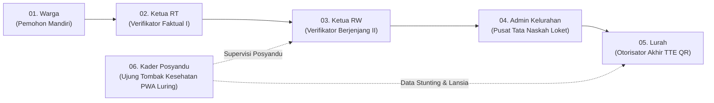
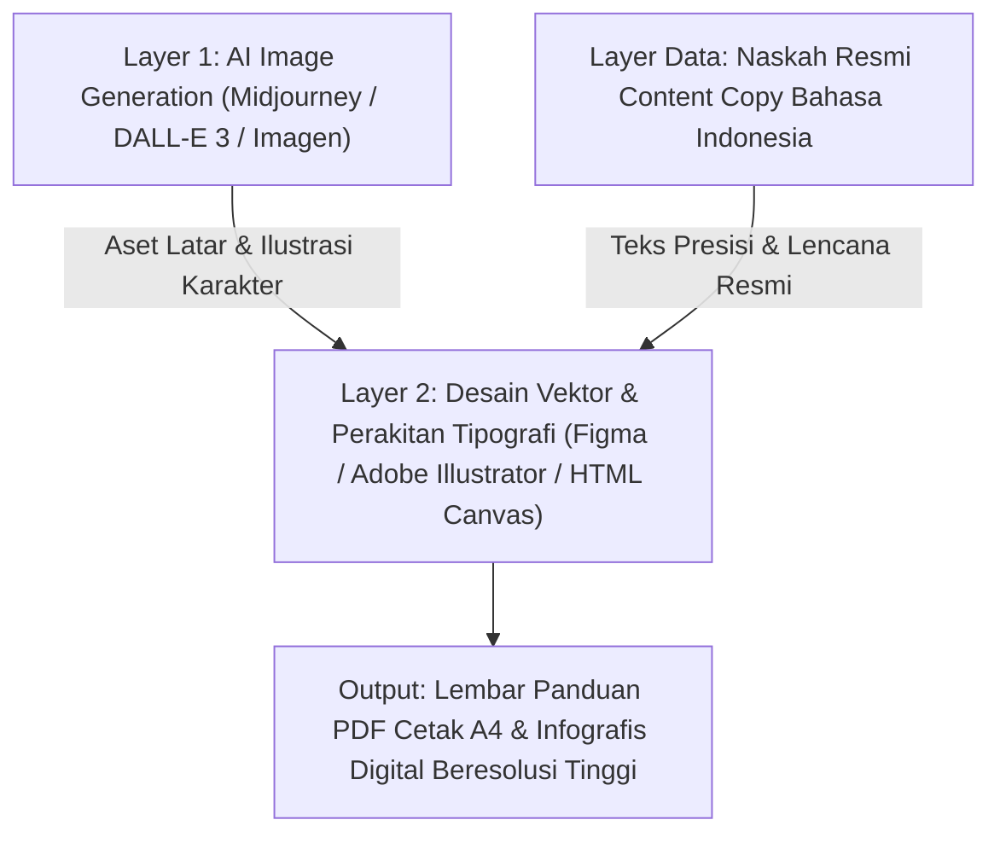

# SISTEM DESAIN VISUAL & REKAYASA PROMPT PENGGUNA BUMI WARGA
**Ekosistem Pelayanan Administrasi Kependudukan & Kesehatan Digital**  
*Pemerintah Kota Sukabumi — Jawa Barat | Edisi Standar 2026*

---

## 📑 LAPORAN ANALISIS DOKUMEN SUMBER & MODEL ALUR KERJA

### 1. Inventarisasi Dokumen Sumber Resmi
Seluruh spesifikasi, peran, alur kerja, batasan hukum, dan parameter visual diturunkan secara murni dari 7 dokumen sumber tanpa rekayasa data asumtif:
1. `INDEX_USER_MODULES.md` — Indeks Resmi Dokumen Modul Pengguna
2. `USER_MODULE_WARGA.md` — Modul Panduan Pengguna: Warga (Pemohon Mandiri)
3. `USER_MODULE_KETUA_RT.md` — Modul Panduan Pengguna: Ketua RT (Verifikator Faktual Tingkat I)
4. `USER_MODULE_KETUA_RW.md` — Modul Panduan Pengguna: Ketua RW (Verifikator Berjenjang Tingkat II)
5. `USER_MODULE_ADMIN_KELURAHAN.md` — Modul Panduan Pengguna: Admin & Petugas Pelayanan Kelurahan
6. `USER_MODULE_LURAH.md` — Modul Panduan Pengguna: Kepala Kelurahan / Lurah (Otorisator TTE)
7. `USER_MODULE_KADER_POSYANDU.md` — Modul Panduan Pengguna: Kader Posyandu (Balita & Lansia)

### 2. Catatan Penyelarasan Dokumen (Source Alignment Notes)
* **Domain Sub-Web**: Dokumen menetapkan pemisahan titik masuk portal: warga masyarakat, RT, RW, dan Posyandu mengakses portal publik `https://bumiwarga.id`, sedangkan Admin Kelurahan dan Lurah mengakses portal kerja intranet kedinasan `https://kelurahan.bumiwarga.id`.
* **Harmonisasi SLA Waktu Layanan**:
  * Ketua RT: Verifikasi faktual maksimal **4 Jam Kerja**.
  * Ketua RW: Validasi kewilayahan & anti-duplikasi maksimal **4 Jam Kerja**.
  * Kelurahan (Admin & Lurah): Penyelesaian naskah dan TTE hingga terbit < **24 Jam**.
  * Total alur pelayanan standar adalah *Same-Day Service* (< 24 jam).
* **Teknologi Penyimpanan Luring (Offline)**: Pada `USER_MODULE_KADER_POSYANDU.md`, penyimpanan luring gawai secara spesifik didefinisikan menggunakan memori lokal browser (**IndexedDB Browser**) dengan indikator banner status online/offline otomatis.

---

## A. MASTER VISUAL DESIGN SYSTEM (BUMI WARGA CIVIC DESIGN)

### 1. Filosofi & Arah Gaya Visual
* **Karakter Utama**: Layanan Publik Pemerintahan Modern (*Modern Civic Digital Service*), humanis, berwibawa, terpercaya (*trustworthy*), inklusif, bersih (*clean*), informatif, dan berakar pada konteks sosial kemasyarakatan perkotaan/suburban Jawa Barat (Kota Sukabumi).
* **Pendekatan Ilustrasi**: *Semi-Realistic Clean Editorial Flat Illustration* berpadu dengan aksen isometrik mikro dan elemen antarmuka digital (UI cards) beresolusi tajam.
* **Larangan Estetika (Strictly Avoided)**:
  * Gaya kartun anak-anak / karikatur berlebihan (*childish cartoon*).
  * Distopia cyberpunk, neon berlebihan, fiksi ilmiah futuristik yang tidak realistis.
  * Tampilan foto stok korporat kaku (*generic corporate stock photos*).
  * Dekorasi ornamental tanpa fungsi semantik (*visual clutter/noise*).

### 2. Master Color System & Aksesibilitas Kontras
Sistem warna mengacu pada identitas resmi SPBE Jawa Barat dan tata naskah dinas:
* **Primary Civic Blue** (`#1E3A8A` / `#0284C7`): Simbol kepercayaan publik, otoritas hukum, dan ketertiban administrasi.
* **Secondary Slate Navy** (`#0F172A` / `#334155`): Warna dasar tipografi, bingkai naskah dinas, dan struktur tata letak.
* **Civic Surface / Background** (`#F8FAFC` / `#FFFFFF`): Latar kanvas bersih dan ramah mata.
* **Functional Semantic Colors**:
  * **Success Emerald** (`#059669`): Status "SELESAI", verifikasi NIK valid, persetujuan naskah, gizi balita normal.
  * **Warning / Action Amber** (`#D97706`): Status "Menunggu Verifikasi", perbaikan berkas, balita berisiko stunting, mode luring PWA.
  * **Alert / Rejection Crimson** (`#DC2626`): Penolakan warga fiktif, stunting akut, peringatan cacat dokumen, pelanggaran UU PDP.
* **Role Accent Variasi Halus (Subtle Accents)**:
  * **Warga**: *Azure Sky Blue* (`#0284C7`) — Inklusivitas dan kemudahan mandiri.
  * **Ketua RT**: *Community Teal* (`#0D9488`) — Kedekatan rukun tetangga dan verifikasi lapangan.
  * **Ketua RW**: *Indigo Authority* (`#4F46E5`) — Koordinasi wilayah dan supervisi berjenjang.
  * **Admin Kelurahan**: *Steel Blue* (`#2563EB`) — Presisi administrasi naskah dinas dan registrasi data.
  * **Lurah**: *Executive Deep Royal Navy with Gold Seal Accent* (`#1E1B4B` & `#D97706`) — Wewenang hukum dan TTE.
  * **Kader Posyandu**: *Healthcare Coral Rose* (`#E11D48` & `#059669`) — Pelayanan kesehatan primer, gizi balita, dan lansia.

### 3. Tipografi & Tata Letak Hierarki
* **Display / Judul Ekosistem**: Modern Geometris Sans-Serif (Inter, Plus Jakarta Sans, Roboto) dengan bobot *Bold / Semi-Bold*.
* **Teks Bodi & Keterangan**: Clean Sans-Serif dengan keterbacaan tinggi (*high legibility*), rasio baris 1.5.
* **Elemen Pengenal Resmi (Official Identifiers)**: Font *Monospace* (JetBrains Mono / Roboto Mono) untuk NIK (16 digit), No KK, Kode Klasifikasi Surat Dinas (`470/142-Kel.Cbr/2026`), dan Segel TTE QR Code.

### 4. Standar Desain Karakter & Lingkungan Nyata
* **Karakter**: Proporsi anatomi manusia realistis, berpakaian dinas/masyarakat Indonesia yang sopan dan representatif:
  * Warga: Pakaian harian kasual rapi di lingkungan rumah tinggal.
  * Ketua RT/RW: Pakaian batik nusantara rapi atau kemeja kasual formal dengan ID card/lencana lingkungan.
  * Admin Kelurahan: Seragam dinas aparatur sipil daerah (khaki PNS / kemeja putih berdasi/dinas).
  * Lurah: Pakaian dinas harian (PDH) resmi pimpinan kelurahan di meja kerja eksekutif.
  * Kader Posyandu: Rompi/seragam kader kesehatan Posyandu khas bernuansa hijau/toska/merah muda dengan pita meteran antropometri.
* **Lingkungan**: Menggambarkan kondisi riil pelayanan: rumah warga dengan gawai smartphone, pos ronda/balai warga RT/RW, meja loket kelurahan dengan komputer dan cap agenda, ruang kerja lurah berbendera merah putih, dan pos pelayanan posyandu balita/lansia.

---

## B. MASTER IMAGE PROMPT TEMPLATE

```text
[SYSTEM IDENTITY]: Official Visual Role Guide for Bumi Warga (WK Community OS), Government Digital Service Ecosystem of Kota Sukabumi, West Java.
[ROLE & NUMBER]: {ROLE_NAME} (Role Guide #{ROLE_ID})
[PURPOSE]: Professional civic educational infographic and visual storytelling poster depicting {ROLE_PURPOSE}.
[SUBJECT & ACTION]: Highly detailed, dignified, realistic Indonesian civic character ({CHARACTER_DESCRIPTION}) engaged in {PRIMARY_ACTION} using {PRIMARY_DEVICE_OR_TOOL}.
[ENVIRONMENT]: Authentic Indonesian public service context: {ENVIRONMENT_CONTEXT}, bathed in clean, bright natural daytime illumination.
[WORKFLOW VISUALIZATION]: Step-by-step horizontal or vertical procedural pipeline showing: {WORKFLOW_STEPS}, connected by subtle civic directional arrows.
[UI & METRIC CARDS]: Clean, razor-sharp digital interface cards showing {UI_ELEMENTS}, status badges with rounded corners, and official data indicators.
[INFORMATION HIERARCHY]: 
  - Primary (P0 - Immediate Sight): Role Title, Critical Verification Action, Safety/SLA Badge.
  - Secondary (P1 - Core Content): 3-step decision flow, responsibilities cards, and primary device screen.
  - Tertiary (P2/P3 - Contextual): Supporting checklists, environmental props, and official institutional footer.
[COMPOSITION & GRID]: Balanced A4/16:9 infographic poster layout, professional grid structure, clear 25% negative space margins dedicated as text-safe zone.
[ILLUSTRATION STYLE]: Contemporary Indonesian government editorial vector illustration, semi-realistic human proportions, crisp vector outlines, gentle ambient occlusion shadows, flat design with micro-depth gradients, zero visual clutter.
[ICONOGRAPHY & BADGES]: Minimalist civic icon set ({ICON_SET_LIST}), uniform 2px stroke weight, high semantic clarity.
[COLOR PALETTE]: Master Civic Blue (#1E3A8A, #0284C7), Clean Background (#F8FAFC, #FFFFFF), Slate Navy typography (#0F172A), Functional Accents (Emerald Green #059669 for success/approval, Amber #D97706 for review/SLA, Crimson #DC2626 for rejection/alert), with specific Role Accent: {ROLE_ACCENT_COLOR}.
[ACCESSIBILITY]: WCAG AAA contrast compliance, bold visual grouping, easily decipherable icons and flow direction for non-technical community users.
[OUTPUT FORMAT]: Vertical A4 Infographic Layout (Aspect Ratio 3:4 or 4:5), high resolution, vector-grade sharpness, print-ready digital manual asset.
[NEGATIVE PROMPT]: {ROLE_NEGATIVE_PROMPT}
```

---

## C. SPESIFIKASI STRUKTURAL 6 PERAN PENGGUNA (ROLE SPECIFICATIONS)



---

### ROLE 01: WARGA (PEMOHON PELAYANAN MANDIRI)

* **ROLE**: Warga Masyarakat (Pemohon Pelayanan Mandiri)
* **ROLE PURPOSE**: Memfasilitasi warga mengurus permohonan surat administrasi kependudukan, memantau bantuan sosial, rekam kesehatan keluarga di Posyandu, dan pengaduan lingkungan secara mandiri dari gawai tanpa perlu antre di kelurahan.
* **PRIMARY RESPONSIBILITIES**:
  1. Login mandiri menggunakan 16 digit NIK dan kata sandi aman (wajib ganti kata sandi awal).
  2. Pengajuan surat online (SKCK, SKU, Domisili, Belum Menikah, SKTM, Kematian, Pengantar Nikah N1-N4).
  3. Mengunggah foto KTP-el dan Kartu Keluarga yang tajam, utuh 4 sudut, dan bebas pantulan lampu (*glare*).
  4. Memantau riwayat proses persetujuan dan mengunduh berkas surat PDF resmi bertanda TTE.
* **KEY FEATURES**: Dasbor Warga, Pelayanan Surat (Ajukan Baru & Riwayat), Bantuan Sosial (Cek Desil 1-10 & Riwayat Penyaluran), Kesehatan Keluarga (KMS Balita & Lansia), Pengaduan Warga (Upload Foto Masalah Lingkungan).
* **WORKFLOW**: Buka Menu Surat &rarr; Pilih Jenis Surat & Isi Keperluan &rarr; Unggah KTP-el & KK &rarr; Periksa Ringkasan & Kirim &rarr; Pantau Lencana Status (🟡 Menunggu RT &rarr; 🔵 Menunggu RW &rarr; 🟣 Proses Kelurahan &rarr; 🟢 Selesai) &rarr; Terima PDF via WhatsApp / Unduh di Aplikasi.
* **CRITICAL REQUIREMENTS**:
  - Foto KTP-el harus tajam, NIK dan Nama terbaca jelas.
  - Keempat sudut kartu KTP dan KK wajib terlihat dalam bingkai (tidak terpotong).
  - Nomor WhatsApp terdaftar wajib aktif untuk menerima dokumen resmi.
* **SECURITY**: Wajib ganti kata sandi awal minimal 8 karakter (kombinasi huruf besar, kecil, angka); dilarang membagikan kata sandi atau kode OTP kepada siapa pun.
* **PRIVACY**: Akses data terisolasi hanya untuk anggota dalam satu Kartu Keluarga; log unggahan tersimpan permanen.
* **SLA**: Waktu tindak lanjut keseluruhan hingga terbit surat PDF resmi < 24 jam kerja.
* **WARNINGS**: Dilarang mengunggah berkas palsu/rekayasa editan; sistem mendeteksi dan mencatat jejak audit manipulasi dokumen.
* **COMMON ERRORS**: Foto KTP buram, NIK salah ketik, foto terpotong sudutnya, lupa kata sandi setelah salah 3x.
* **DEPENDENCIES**: Ketua RT (tahap verifikasi 1) &rarr; Ketua RW (tahap verifikasi 2) &rarr; Admin Kelurahan (tata naskah) &rarr; Lurah (pengesahan TTE).
* **VISUAL SUBJECTS**: Sosok warga Indonesia (pria/wanita dewasa ramah, pakaian kasual rapi) tersenyum percaya diri memegang smartphone berlayar aplikasi Bumi Warga, berlatar ruang keluarga rumah yang nyaman.
* **VISUAL METAPHORS**: Dokumen digital meluncur mulus ke ponsel pintar, simbol perisai keamanan NIK, kartu digital terverifikasi.
* **UI ELEMENTS**: Kartu status permohonan dengan lencana hijau 🟢 "Selesai - Siap Unduh", ikon WhatsApp pengiriman PDF, kartu desil keluarga, checklist 4 sudut KTP.
* **ICON SET**: `smartphone`, `file-text`, `check-circle`, `clock`, `shield-check`, `user`, `heart-pulse`, `message-square`.
* **COLOR ACCENT**: *Azure Sky Blue* (`#0284C7`) dipadu *Emerald Green* (`#059669`).
* **INFORMATION HIERARCHY**: P0: Checklist Kejernihan KTP & Notifikasi PDF WhatsApp; P1: Alur Pengajuan Surat Mandiri; P2: Cek Bansos & Posyandu; P3: Tata Cara Reset Password.
* **TEXT-SAFE AREAS**: Sisi kanan atas untuk kartu instruksi dokumen dan sisi bawah untuk alur lencana status.
* **NEGATIVE ELEMENTS**: Antrean loket fisik berdesak-desakan, dokumen kertas bertumpuk kusam, KTP buram/rusak, ekspresi wajah bingung/stres.

---

### ROLE 02: KETUA RT (RUKUN TETANGGA)

* **ROLE**: Ketua RT (Verifikator Faktual Tingkat Pertama)
* **ROLE PURPOSE**: Menjalankan meja kerja digital garda terdepan untuk memastikan kebenaran fisik domisili pemohon, keabsahan dokumen warga di wilayah rukun tetangga, dan mencegah permohonan fiktif.
* **PRIMARY RESPONSIBILITIES**:
  1. Memeriksa antrean surat masuk warga berdasarkan prinsip *First-In, First-Out*.
  2. Melakukan uji 4 kriteria faktual: domisili riil warga, kejernihan dokumen KTP/KK, peruntukan surat, dan kesesuaian khusus (kematian / SKTM).
  3. Mengambil keputusan: Setujui & Teruskan ke RW, Kembalikan dengan Catatan, atau Tolak Permohonan.
  4. Mengelola dan mengeskalasi laporan aduan lingkungan RT.
* **KEY FEATURES**: Dasbor Ringkasan RT, Antrean Surat Masuk RT, Pangkalan Data Warga RT, Monitoring Bansos RT, Pengaduan Warga RT.
* **WORKFLOW**: Buka Antrean Masuk &rarr; Buka Rincian Berkas &rarr; Uji Kelayakan 4 Kriteria Faktual &rarr; Klik Tombol Keputusan (Hijau: Setujui ke RW | Oranye: Kembalikan Berkas | Merah: Tolak) &rarr; Sistem Mengirimkan Notifikasi ke RW atau Koreksi ke Warga.
* **CRITICAL REQUIREMENTS**:
  - Batas waktu periksa (SLA): **Maksimal 4 Jam Kerja**.
  - Wajib memastikan pemohon benar-benar warga yang tinggal fisik di wilayah RT bersangkutan.
  - Untuk SKTM: hanya disetujui untuk keluarga prasejahtera yang berhak.
* **SECURITY**: Akun kedinasan RT memiliki kekuatan hukum; dilarang meminjamkan akun dan password ke orang lain; wajib ganti password berkala (90 hari).
* **PRIVACY**: Menjaga kerahasiaan berkas kependudukan dan rekam medis/sosial warga rukun tetangga.
* **SLA**: **Maksimal 4 Jam Kerja per berkas**.
* **WARNINGS**:
  - Dilarang memberikan persetujuan berkas warga fiktif / tidak bertempat tinggal nyata.
  - **Pencegahan Pungli & Gratifikasi**: Seluruh persetujuan surat pengantar RT adalah **GRATIS 100% tanpa biaya tambahan**.
* **COMMON ERRORS**: Menunda pemeriksaan berkas lebih dari 4 jam, menyetujui foto KTP yang buram tanpa meminta perbaikan.
* **DEPENDENCIES**: Menerima pengajuan dari Warga &rarr; Meneruskan hasil verifikasi sah ke Ketua RW.
* **VISUAL SUBJECTS**: Sosok Ketua RT (tokoh masyarakat pria/wanita paruh baya berwibawa, mengenakan kemeja batik rapi dan kacamata) sedang meneliti tablet/laptop kerja di pos balai RT dengan latar papan peta RT dan bendera merah putih kecil.
* **VISUAL METAPHORS**: Kaca pembesar verifikasi dokumen, cap jempol persetujuan digital, lampu hijau penerusan berkas, gembok integritas anti-pungli.
* **UI ELEMENTS**: Meja kerja antrean surat RT, 3 tombol aksi (*Setujui*, *Kembalikan*, *Tolak*), timer SLA 4 Jam, checklist 4 kriteria faktual.
* **ICON SET**: `clipboard-check`, `user-check`, `clock-alert`, `home`, `map-pin`, `x-circle`, `check-circle-2`, `ban`.
* **COLOR ACCENT**: *Community Teal* (`#0D9488`) dipadu *Emerald Green* (`#059669`) dan *Amber* (`#D97706`).
* **INFORMATION HIERARCHY**: P0: Peringatan SLA 4 Jam & 4 Uji Kriteria Faktual; P1: 3 Tombol Keputusan; P2: Manajemen Pengaduan RT; P3: Registrasi Warga.
* **TEXT-SAFE AREAS**: Kuadran kanan tengah untuk tabel 4 kriteria verifikasi dan kuadran bawah untuk 3 tombol keputusan.
* **NEGATIVE ELEMENTS**: Uang suap/amplop, pungli, berkas berserakan tidak teratur, tanda tangan basah di kertas lusuh, stempel manual tinta tumpah.

---

### ROLE 03: KETUA RW (RUKUN WARGA)

* **ROLE**: Ketua RW (Koordinator Kewilayahan & Verifikator Berjenjang Tingkat Kedua)
* **ROLE PURPOSE**: Mengoordinasikan unit-unit RT di wilayahnya, memvalidasi berkas terusan RT, menyaring potensi pengajuan ganda (*anti-duplicate*), mengawasi ketepatan bansos desil, dan mensupervisi Posyandu RW.
* **PRIMARY RESPONSIBILITIES**:
  1. Memeriksa antrean surat terverifikasi RT di wilayah naungan RW.
  2. Evaluasi 3 parameter kritis: validasi batas kewilayahan RT, pencegahan permohonan ganda (kurun 7 hari), dan integritas kelengkapan dokumen.
  3. Memutuskan persetujuan naskah ke kelurahan atau pengembalian korektif.
  4. Pengawasan bantuan sosial berbasis desil (prioritas Desil 1-3) dan supervisi jadwal/capaian Posyandu RW.
* **KEY FEATURES**: Dasbor Ringkasan Kewilayahan RW, Antrean Surat Terverifikasi RT, Pusat Monitoring Bansos RW, Supervisi Posyandu RW, Pusat Eskalasi Pengaduan RW.
* **WORKFLOW**: Buka Antrean Pengantar RT &rarr; Telaah Catatan RT & Dokumen &rarr; Uji 3 Parameter (Batas Wilayah, Anti-Duplikasi 7 Hari, Kelengkapan) &rarr; Setujui ke Kelurahan atau Kembalikan ke RT/Warga &rarr; Berkas Masuk Loket Kelurahan.
* **CRITICAL REQUIREMENTS**:
  - Batas waktu periksa (SLA): **Maksimal 4 Jam Kerja**.
  - Pengecekan riwayat pengajuan pemohon dalam 7 hari terakhir guna mencegah duplikasi naskah di kelurahan.
  - Menjaga netralitas dan keadilan antar seluruh RT binaan.
* **SECURITY**: Kredensial mengontrol multi-RT; wajib logout pada perangkat bersama; proteksi autentikasi ganda.
* **PRIVACY**: Menjaga kerahasiaan sebaran keluarga prasejahtera dan rekap kesehatan lingkungan RW.
* **SLA**: **Maksimal 4 Jam Kerja per berkas**.
* **WARNINGS**:
  - Dilarang meloloskan berkas dari RT di luar yurisdiksi RW resmi.
  - Jangan biarkan berkas menumpuk melebihi 4 jam kerja.
* **COMMON ERRORS**: Mengabaikan peringatan sistem terkait permohonan ganda NIK yang sama dalam 7 hari.
* **DEPENDENCIES**: Menerima berkas terusan dari Ketua RT &rarr; Meneruskan ke Loket Admin Kelurahan; berkoordinasi dengan Kader Posyandu RW.
* **VISUAL SUBJECTS**: Sosok Ketua RW (figur pimpinan lingkungan senior berwibawa, pakaian batik dinas elegan) sedang memeriksa dasbor analitik kewilayahan pada layar monitor terstruktur, berlatar kantor sekretariat RW yang rapi dan tertib.
* **VISUAL METAPHORS**: Jembatan koordinasi RT-Kelurahan, filter anti-duplikasi ganda, peta matriks cakupan wilayah, neraca keadilan sosial.
* **UI ELEMENTS**: Matriks daftar RT pengusul, filter deteksi permohonan 7 hari terakhir, indikator kuota bansos Desil 1-3, tombol persetujuan hijau ke kelurahan.
* **ICON SET**: `network`, `layers`, `shield-alert`, `copy-slash`, `users`, `gift`, `activity`, `corner-up-right`.
* **COLOR ACCENT**: *Indigo Authority* (`#4F46E5`) dipadu *Navy Blue* (`#1E3A8A`).
* **INFORMATION HIERARCHY**: P0: Peringatan SLA 4 Jam & Filter Anti-Duplikasi 7 Hari; P1: 3 Parameter Uji RW & Tombol Teruskan ke Kelurahan; P2: Pengawasan Bansos Desil; P3: Jadwal Posyandu RW.
* **TEXT-SAFE AREAS**: Bagian tengah horizontal untuk alur pengujian 3 parameter dan bagian sudut kanan bawah untuk metrik bansos.
* **NEGATIVE ELEMENTS**: Keputusan diskriminatif/nepotisme, berkas rangkap berulang, tampilan UI kacau tanpa diagram RT.

---

### ROLE 04: ADMIN & PETUGAS PELAYANAN KELURAHAN

* **ROLE**: Admin / Petugas Pelayanan Kelurahan (Pusat Tata Naskah Dinas & Loket Digital)
* **ROLE PURPOSE**: Mengelola operasional tata naskah dinas kedinasan kelurahan, sinkronisasi NIK pangkalan data Dukcapil, penomoran agenda otomatis, pratinjau draf PDF resmi, dan penyaluran bansos bebas pungli.
* **PRIMARY RESPONSIBILITIES**:
  1. Meneliti keabsahan berkas yang lolos verifikasi RW.
  2. Memeriksa sinkronisasi NIK Dukcapil pangkalan data kelurahan.
  3. Menerbitkan nomor agenda surat dinas otomatis sesuai tata naskah kota (misal: `470/142-Kel.Cbr/2026`).
  4. Memeriksa pratinjau draf PDF dan mengajukan otorisasi TTE ke meja Lurah.
  5. Konfirmasi serah terima bansos fisik (verifikasi KTP asli & kirim notifikasi tanda terima WA).
* **KEY FEATURES**: Dasbor Pelayanan Terpadu, Antrean Permohonan Surat Masuk, Pangkalan Data Kependudukan Kelurahan, Pusat Verifikasi Bantuan Sosial, Manajemen Arsip Digital.
* **WORKFLOW**: Buka Antrean Terverifikasi RW &rarr; Periksa Lencana Sinkronisasi NIK Dukcapil &rarr; Generate Nomor Surat Otomatis & Telaah Pratinjau Draf PDF &rarr; Klik "Ajukan Otorisasi TTE Lurah" (atau Kembalikan Berkas) &rarr; Pasca TTE: PDF Terkirim Otomatis via WhatsApp & Tersimpan di Arsip Digital.
* **CRITICAL REQUIREMENTS**:
  - Kepatuhan Mutlak **UU Pelindungan Data Pribadi (UU No. 27/2022)**: Dilarang menyebarkan/memotret data pribadi warga.
  - **Dilarang Mengubah Nomor Surat secara Manual**: Wajib menggunakan penomoran otomatis sistem buku agenda dinas.
  - Kepatuhan SLA Penyelesaian Layanan: **Kurang dari 24 Jam Kerja**.
* **SECURITY**: Setiap klik, buka berkas, dan persetujuan dicatat permanen dalam *Audit Log* kedinasan pemerintah; akses terbatas jaringan dinas.
* **PRIVACY**: Hak akses data kependudukan skala kelurahan di bawah sumpah jabatan dinas.
* **SLA**: **Layanan selesai dalam hari kerja yang sama (< 24 Jam)**.
* **WARNINGS**: Dilarang membuat nomor surat manual di luar sistem; dilarang menyetujui naskah tanpa pratinjau redaksional; seluruh aktivitas terpantau sistem audit.
* **COMMON ERRORS**: Salah memilih kode klasifikasi naskah, tidak meneliti pratinjau draf sehingga ada redaksi yang ambigu.
* **DEPENDENCIES**: Menerima berkas dari Ketua RW &rarr; Mengajukan naskah ke Lurah &rarr; Modul WhatsApp Gateway otomatis mengirim PDF ke Warga.
* **VISUAL SUBJECTS**: Petugas pelayanan kelurahan (wanita/pria muda berseragam dinas aparatur sipil putih/khaki rapi) duduk profesional di meja loket digital modern, menghadap komputer kerja dengan layar antarmuka penomoran surat otomatis dan arsip digital.
* **VISUAL METAPHORS**: Buku agenda dinas digital otomatis, stempel sistem tata naskah, brankas arsip digital *paperless*, integrasi jaringan Dukcapil.
* **UI ELEMENTS**: Layar loket terpadu, pratinjau draf PDF berkop resmi Pemkot Sukabumi, generator kode naskah `470/...`, tombol "Ajukan TTE Lurah", log audit aktivitas.
* **ICON SET**: `building-2`, `database`, `file-check-2`, `hash`, `send`, `lock`, `eye`, `archive`.
* **COLOR ACCENT**: *Steel Blue* (`#2563EB`) dipadu *Slate Gray* (`#475569`).
* **INFORMATION HIERARCHY**: P0: Kepatuhan UU PDP & Larangan Nomor Manual; P1: Alur Loket & Penomoran Otomatis Naskah Dinas; P2: Penyaluran Bansos Anti-Pungli; P3: Arsip Digital PDF.
* **TEXT-SAFE AREAS**: Area kanan layar untuk pratinjau format naskah dinas dan area bawah untuk peringatan kepatuhan UU PDP.
* **NEGATIVE ELEMENTS**: Mesin ketik manual usang, tumpukan kertas map kuning berdebu, nomor surat ditulis tangan pensil, flashdisk tidak resmi.

---

### ROLE 05: KEPALA KELURAHAN / LURAH

* **ROLE**: Kepala Kelurahan / Lurah (Pimpinan Eksekutif & Otorisator TTE)
* **ROLE PURPOSE**: Memberikan penelaahan akhir dan pengesahan sah naskah dinas publik menggunakan Tanda Tangan Elektronik (TTE) QR Code Kriptografis berbasis PIN rahasia, serta mengawasi mutu SLA birokrasi, kemiskinan ekstrem, dan stunting.
* **PRIMARY RESPONSIBILITIES**:
  1. Menelaah pratinjau naskah dinas yang telah disiapkan secara berjenjang (RT &rarr; RW &rarr; Admin).
  2. Membubuhkan Tanda Tangan Elektronik (TTE) resmi menggunakan PIN Otorisasi Kedinasan.
  3. Mengembalikan naskah ke admin loket apabila ada koreksi klausul atau redaksional.
  4. Pengawasan strategis mutu pelayanan publik (SLA Monitor < 24 jam).
  5. Pengawasan akurasi alokasi bansos (prioritas Desil 1) dan intervensi percepatan penurunan stunting.
* **KEY FEATURES**: Dasbor Eksekutif Kelurahan (SLA Monitor, Antrean TTE, Indeks IKM), Meja Pengesahan Surat (Antrean TTE), Analitik Kemiskinan & Bansos, Dasbor Stunting Kelurahan, Log Audit & Validasi Dokumen.
* **WORKFLOW**: Buka Antrean TTE &rarr; Pratinjau Naskah Dinas Lengkap & Riwayat Paraf RT/RW &rarr; Klik "Sahkan Dokumen (TTE)" &rarr; Masukkan PIN Otorisasi Rahasia &rarr; Sistem Menyematkan QR Code Kriptografis & Status SELESAI &rarr; PDF Resmi Otomatis Terkirim ke WhatsApp Warga.
* **CRITICAL REQUIREMENTS**:
  - **Kerahasiaan PIN Otorisasi TTE**: DILARANG KERAS membagikan PIN kepada staf/pihak mana pun; TTE membawa tanggung jawab hukum pejabat negara.
  - Pemantauan ketat terhadap permohonan yang tertahan lebih dari 4 jam di meja RT/RW.
* **SECURITY**: Otentikasi kriptografis tingkat tinggi; segel digital QR Code tahan pemalsuan; riwayat scan verifikasi pihak eksternal (Perbankan, Kepolisian, BPJS) tercatat di log audit.
* **PRIVACY**: Tanggung jawab kerahasiaan dokumen kedinasan setingkat kepala wilayah kelurahan.
* **SLA**: **Pengesahan surat selesai dalam < 24 Jam** (dapat diakses fleksibel melalui smartphone/tablet di mana pun).
* **WARNINGS**: Setiap pembubuhan TTE mengikat secara administratif dan hukum; jangan pernah mengesahkan dokumen tanpa memeriksa pratinjau.
* **COMMON ERRORS**: Membagikan PIN TTE kepada operator/staf loket, mengabaikan antrean merah di monitor SLA.
* **DEPENDENCIES**: Menerima draf naskah yang diajukan oleh Admin Loket Kelurahan &rarr; Mengesahkan dokumen akhir yang langsung diterima Warga.
* **VISUAL SUBJECTS**: Sosok Lurah (pejabat eksekutif pria/wanita matang berwibawa, mengenakan Pakaian Dinas Harian/PDH resmi aparatur daerah lengkap dengan lencana jabatan) menandatangani dokumen digital pada tablet kedinasan, di ruang kerja eksekutif kelurahan berlatar lambang garuda dan bendera merah putih.
* **VISUAL METAPHORS**: Segel stempel garuda digital emas, gembok PIN kriptografis, pancaran QR code keaslian dokumen, dasbor komando eksekutif.
* **UI ELEMENTS**: Antrean TTE eksekutif, dialog input PIN Otorisasi, pratinjau naskah berkop resmi dengan QR Code di kaki surat, gauge monitor SLA hijau < 24 jam.
* **ICON SET**: `award`, `qr-code`, `key`, `shield-check`, `file-signature`, `bar-chart-3`, `landmark`, `check-check`.
* **COLOR ACCENT**: *Executive Deep Royal Navy* (`#1E1B4B`) dengan aksen *Gold Seal* (`#D97706`).
* **INFORMATION HIERARCHY**: P0: Otorisasi PIN Rahasia & Tanggung Jawab Hukum TTE; P1: Alur Pengesahan 1-Klik TTE QR Code; P2: Monitor SLA Eksekutif < 24 Jam; P3: Analitik Bansos Desil 1 & Stunting.
* **TEXT-SAFE AREAS**: Bagian tengah bawah untuk dialog PIN otorisasi dan bagian kanan untuk kartu monitor analitik SLA.
* **NEGATIVE ELEMENTS**: Pulpen basah bocor, stempel kayu manual tinta merah berceceran, staf mengetikkan PIN untuk pimpinan, dokumen menumpuk berhari-hari.

---

### ROLE 06: KADER POSYANDU (BALITA & LANSIA)

* **ROLE**: Kader Posyandu (Balita & Lansia — Ujung Tombak Kesehatan Primer)
* **ROLE PURPOSE**: Melakukan pencatatan pengukuran tumbuh kembang balita (antropometri) dan skrining Penyakit Tidak Menular (PTM) lansia secara cepat di pos lingkungan, mendeteksi risiko stunting otomatis, serta tetap dapat beroperasi lancar tanpa internet (*Offline-First PWA*).
* **PRIMARY RESPONSIBILITIES**:
  1. Instalasi mandiri aplikasi PWA di layar utama smartphone kader.
  2. Input pengukuran fisik balita (Berat Badan, Tinggi Badan, Lingkar Kepala, Lingkar Lengan Atas) serta pemberian vitamin A/imunisasi.
  3. Evaluasi otomatis status gizi balita (Normal, Berisiko Stunting, Stunting Akut rujukan Puskesmas).
  4. Pencatatan skrining lansia (Tensi Darah, Gula Darah Sewaktu, Asam Urat, Kolesterol, IMT).
  5. Menjalankan operasional mode luring (*Offline PWA*) saat tidak ada sinyal internet dan melakukan *auto-sync* saat sinyal pulih.
* **KEY FEATURES**: Dasbor Posyandu RW, Layanan Balita (Antropometri & KMS), Layanan Lansia (Skrining PTM), Banner Indikator Jaringan (Online Hijau / Offline Kuning).
* **WORKFLOW**: Buka PWA di Ponsel &rarr; Deteksi Status Jaringan (Online / Mode Luring Aktif) &rarr; Input Antropometri Balita (BB, TB, LK, LiLA terkalibrasi) & Skrining Lansia &rarr; Sistem Kalkulasi Otomatis Z-Score & Status Gizi &rarr; Data Tersimpan di IndexedDB Ponsel &rarr; Kader Terhubung Internet &rarr; Sistem Otomatis Mengunggah Seluruh Data ke Server (Auto Flush).
* **CRITICAL REQUIREMENTS**:
  - **Kalibrasi Alat Timbang**: Pastikan timbangan digital menunjukkan angka `0.00` sebelum balita ditimbang.
  - **Dilarang Clear Browser Cache**: Jangan membersihkan cache/riwayat browser saat masih ada data tersimpan di mode offline yang belum tersinkronisasi.
  - Ketelitian pencocokan nama balita dan nama ibu kandung.
* **SECURITY**: Autentikasi akun kader terikat dengan wilayah Posyandu RW setempat.
* **PRIVACY**: Kerahasiaan data rekam medik antropometri anak dan riwayat penyakit lansia.
* **SLA**: Sinkronisasi data maksimal 1x24 jam setelah kegiatan hari buka Posyandu selesai.
* **WARNINGS**: Waspada data offline hilang jika cache browser dibersihkan sebelum terhubung internet; pastikan alat ukur terstandarisasi Kemenkes (stadiometer/infantometer).
* **COMMON ERRORS**: Salah memilih balita dengan nama yang mirip, lupa menyalakan koneksi internet setelah pulang dari posyandu untuk sinkronisasi.
* **DEPENDENCIES**: Mengirimkan data balita stunting ke Puskesmas & Lurah &rarr; Berkoordinasi dengan Ketua RW untuk pemberian makanan tambahan (PMT).
* **VISUAL SUBJECTS**: Kader posyandu wanita Indonesia (ramah, mengenakan rompi/seragam kader kesehatan rapi dan jilbab/rambut tertata) sedang memegang smartphone dengan aplikasi PWA Posyandu sambil mendampingi ibu dan balita yang sedang ditimbang di posyandu ceria.
* **VISUAL METAPHORS**: Grafik kurva tumbuh kembang KMS hijau, timbangan digital nol presisi, ikon sinyal offline ke cloud sinkron, pita meteran balita.
* **UI ELEMENTS**: Banner kuning "Mode Luring Aktif (Data Tersimpan Aman)", formulir input antropometri (BB, TB, LK, LiLA), lencana status gizi 🟢 Hijau / 🟡 Kuning / 🔴 Merah, tombol simpan lokal.
* **ICON SET**: `baby`, `heart-pulse`, `wifi-off`, `refresh-cw`, `scale`, `activity`, `clipboard-plus`, `shield-plus`.
* **COLOR ACCENT**: *Healthcare Coral Rose* (`#E11D48`) dipadu *Emerald Green* (`#059669`) dan *Warning Amber* (`#D97706`).
* **INFORMATION HIERARCHY**: P0: Kalibrasi Timbangan & Larangan Hapus Cache Saat Offline; P1: Alur Mode Luring PWA & Auto-Flush; P2: Input Antropometri Balita & Skrining Lansia; P3: Klasifikasi Rujukan Stunting.
* **TEXT-SAFE AREAS**: Bagian atas horizontal untuk banner mode luring dan bagian kanan tengah untuk kartu indikator status gizi.
* **NEGATIVE ELEMENTS**: Timbangan beras dacin berkarat tanpa kalibrasi, jarum suntik menakutkan, balita menangis histeris, ponsel rusak kehabisan baterai.

---

## D. ENAM PROMPT GENERASI GAMBAR FINAL (FINAL AI IMAGE PROMPTS)

### PROMPT 01: USER_MODULE_WARGA
```text
Professional civic educational infographic guide poster for Bumi Warga (WK Community OS), Government Digital Service Ecosystem of Kota Sukabumi, West Java. Role Guide #01: Warga Masyarakat (Pemohon Pelayanan Mandiri). 

Central visual features a dignified, friendly Indonesian citizen (adult male or female, casual-smart attire) in a warm, clean home interior holding a smartphone displaying the Bumi Warga mobile app interface. The screen clearly exhibits an approved civic request card with a vibrant emerald green status badge and an official digital document download indicator. Floating surrounding graphic cards showcase the seamless citizen digital service: an incoming WhatsApp document notification card with PDF icon, a clean document quality checklist emphasizing razor-sharp 16-digit e-KTP photo with all 4 corners visible without glare, and a family social aid welfare desil status widget.

At the base, an illustrative 5-step horizontal procedural pipeline flows with civic blue arrow connectors: (1) Select Certificate Type, (2) Fill Purpose & Attach Documents, (3) Automated System Validation, (4) Multi-tier RT/RW Review, (5) Instant Official PDF Delivery via WhatsApp. 

Style: Contemporary Indonesian editorial vector illustration, semi-realistic human anatomy, clean outlines, micro-depth lighting, master civic palette of deep civic blue (#1E3A8A), sky blue (#0284C7), emerald green (#059669), and pristine white (#FFFFFF). 

Composition: Vertical A4 layout (3:4 ratio), strictly balanced visual hierarchy, dedicated 25% negative space zones reserved for Indonesian typography overlays. High-resolution, vector-grade finish, zero clutter, accessible civic public-service design.
```

### PROMPT 02: USER_MODULE_KETUA_RT
```text
Professional civic educational infographic guide poster for Bumi Warga (WK Community OS), Government Digital Service Ecosystem of Kota Sukabumi, West Java. Role Guide #02: Ketua RT (Verifikator Faktual Tingkat Pertama).

Central visual features a respected Indonesian neighborhood leader (middle-aged Ketua RT, smart Indonesian batik shirt, eyeglasses) reviewing citizen document applications on a modern tablet at a clean community secretariat desk. The background portrays an authentic Indonesian RT community office with a wall-mounted neighborhood map, structured pinboard, and a modest Indonesian flag. Floating interface panels display the RT Digital Desk: an incoming application queue sorted by FIFO, a glowing SLA warning badge highlighting 'Maksimal 4 Jam Kerja', and a prominent 4-point factual verification checklist: (1) Physical Residential Verification, (2) Document Legibility, (3) Specific Purpose Assessment, (4) Special Case Due Diligence (SKTM & Death Reports).

Below, a distinct decision-making command panel displays three prominent civic action buttons: Green 'Setujui & Teruskan ke RW', Amber 'Kembalikan dengan Catatan Edukatif', and Red 'Tolak Permohonan Fiktif'. A dedicated anti-corruption badge affirms 100% Free Public Service (Tanpa Pungli).

Style: Clean Indonesian public-service editorial vector illustration, natural lighting, community teal accent (#0D9488), master civic navy (#1E3A8A), alert amber (#D97706), and emerald green (#059669). 

Composition: Vertical A4 layout (3:4 ratio), structured visual hierarchy prioritizing SLA and the 4 criteria check, 25% clean text-safe margins for typography placement. Sharp vector details, highly legible icons, professional administrative atmosphere.
```

### PROMPT 03: USER_MODULE_KETUA_RW
```text
Professional civic educational infographic guide poster for Bumi Warga (WK Community OS), Government Digital Service Ecosystem of Kota Sukabumi, West Java. Role Guide #03: Ketua RW (Koordinator Kewilayahan & Verifikator Berjenjang Tingkat Kedua).

Central visual portrays a distinguished Indonesian Community Leader (Ketua RW, dignified senior male, formal dark batik attire) analyzing neighborhood coordination metrics on an ergonomic desktop workstation. The background depicts an organized Rukun Warga administrative hall with statistical wall charts of multiple RT units. Emerging from the workstation screen are crisp floating UI modules: a hierarchical verification queue displaying incoming RT endorsements, a specialized 'Anti-Duplicate Filter' badge preventing duplicate submissions within a 7-day window, and an executive RT jurisdiction boundary validator.

Adjacent informational panels feature the RW Welfare & Health Supervision dashboards: Desil 1–3 Extreme Poverty assistance monitoring and RW Posyandu growth monitoring indicators. A streamlined 3-step decision flow connects the RT endorsement intake to the Kelurahan sub-district administration forwarding step under a strict 'SLA 4 Jam' timekeeper icon.

Style: Authoritative civic vector art, sophisticated indigo authority palette (#4F46E5) blended with municipal deep blue (#1E3A8A), slate navy (#0F172A), and emerald (#059669). 

Composition: Vertical A4 layout (3:4 ratio), crisp grid system, dedicated text-safe negative zones, professional civic icons, high legibility for municipal training documentation.
```

### PROMPT 04: USER_MODULE_ADMIN_KELURAHAN
```text
Professional civic educational infographic guide poster for Bumi Warga (WK Community OS), Government Digital Service Ecosystem of Kota Sukabumi, West Java. Role Guide #04: Admin & Petugas Pelayanan Kelurahan (Pusat Tata Naskah Loket Digital).

Central visual presents a proficient Indonesian civil service officer (female or male civil servant in crisp official khaki/white government uniform) operating an integrated dual-monitor municipal service terminal at a streamlined kelurahan front-office counter. The screen showcases the unified registry system: automated official numbering engine generating formatted decree numbers (e.g., 470/142-Kel.Cbr/2026), live Dukcapil database NIK verification status badge (Green 'NIK Valid & Terdaftar'), and an exact digital preview of the official municipal letter complete with Kota Sukabumi municipal seal header.

A prominent side security panel highlights 'Kepatuhan UU PDP (Data Privacy Compliance)' with an encrypted audit log badge. The procedural workflow illustrates: RW Approved Intake -> Automated Agenda Numbering & PDF Drafting -> Submission to Lurah for Cryptographic TTE -> Instant Automatic WhatsApp Dispatch & Paperless Digital Archiving.

Style: Modern municipal government digital aesthetic, clean vector illustration, steel blue accents (#2563EB), slate gray (#475569), crisp lines, balanced illumination, completely paperless civic desk.

Composition: Vertical A4 layout (3:4 ratio), structured visual compartments, clear 25% whitespace for Indonesian administrative copy, high-definition vector rendering.
```

### PROMPT 05: USER_MODULE_LURAH
```text
Professional civic educational infographic guide poster for Bumi Warga (WK Community OS), Government Digital Service Ecosystem of Kota Sukabumi, West Java. Role Guide #05: Kepala Kelurahan / Lurah (Pimpinan Eksekutif & Otorisator TTE).

Central visual depicts an authoritative, wise Indonesian Head of Sub-District (Lurah, senior municipal leader in official dark regional executive uniform with government insignia and pin) endorsing an official public decree on an executive digital tablet with a stylus. The prestigious executive office features an Indonesian state coat of arms (Garuda) on the wood-paneled wall, national flag, and expansive windows. Expanding from the tablet is a prominent golden holographic seal representing the Cryptographic TTE QR Code, accompanied by a secure 6-digit Secret Authorization PIN input modal.

A floating executive command center dashboard displays two critical strategic gauges: an Executive SLA Monitor (< 24 Jam) tracking sub-district service speed and a Zero Stunting / Extreme Poverty (Desil 1) heatmap. The workflow demonstrates: Final 3-tier Reviewed Document Preview -> Secret PIN Input -> Instant Cryptographic QR Code Stamping -> Automated Distribution to Citizen.

Style: Prestigious, authoritative municipal executive vector art, deep royal navy (#1E1B4B) with regal gold seal accents (#D97706) and emerald approval tags (#059669).

Composition: Vertical A4 layout (3:4 ratio), commanding visual focus on the legal digital signature action, clean text-safe zones, impeccable vector fidelity, no visual clutter.
```

### PROMPT 06: USER_MODULE_KADER_POSYANDU
```text
Professional civic educational infographic guide poster for Bumi Warga (WK Community OS), Government Digital Service Ecosystem of Kota Sukabumi, West Java. Role Guide #06: Kader Posyandu Balita & Lansia (Ujung Tombak Kesehatan Primer PWA).

Central visual shows an energetic, compassionate Indonesian community health volunteer (Kader Posyandu, female, wearing official healthcare volunteer vest and tidy headscarf) operating the Bumi Warga PWA app on a smartphone inside a cheerful, clean community health post (Posyandu). Beside her, a mother and toddler sit near an accurately calibrated digital infant scale displaying 0.00 kg calibration. Across the room, an elderly citizen is having blood pressure checked. 

Prominently featured across the top of the mobile screen is a distinct amber system banner: 'Mode Luring Aktif (Data Tersimpan Aman di Memori HP)' with an offline synchronization queue counter. Floating cards display the automatic WHO growth curve Z-Score evaluator (Green Normal, Yellow Risk, Red Urgent Referral), and an elder chronic disease screening panel. A procedural diagram showcases: Offline Field Entry -> Local Browser Storage -> Auto-flush Background Sync upon reconnecting to internet -> Server Green Status.

Style: Warm, trustworthy community healthcare editorial vector, healthcare coral rose (#E11D48), posyandu green (#059669), warning amber (#D97706), and soft white surface.

Composition: Vertical A4 layout (3:4 ratio), empathetic and precise visual storytelling, 25% negative space margins reserved for technical instructions, sharp vector details.
```

---

## E. ENAM NEGATIVE PROMPTS SPESIFIK (ROLE NEGATIVE PROMPTS)

### NEGATIVE PROMPT — UMUM (INHERITED BY ALL PROMPTS):
```text
childish cartoon, exaggerated caricature, 3d render, low resolution, blurry text, illegible scribbles, deformed hands, extra fingers, distorted facial features, western police badges, fake government logos, fantasy elements, sci-fi cyberpunk armor, neon glow, messy desk, dirty paper piles, crumpled documents, cluttered background, corporate stock photo tropes, unnatural lighting, oversaturated neon colors, chaotic composition.
```

### NEGATIVE PROMPT 01 (WARGA):
```text
(Inherited Common Negatives), long physical office queues, frustrated citizens, crying people, stacks of physical paper files, broken smartphone screens, blurry KTP card, dark shadowy room, informal dirty clothes.
```

### NEGATIVE PROMPT 02 (KETUA RT):
```text
(Inherited Common Negatives), bribery envelope, cash transaction on desk, physical rubber stamps, messy ashtray, dark smoke, handwritten messy notes on torn paper, angry shouting gesture, neglected clock past deadline.
```

### NEGATIVE PROMPT 03 (KETUA RW):
```text
(Inherited Common Negatives), chaotic unorganized office, duplicate paper copies, biased favoritism gestures, isolated unconnected desk, complex gaming monitors, confusing flowchart wires.
```

### NEGATIVE PROMPT 04 (ADMIN KELURAHAN):
```text
(Inherited Common Negatives), manual typewriter, dusty yellow paper archives, USB flash drives scattered, unauthorized smartphone camera pointing at computer screen, correction fluid, non-standard casual t-shirt.
```

### NEGATIVE PROMPT 05 (LURAH):
```text
(Inherited Common Negatives), traditional ink dipping pen, leaking blue ink, dirty red wax seal, assistant typing PIN for the mayor, messy paper backlog, casual informal shirt, empty unverified letter template.
```

### NEGATIVE PROMPT 06 (KADER POSYANDU):
```text
(Inherited Common Negatives), rusty hanging market scale (timbangan dacin berkarat), intimidating medical needles, crying distressed toddler, expired medical instruments, dead battery icon, medical hospital surgical room.
```

---

## F. CONTENT COPY (TEKS INDONESIA RESMI UNTUK FIGMA/INFOGRAFIS)

Berikut adalah naskah resmi Bahasa Indonesia yang wajib ditempatkan pada zona teks aman (*Text-Safe Areas*) saat proses perakitan tata letak di Figma atau aplikasi desain:

```text
================================================================================
KONTEN KOP & IDENTITAS EKOSISTEM (PADA SELURUH MODUL):
================================================================================
Header Utama: BUMI WARGA — SISTEM INFORMASI PELAYANAN PUBLIK DIGITAL
Sub-Header  : Pemerintah Kota Sukabumi — Tata Kelola Lingkungan Berbasis SPBE 2026
Tagline     : "Transparan, Cepat, Akuntabel, dan Terintegrasi Sampai ke Tingkat Rukun Warga"

================================================================================
KONTEN PANDUAN ROLE 01: WARGA MASYARAKAT
================================================================================
Judul Modul: PANDUAN LAYANAN MANDIRI WARGA
P0 — HAL KRITIS DOKUMEN:
• Foto KTP-el Wajib Tajam: 16 digit NIK, Nama, dan Tanggal Lahir harus terbaca sangat jelas tanpa pantulan kilau lampu (glare).
• Foto Utuh 4 Sudut: Keempat sudut fisik KTP-el dan Kartu Keluarga wajib masuk penuh ke dalam bingkai foto (tidak terpotong).
• Nomor WhatsApp Aktif: Surat resmi PDF dan notifikasi status hanya dikirimkan ke nomor WhatsApp yang terdaftar pada akun Anda.
• Keaslian Berkas Mutlak: Dilarang mengunggah berkas editan/palsu. Seluruh riwayat unggahan terekam pada Audit Log kelurahan.

ALUR TIKET LAYANAN SURAT:
1. Ajukan Surat Baru  --> 2. Unggah Syarat KTP/KK --> 3. Verifikasi RT/RW 
4. Otorisasi TTE Lurah --> 5. Terima Dokumen PDF Resmi di WhatsApp

LENCANA STATUS DOKUMEN:
🟡 Menunggu RT | 🔵 Menunggu RW | 🟣 Proses Kelurahan | 🟢 Selesai (Siap Unduh) | 🔴 Perlu Perbaikan

================================================================================
KONTEN PANDUAN ROLE 02: KETUA RT
================================================================================
Judul Modul: PANDUAN MEJA KERJA KETUA RT (VERIFIKATOR FAKTUAL I)
P0 — PERINGATAN SLA & INTEGRITAS:
• Batas Waktu Layanan (SLA): Maksimal 4 Jam Kerja per berkas agar tidak menghambat rantai pelayanan kelurahan.
• Bebas Pungli 100%: Seluruh pengurusan surat pengantar RT di aplikasi Bumi Warga adalah GRATIS tanpa pungutan biaya apa pun.
• Larangan Berkas Fiktif: Menyetujui pemohon yang tidak bertempat tinggal nyata merupakan pelanggaran tertib administrasi kependudukan.

4 KRITERIA UJI KELAYAKAN FAKTUAL RT:
1. Pemeriksaan Domisili Nyata: Warga benar-benar bertempat tinggal fisik di RT setempat.
2. Kejernihan Berkas: Foto KTP dan KK terbaca tajam, tidak buram, dan tidak terpotong.
3. Kesesuaian Peruntukan: Alasan keperluan surat tertulis spesifik dan memiliki tujuan jelas.
4. Uji Kasus Khusus: Kematian (wafat riil) & SKTM (khusus keluarga prasejahtera yang berhak).

TOMBOL KEPUTUSAN RT:
[🟢 SETUJUI & TERUSKAN KE RW]  [🟠 KEMBALIKAN DENGAN CATATAN]  [🔴 TOLAK PERMOHONAN]

================================================================================
KONTEN PANDUAN ROLE 03: KETUA RW
================================================================================
Judul Modul: PANDUAN KOORDINATOR KEWILAYAHAN KETUA RW (VERIFIKATOR II)
P0 — PARAMETER KOORDINASI & PENGAWASAN:
• Batas Waktu Verifikasi (SLA): Maksimal 4 Jam Kerja per berkas pengantar terusan RT.
• Filter Anti-Duplikasi: Waspadai dan batalkan permohonan ganda dari NIK yang sama dalam kurun 7 hari terakhir.
• Netralitas Wilayah: Memastikan perlakuan adil dan setara bagi seluruh RT binaan tanpa diskriminasi.

3 PARAMETER VALIDASI TINGKAT RW:
1. Validasi Batas Wilayah: Pastikan RT pengusul sah berada di bawah naungan RW bersangkutan.
2. Pencegahan Duplikasi: Deteksi pengajuan naskah serupa dalam 7 hari terakhir untuk mencegah nomor surat ganda.
3. Integritas Berkas: Memastikan berkas persyaratan yang lolos verifikasi RT lengkap dan utuh.

SUPERVISI BANSOS & KESEHATAN RW:
• Bansos Tepat Sasaran: Prioritas mutlak warga Desil 1 (Kemiskinan Ekstrem) dan Desil 2–3.
• Posyandu RW: Gerakkan balita status kuning/merah agar rutin hadir pemeriksaan dan menerima PMT.

================================================================================
KONTEN PANDUAN ROLE 04: ADMIN KELURAHAN
================================================================================
Judul Modul: PANDUAN LOKET TATA NASKAH ADMIN KELURAHAN
P0 — KEPATUHAN HUKUM & TATA NASKAH:
• Kepatuhan UU PDP (UU No. 27/2022): Dilarang keras mengekspor, memotret, atau menyebarkan data kependudukan warga.
• Penomoran Otomatis Sistem: Dilarang membuat nomor surat manual di luar sistem buku agenda dinas otomatis.
• Komitmen Mutu Layanan: Disiplin SLA pelayanan selesai dalam hari kerja yang sama (< 24 Jam).

PROSEDUR OPERASIONAL LOKET:
1. Buka Antrean Terverifikasi RW  --> 2. Cek Sinkronisasi NIK Dukcapil (🟢 Valid / 🔴 Peringatan)
3. Generate Nomor Naskah Otomatis --> 4. Pratinjau Draf PDF --> 5. Ajukan Otorisasi TTE Lurah

PENYERAHAN BANSOS DI LOKET:
Periksa fisik e-KTP asli --> Konfirmasi Penyerahan Sistem --> Notifikasi tanda terima otomatis terkirim ke WhatsApp warga.

================================================================================
KONTEN PANDUAN ROLE 05: LURAH
================================================================================
Judul Modul: PANDUAN EKSEKUTIF KEPALA KELURAHAN (LURAH)
P0 — TANGGUNG JAWAB OTORISASI HUKUM:
• Kekuatan Hukum TTE: Tanda Tangan Elektronik QR Code memiliki kekuatan hukum setara tanda tangan basah dan stempel dinas negara.
• Kerahasiaan PIN Otorisasi: Dilarang keras membagikan PIN TTE kepada staf atau siapa pun.
• Kecepatan Layanan Fleksibel: Pengesahan dapat dilakukan kapan saja melalui smartphone/tablet dinas tanpa menunggu keberadaan fisik di kantor.

ALUR PENGESAHAN TTE QR CODE:
1. Buka Antrean TTE (Telah lolos RT->RW->Loket) --> 2. Telaah Pratinjau Draf PDF Lengkap
3. Klik 'Sahkan Dokumen (TTE)' --> 4. Masukkan PIN Otorisasi Rahasia --> 5. Terbit QR Code Kriptografis & Auto-Send WhatsApp

DASBOR MONITORING STRATEGIS LURAH:
• SLA Pelayanan Publik (< 24 Jam) | • Analitik Kemiskinan Desil 1 | • Dasbor Percepatan Penurunan Stunting

================================================================================
KONTEN PANDUAN ROLE 06: KADER POSYANDU
================================================================================
Judul Modul: PANDUAN KADER POSYANDU (BALITA & LANSIA)
P0 — INTEGRITAS DATA & OPERASIONAL LURING:
• Kalibrasi Alat Timbang: Pastikan timbangan digital menunjukkan angka 0.00 kg sebelum balita ditimbang.
• Larangan Hapus Cache: Jangan bersihkan riwayat penjelajah (browser cache) sebelum data tersinkronisasi sempurna ke peladen.
• PWA Mode Luring (Offline-First): Aplikasi tetap berfungsi normal mencatat balita & lansia meski di lokasi posyandu tanpa internet.

ALUR HARI BUKA POSYANDU:
1. Buka PWA di Ponsel --> 2. Banner Kuning: 'Mode Luring Aktif' (Tersimpan di IndexedDB)
3. Input Antropometri Balita (BB, TB, LK, LiLA) & Skrining PTM Lansia (Tensi, Gula Darah, Asam Urat, Kolesterol)
4. Evaluasi Otomatis Status Gizi KMS --> 5. Kader Terhubung Internet --> 6. Sistem Mengunggah Otomatis (Background Flush)

KLASIFIKASI GIZI BALITA:
🟢 Normal (Sesuai Standar WHO) | 🟡 Berisiko Stunting (Intervensi PMT) | 🔴 Stunting Akut (Rujukan Prioritas Puskesmas)
```

---

## G. DESIGN IMPLEMENTATION NOTES (AI VS DESIGN SOFTWARE BREAKDOWN)

Untuk menghasilkan infografis panduan kedinasan dengan standar penerbitan resmi Pemerintah Kota Sukabumi, eksekusi visual dibagi menjadi 2 layer kerja:



### 1. Dihasilkan oleh Model AI Image Generation (Midjourney / Imagen / DALL-E 3):
* **Ilustrasi Karakter Utama**: Karakter representatif Indonesia (Warga, RT, RW, Admin, Lurah, Kader Posyandu) dengan ekspresi ramah, busana dinas/batik yang proporsional, dan pose operasional yang natural.
* **Lingkungan Visual Kontekstual**: Ruang tamu rumah, balai pertemuan RT, kantor sekretariat RW, meja loket kantor kelurahan, ruang kerja eksekutif lurah, dan suasana pos pelayanan terpadu.
* **Komposisi Latar Belakang**: Pencahayaan lembut natural, palet warna primer SPBE, tata letak grid dengan *negative space* bersih 25% tanpa gangguan objek.
* **Mockup Gawai**: Bentuk fisik smartphone, tablet dinas, monitor PC tanpa teks acak yang terdistorsi.

### 2. Dikerjakan pada Perangkat Lunak Desain (Figma / Adobe Illustrator / Canva / HTML-Tailwind):
* **Tipografi Presisi 100%**: Judul, sub-judul, naskah narasi, nomor regulasi UU PDP, dan format penomoran agenda dinas menggunakan font resmi (Inter, Plus Jakarta Sans, JetBrains Mono).
* **Lencana Status Fungsional (*Status Badges*)**: Lencana bulat warna 🟢 Hijau, 🟡 Kuning, 🟠 Oranye, 🔴 Merah dengan ikon SVG bersih.
* **QR Code Kriptografis Fungsional**: QR Code riil yang dapat dipindai oleh kamera smartphone menuju URL verifikasi keaslian SPBE `https://bumiwarga.online/validasi/...`.
* **Kop Surat & Lambang Daerah**: Logo resmi Pemerintah Kota Sukabumi / Jawa Barat dan garis pembatas naskah dinas formal.
* **Garis Konektor Alur Prosedural**: Panah diagram alur yang presisi menghubungkan langkah 1 hingga langkah 5.

---

## 🏛️ VALIDASI QUALITY CONTROL (QC CHECKLIST)

- [x] **Seluruh klaim berasal murni dari dokumen sumber**: Tidak ada penambahan fitur fiktif atau wewenang palsu.
- [x] **Tanggung jawab peran 100% akurat**: RT (verifikator domisili I), RW (koordinator & anti-duplikasi II), Admin (loket & tata naskah), Lurah (otorisator TTE), Posyandu (antropometri balita/lansia & PWA luring), Warga (pemohon mandiri).
- [x] **Alur kerja terintegrasi & konsisten**: Rantai naskah dinas mengalir berjenjang (Warga &rarr; RT &rarr; RW &rarr; Admin &rarr; Lurah &rarr; WhatsApp).
- [x] **Parameter keamanan & SLA terjaga**: RT SLA 4 jam, RW SLA 4 jam, Kelurahan SLA < 24 jam; PIN TTE rahasia; UU PDP No. 27/2022.
- [x] **Peringatan kritis dan mitigasi kesalahan terdokumentasi**: Larangan berkas fiktif, anti-pungli, kalibrasi timbangan 0.00 kg, larangan clear cache saat offline.
- [x] **Visual hierarchy terstruktur (P0 - P3)**: P0 (Keamanan, Hukum, SLA, Validasi Kritis) mendominasi perhatian pertama.
- [x] **Konteks pelayanan publik Indonesia autentik**: Pakaian batik, seragam dinas aparatur, lingkungan balai warga, suasana posyandu.
- [x] **Tersedia area aman teks (*text-safe area*)**: 25% margin bersih untuk penempatan naskah Bahasa Indonesia tanpa terganggu elemen visual AI.
- [x] **Negative prompt komprehensif**: Menangkal distorsi anatomi, teks AI acak, elemen kartun kekanak-kanakan, dan klise foto stok korporat.

