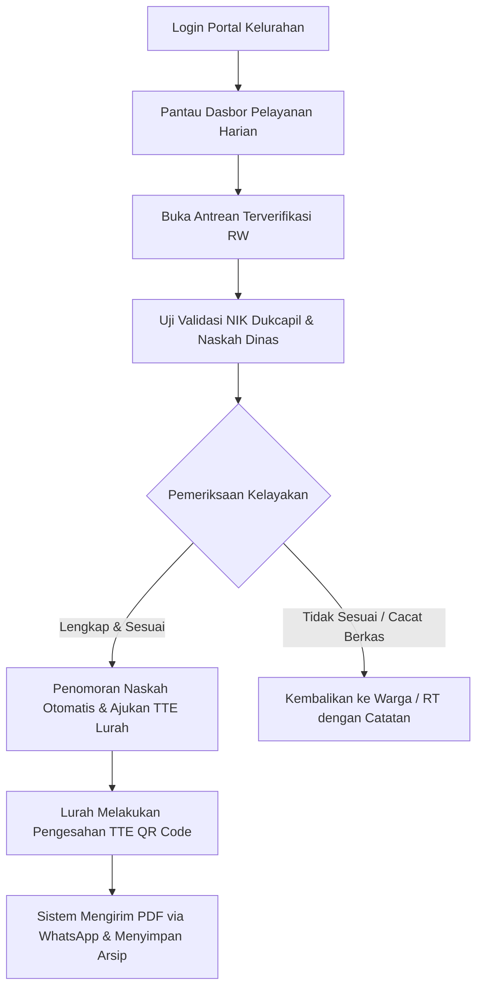

# STANDAR OPERASIONAL PROSEDUR (SOP) RESMI APLIKASI BUMI WARGA
## PANDUAN PENGGUNA: ADMIN & PETUGAS PELAYANAN KELURAHAN
### Dokumen Kode: SOP-BW-04-ADMIN-KELURAHAN | Edisi: 2026

---

## 1. TUJUAN & TANGGUNG JAWAB UTAMA
Petugas Loket dan Admin Kelurahan memegang peranan krusial dalam **Tata Kelola Administrasi dan Validasi Naskah Dinas**. SOP ini memandu petugas dalam:
1. Meneliti keabsahan data kependudukan (Dukcapil) pemohon.
2. Memeriksa format draf surat naskah dinas dan menertibkan penomoran agenda otomatis.
3. Meneruskan draf surat resmi ke meja otorisasi Tanda Tangan Elektronik (TTE) Lurah.
4. Memastikan dokumen tersalurkan sempurna via WhatsApp Gateway serta terarsip secara digital.

---

## 2. STANDAR OPERASIONAL PELAYANAN LOKET KELURAHAN

---

## 3. CHECKLIST DAN LANGKAH OPERASIONAL HARIAN

### Langkah 1: Membuka Dasbor Pelayanan Kelurahan
1. Buka peramban web dan login menggunakan akun dinas kelurahan (misal: `admin.kelurahan@bumiwarga.id`).
2. Periksa metrik kerja pada dasbor:
   - Antrean surat terusan dari RW.
   - Status antrean tanda tangan elektronik Lurah.
   - Indikator SLA pelayanan (target penyelesaian < 24 jam).

### Langkah 2: Memeriksa Antrean Surat
1. Buka menu **Pelayanan Surat > Antrean Terverifikasi RW**.
2. Klik nama pemohon dan pilih **"Tinjau Permohonan"**.
3. Sistem secara otomatis mencocokkan data NIK dan No. KK pemohon dengan basis data kependudukan kelurahan.
4. Periksa poin-poin berikut:
   - Kesesuaian nama pemohon dan NIK pada KTP-el.
   - Kejelasan alasan permohonan pada draf isi surat.
   - Lampiran persyaratan khusus sesuai regulasi dinas terkait.

### Langkah 3: Penomoran Naskah Dinas & Penerusan ke Lurah
1. Sistem secara default memberikan **Nomor Agenda Surat Otomatis** sesuai klasifikasi kode tata naskah dinas pemerintah daerah (tanpa risiko nomor ganda atau loncat nomor).
2. Periksa pratinjau (*preview*) dokumen PDF naskah dinas.
3. Jika telah sesuai, klik tombol **"Ajukan Otorisasi Lurah"**.
4. Berkas akan langsung berpindah ke antrean digital Kepala Kelurahan / Lurah.

### Langkah 4: Penanganan Berkas Bermasalah / Ditolak
* Apabila ditemukan foto KTP buram, NIK tidak aktif, atau syarat tidak lengkap:
  - Klik tombol **"Kembalikan dengan Catatan"**.
  - Tuliskan pesan perbaikan yang ramah, santun, dan detail agar warga langsung memahami kekurangannya.

### Langkah 5: Distribusi & Arsip Digital
1. Setelah Lurah mengesahkan surat dengan TTE QR Code, status surat otomatis berubah menjadi **"SELESAI"**.
2. Modul gerbang pesan (*WhatsApp Gateway*) mengirimkan dokumen PDF resmi langsung ke ponsel warga.
3. Dokumen otomatis tersimpan pada tab **Arsip Surat Digital Kelurahan**, siap diunduh sewaktu-waktu tanpa memerlukan pencetakan arsip fisik ke lemari berkas.

