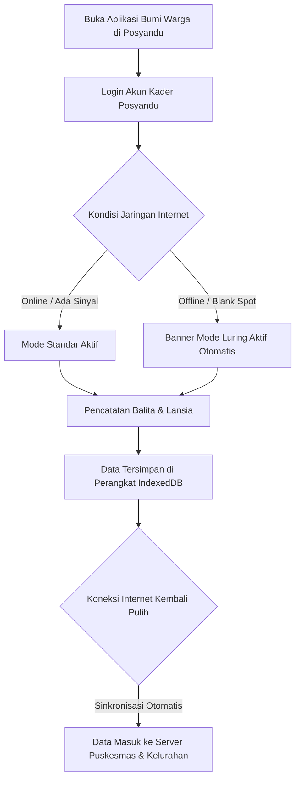

# STANDAR OPERASIONAL PROSEDUR (SOP) RESMI APLIKASI BUMI WARGA
## PANDUAN PENGGUNA: KADER POSYANDU (BALITA & LANSIA)
### Dokumen Kode: SOP-BW-06-KADER-POSYANDU | Edisi: 2026

---

## 1. TUJUAN & RUANG LINGKUP
Kader Posyandu memegang tanggung jawab langsung dalam **Pencatatan Tumbuh Kembang Balita dan Skrining Kesehatan Lansia di Tingkat RW**. SOP ini memandu kader dalam:
1. Menginput data antropometri balita pada hari buka Posyandu.
2. Melakukan deteksi dini balita berisiko stunting dan gizi kurang.
3. Mencatat pemeriksaan faktor risiko penyakit tidak menular (PTM) pada warga lansia.
4. Mengoperasikan aplikasi dalam kondisi jaringan lemah atau tanpa internet (*Mode Offline PWA*).

---

## 2. ALUR OPERASIONAL HARI BUKA POSYANDU

---

## 3. PROSEDUR PELAYANAN POSYANDU BALITA

### Langkah 1: Registrasi & Pencarian Data Balita
1. Login dengan akun Kader (misal: `kader.posyandu.cibeureum@bumiwarga.id`).
2. Buka menu **Posyandu > Layanan Balita**.
3. Cari nama balita atau masukkan NIK balita/ibu. Jika balita baru, pilih **"Tambah Data Balita Baru"**.

### Langkah 2: Pengukuran Antropometri
1. Lakukan penimbangan dan pengukuran fisik:
   - Berat Badan (BB) dalam kilogram (kg).
   - Tinggi / Panjang Badan (TB/PB) dalam sentimeter (cm).
   - Lingkar Kepala (LK) dan Lingkar Lengan Atas (LiLA) dalam sentimeter (cm).
2. Masukkan angka hasil pengukuran ke formulir input aplikasi.

### Langkah 3: Deteksi Dini & Rekomendasi
1. Sistem secara otomatis menghitung z-score antropometri:
   - **Gizi Baik (Hijau)**: Pertumbuhan normal, berikan edukasi gizi seimbang dan vitamin A/imunisasi.
   - **Berisiko Stunting / Gizi Kurang (Kuning/Merah)**: Sistem memunculkan tanda peringatan (*flag alert*) rujukan otomatis ke petugas gizi Puskesmas.

---

## 4. PROSEDUR PELAYANAN POSYANDU LANSIA

1. Buka menu **Posyandu > Layanan Lansia**.
2. Pilih nama warga lansia yang hadir.
3. Masukkan data pemeriksaan kesehatan:
   - Tekanan Darah (Sistolik / Diastolik).
   - Indeks Massa Tubuh (Berat Badan & Tinggi Badan).
   - Gula Darah Sewaktu (GDS), Asam Urat, dan Kolesterol.
4. Sistem akan mengklasifikasikan risiko kesehatan (Normal, Pra-Hipertensi, Hipertensi, Waspada Diabetes) dan menyimpan riwayat berkala untuk pemantauan keluarga warga.

---

## 5. PROSEDUR OPERASIONAL DALAM MODE LURING (OFFLINE-FIRST)

Jika lokasi Posyandu mengalami kendala pemadaman listrik atau tidak terjangkau sinyal internet (*blank spot*):
1. **Aplikasi Tetap Berjalan Normal**:
   - Buka aplikasi Bumi Warga melalui peramban HP kader.
   - Banner kuning **"Mode Offline Aktif"** akan muncul di bagian atas layar.
2. **Penginputan Tanpa Hambatan**:
   - Kader tetap menimbang, mengukur, dan menginput data balita/lansia seperti biasa.
   - Data secara aman tersimpan di penyimpanan internal gawai (**IndexedDB Browser**).
3. **Sinkronisasi Otomatis (Background Flush)**:
   - Begitu kader selesai kegiatan dan gawai kembali terhubung ke jaringan internet/WiFi, sistem secara otomatis mengunggah seluruh antrean data ke peladen tanpa ada data yang tercecer.

