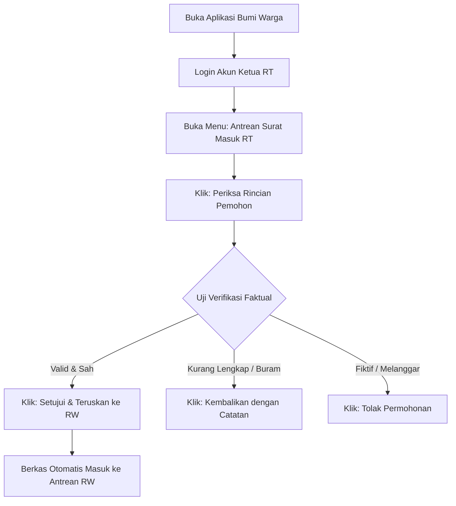

# STANDAR OPERASIONAL PROSEDUR (SOP) RESMI APLIKASI BUMI WARGA
## PANDUAN PENGGUNA: KETUA RT (RUKUN TETANGGA)
### Dokumen Kode: SOP-BW-02-RT | Edisi: 2026

---

## 1. TUJUAN & TANGGUNG JAWAB UTAMA
Ketua RT memegang posisi sebagai **Garda Terdepan dan Verifikator Faktual Tingkat Pertama**. SOP ini memandu Ketua RT dalam:
1. Memvalidasi keabsahan warga yang berdomisili nyata di lingkungannya.
2. Memeriksa dan meneruskan permohonan surat pengantar warga secara digital.
3. Memantau ketertiban data kependudukan dan mengelola pengaduan warga tingkat RT.

---

## 2. STANDAR VERIFIKASI FAKTUAL OLEH KETUA RT

Sebelum memberikan persetujuan pada aplikasi, Ketua RT **wajib melakukan uji kelayakan faktual**:

| No | Parameter Pemeriksaan | Kriteria Sah (Disetujui) | Tindakan jika Tidak Sesuai |
|---|---|---|---|
| 1 | **Status Domisili Warga** | Pemohon benar-benar menetap/berdomisili fisik di lingkungan RT terkait. | Tolak permohonan dengan alasan: *"Warga tidak berdomisili di RT ini"*. |
| 2 | **Kejelasan Foto Dokumen** | Foto KTP-el / KK terlihat jelas, tidak buram, dan tidak terpotong. | Pilih *"Kembalikan"* dengan catatan unggah ulang foto yang jelas. |
| 3 | **Kesesuaian Jenis Surat** | Keperluan surat masuk akal dan sesuai jenis pengantar yang dipilih. | Beri catatan perbaikan jenis surat yang tepat. |
| 4 | **Surat Keterangan Kematian** | Benar terdapat warga meninggal dunia di rumah duka/rumah sakit. | Verifikasi tanggal, jam, dan lokasi meninggal sebelum persetujuan. |
| 5 | **Keterangan Tidak Mampu (SKTM)** | Kondisi ekonomi keluarga pemohon sesuai dengan fakta lapangan. | Jangan disetujui jika pemohon termasuk kategori mampu/mewah. |

---

## 3. ALUR OPERASIONAL KETUA RT PADA APLIKASI

---

## 4. LANGKAH-LANGKAH OPERASIONAL HARIAN KETUA RT

### Langkah 1: Akses Menu Verifikasi
1. Buka aplikasi Bumi Warga dan login dengan akun Ketua RT (misal: `rt01.rw05@bumiwarga.id`).
2. Pada dasbor utama, perhatikan kartu notifikasi **"Permohonan Menunggu Verifikasi RT"**.
3. Klik tombol **"Buka Antrean"**.

### Langkah 2: Memeriksa Data & Dokumen Pemohon
1. Pilih nama pemohon dan klik **"Tinjau Berkas"**.
2. Periksa detail:
   - Nama pemohon, NIK, dan alamat rumah/nomor rumah.
   - Keperluan surat yang dituliskan warga.
   - Lampiran foto KTP-el dan Kartu Keluarga.

### Langkah 3: Mengambil Keputusan Verifikasi
* **Opsi A: SETUJUI & TERUSKAN KE RW (Tombol Hijau)**:
  - Gunakan opsi ini jika pemohon sah dan dokumen lengkap.
  - Sistem akan langsung memindahkan berkas ke meja verifikasi digital Ketua RW.
  - Batas waktu verifikasi RT: **Maksimal 4 Jam Kerja**.
* **Opsi B: KEMBALIKAN DENGAN CATATAN (Tombol Oranye)**:
  - Gunakan opsi ini jika ada kekurangan (contoh: foto KTP terpotong).
  - Tuliskan pesan yang jelas pada kolom catatan agar warga tahu apa yang harus diperbaiki.
* **Opsi C: TOLAK PERMOHONAN (Tombol Merah)**:
  - Gunakan opsi ini jika data pemohon fiktif, identitas disalahgunakan, atau peruntukan surat melanggar hukum.

### Langkah 4: Pemantauan Pengaduan Warga Tingkat Lingkungan
1. Buka menu **Pengaduan Lingkungan**.
2. Tinjau laporan warga terkait ketertiban lingkungan, saluran air tersumbat, atau lampu jalan padam.
3. Koordinasikan langkah penyelesaian dengan warga atau teruskan ke pihak Kelurahan jika membutuhkan bantuan dinas teknis.

