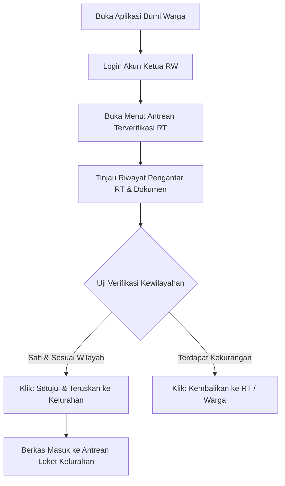

# STANDAR OPERASIONAL PROSEDUR (SOP) RESMI APLIKASI BUMI WARGA
## PANDUAN PENGGUNA: KETUA RW (RUKUN WARGA)
### Dokumen Kode: SOP-BW-03-RW | Edisi: 2026

---

## 1. TUJUAN & WEWENANG UTAMA
Ketua RW bertindak sebagai **Koordinator Kewilayahan dan Verifikator Berjenjang Tingkat Kedua**. SOP ini memandu Ketua RW dalam:
1. Memvalidasi rekomendasi surat pengantar yang telah disetujui oleh para Ketua RT di wilayahnya.
2. Memastikan ketertiban batas administrasi kewilayahan RW.
3. Melakukan supervisi pelaksanaan kegiatan Posyandu dan distribusi bantuan sosial di tingkat RW.

---

## 2. STANDAR VERIFIKASI TINGKAT KETUA RW

| No | Parameter Pemeriksaan | Kriteria Sah | Tindakan jika Terjadi Kejanggalan |
|---|---|---|---|
| 1 | **Legalitas Pengantar RT** | Telah disetujui secara digital oleh Ketua RT yang bersangkutan. | Kembalikan berkas jika belum divalidasi RT asal. |
| 2 | **Pengecekan Duplikasi Permohonan** | Tidak ada pengajuan ganda untuk keperluan yang sama dalam rentang waktu singkat. | Batalkan pengajuan yang terbukti ganda. |
| 3 | **Kesesuaian Batas Wilayah** | Nomor RT pemohon terdaftar sah di bawah naungan RW terkait. | Tolak jika terjadi kesalahan pilih RT/RW oleh pemohon. |
| 4 | **Integritas Lampiran** | Dokumen pendukung telah lengkap dan terbaca dengan baik. | Beri catatan koreksi sebelum diteruskan ke Kelurahan. |

---

## 3. ALUR OPERASIONAL KETUA RW PADA APLIKASI

---

## 4. LANGKAH-LANGKAH OPERASIONAL KETUA RW

### Langkah 1: Akses Menu Verifikasi RW
1. Buka aplikasi dan login dengan akun Ketua RW (misal: `rw05@bumiwarga.id`).
2. Masuk ke menu **Pelayanan Surat > Antrean Pengantar RT**.
3. Sistem menyajikan daftar permohonan yang telah lolos verifikasi dari seluruh Ketua RT di bawah koordinasi RW Anda.

### Langkah 2: Evaluasi Dokumen
1. Klik nama pemohon untuk melihat ringkasan:
   - Data pemohon dan nomor RT pengusul.
   - Catatan pengantar dari Ketua RT.
   - Kelengkapan lampiran dokumen.

### Langkah 3: Eksekusi Otorisasi
* **SETUJUI & TERUSKAN KE KELURAHAN (Tombol Hijau)**:
  - Berkas langsung berpindah ke antrean kerja loket administrasi kelurahan.
  - Batas waktu validasi RW: **Maksimal 4 Jam Kerja**.
* **KEMBALIKAN DENGAN CATATAN (Tombol Oranye)**:
  - Apabila ditemukan berkas yang belum lengkap atau perlu koreksi redaksional.

### Langkah 4: Supervisi Penyaluran Bantuan Sosial (Bansos) RW
1. Buka menu **Bantuan Sosial > Monitoring Wilayah RW**.
2. Pantau daftar penerima manfaat bansos (PKH, BPNT, Beras) per RT di lingkungan Anda.
3. Pastikan penyaluran bansos tepat sasaran pada warga yang tergolong dalam desil kemiskinan prioritas (Desil 1–3).
4. Laporkan melalui aplikasi jika terdapat perubahan kondisi ekonomi warga yang belum tercatat.

