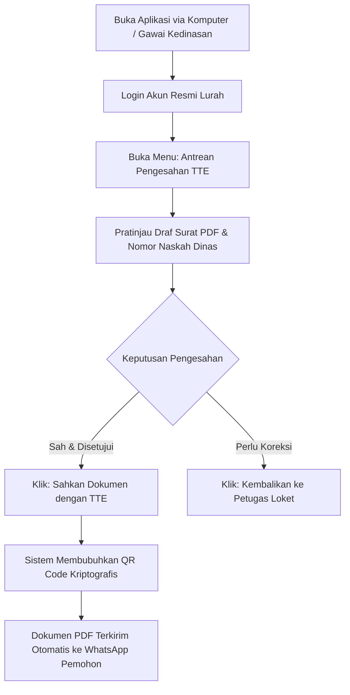

# STANDAR OPERASIONAL PROSEDUR (SOP) RESMI APLIKASI BUMI WARGA
## PANDUAN PENGGUNA: KEPALA KELURAHAN / LURAH
### Dokumen Kode: SOP-BW-05-LURAH | Edisi: 2026

---

## 1. KEDUDUKAN & WEWENANG OTORISASI
Lurah memegang wewenang tertinggi dalam **Pengesahan Dokumen Administrasi Kependudukan dan Naskah Dinas Kelurahan**. SOP ini memandu Lurah dalam:
1. Melakukan telaah akhir terhadap draf surat resmi yang telah diverifikasi berjenjang oleh RT, RW, dan Admin Kelurahan.
2. Membubuhkan Tanda Tangan Elektronik (TTE) berbasis QR Code Kriptografis yang sah secara hukum.
3. Memantau laporan kinerja pelayanan, status kemiskinan (desil), dan penanganan stunting di wilayah kelurahan.

---

## 2. ALUR OPERASIONAL PENGESAHAN TTE LURAH

---

## 3. PROSEDUR KERJA PENANDATANGANAN DIGITAL (TTE QR CODE)

### Langkah 1: Akses Antrean TTE
1. Lurah dapat mengakses aplikasi melalui komputer kerja, tablet, maupun ponsel pintar (*smartphone*) kedinasan di mana pun berada.
2. Login menggunakan akun resmi Lurah (misal: `lurah@bumiwarga.id`).
3. Pada halaman utama, klik menu **Pengesahan Surat > Antrean TTE**.

### Langkah 2: Menelaah Draf Surat
1. Klik nama pemohon untuk melihat lembar pratinjau (*preview*) dokumen PDF lengkap.
2. Pastikan:
   - Identitas pemohon dan peruntukan naskah dinas telah sesuai.
   - Penomoran surat dinas telah terisi sesuai format kode kearsipan daerah.
   - Riwayat verifikasi RT, RW, dan Admin loket telah tervalidasi lengkap.

### Langkah 3: Eksekusi Tanda Tangan Elektronik
1. Klik tombol hijau **"Sahkan Dokumen (TTE)"**.
2. Masukkan PIN Otorisasi / Kata Sandi Kedinasan jika diminta oleh sistem keamanan.
3. Sistem secara otomatis merekatkan **Segel Kriptografis QR Code Resmi Kelurahan** pada lembar surat.
4. Begitu disahkan:
   - Dokumen berstatus **SELESAI**.
   - Sistem gerbang pesan (*WhatsApp Gateway*) mengirimkan dokumen PDF bertanda tangan resmi langsung ke WhatsApp warga pemohon.

---

## 4. SUPERVISI KINERJA & KEBIJAKAN STRATEGIS LURAH

### 4.1 Pemantauan SLA Pelayanan Publik
Lurah dapat memantau kepatuhan batas waktu pelayanan (SLA):
- Target penyelesaian seluruh proses surat: **Maksimal 24 Jam Kerja**.
- Mengidentifikasi antrean yang mengalami hambatan di tingkat RT, RW, atau loket kelurahan.

### 4.2 Pemantauan Kemiskinan & Penyaluran Bansos
1. Buka menu **Analitik Kemiskinan & Bansos**.
2. Pantau persebaran warga berdasarkan peringkat desil kemiskinan (Desil 1–10).
3. Mengawasi kuota dan realisasi penyaluran bansos agar tepat sasaran bagi keluarga prasejahtera tanpa ada potensi manipulasi atau pungli.

### 4.3 Pemantauan Penurunan Stunting & Kesehatan Lansia
1. Buka menu **Dasbor Posyandu Kelurahan**.
2. Pantau angka prevalensi balita berisiko stunting dan intervensi rujukan ke Puskesmas.

