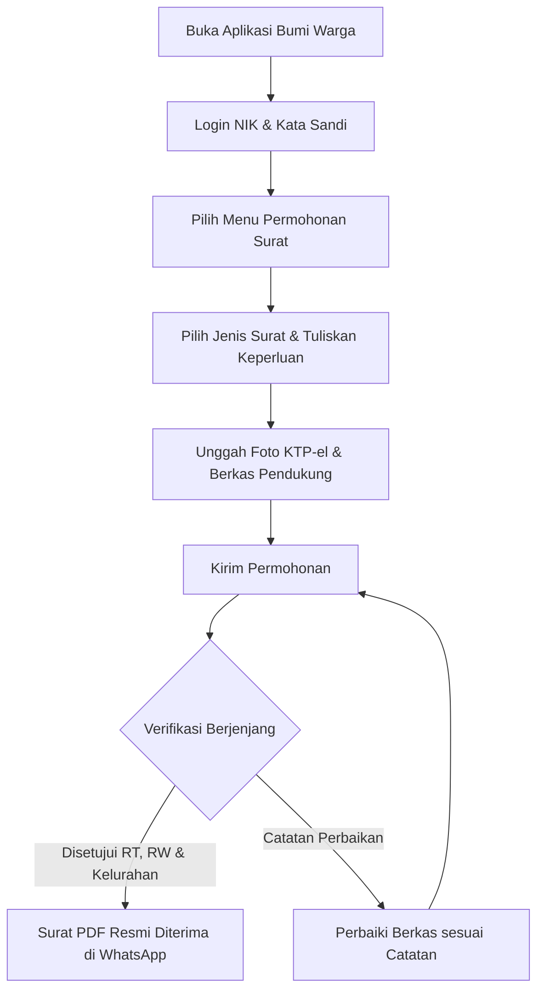

# STANDAR OPERASIONAL PROSEDUR (SOP) RESMI APLIKASI BUMI WARGA
## PANDUAN PENGGUNA: WARGA (PEMOHON PELAYANAN MANDIRI)
### Dokumen Kode: SOP-BW-01-WARGA | Edisi: 2026

---

## 1. TUJUAN & RUANG LINGKUP
SOP ini menjadi pedoman operasional baku bagi seluruh warga masyarakat dalam mengajukan permohonan surat administrasi kependudukan, memeriksa status bantuan sosial, memantau riwayat kesehatan Posyandu keluarga, serta menyampaikan aspirasi dan pengaduan lingkungan secara mandiri melalui aplikasi **Bumi Warga**.

---

## 2. PERSYARATAN & KETENTUAN AWAL
Sebelum melakukan permohonan melalui aplikasi, warga wajib memastikan hal-hal berikut:
1. **Nomor Induk Kependudukan (NIK) & Kartu Keluarga (KK)**:
   - Terdaftar aktif pada basis data kependudukan (Dukcapil).
   - Nama pemohon pada formulir wajib sama persis dengan nama pada KTP-el.
2. **Kualitas Unggahan Dokumen Lampiran**:
   - Foto KTP-el, Kartu Keluarga, dan berkas pendukung harus **jelas, terbaca tajam, keempat sudut dokumen tidak terpotong, dan bebas dari pantulan cahaya/silau**.
   - Format file: JPG, PNG, atau PDF (ukuran maksimal 2 MB per berkas).
3. **Nomor Kontak WhatsApp Aktif**:
   - Nomor ponsel yang didaftarkan wajib terhubung dengan WhatsApp aktif untuk menerima notifikasi status dan berkas surat resmi PDF.

---

## 3. ALUR KERJA OPERASIONAL WARGA

---

## 4. TATA CARA PENGAJUAN SURAT ADMINISTRASI MANDIRI

### Langkah 1: Akses & Autentikasi
1. Buka peramban di ponsel/komputer dan akses tautan aplikasi: `https://bumiwarga.id` (atau buka aplikasi PWA Bumi Warga).
2. Masukkan **NIK** dan **Kata Sandi**.
3. Jika baru pertama kali login dengan kredensial bawaan, sistem akan mewajibkan penggantian kata sandi baru (minimal 8 karakter kombinasi huruf dan angka).

### Langkah 2: Pemilihan Layanan Surat
1. Klik menu **Pelayanan Surat > Ajukan Surat Baru**.
2. Pilih jenis surat yang dibutuhkan:
   - Surat Pengantar SKCK.
   - Surat Keterangan Usaha (SKU).
   - Surat Keterangan Domisili.
   - Surat Keterangan Belum Menikah.
   - Surat Keterangan Tidak Mampu (SKTM).
   - Surat Pengantar Nikah (N1–N4).
   - Surat Keterangan Kematian / Kelahiran.
3. Masukkan alasan atau keperluan permohonan pada kolom yang disediakan secara padat, jelas, dan santun.

### Langkah 3: Unggah Dokumen Lampiran
1. Unggah foto KTP-el pemohon.
2. Unggah foto Kartu Keluarga (KK).
3. Unggah berkas persyaratan khusus sesuai jenis surat (misal: foto tempat usaha untuk SKU, atau surat kematian RS untuk pelaporan kematian).
4. Klik tombol **"Kirim Permohonan"**.

### Langkah 4: Pemantauan Status & Penerimaan Dokumen
1. Pantau perkembangan surat pada tab **Riwayat Permohonan**:
   - `Menunggu Verifikasi RT`: Berkas sedang diteliti Ketua RT.
   - `Menunggu Validasi RW`: Berkas diteruskan dan diverifikasi Ketua RW.
   - `Proses Kelurahan`: Berkas dalam validasi naskah dan otorisasi TTE Lurah.
   - `Selesai`: Surat dinas telah disahkan.
2. Begitu status menjadi **Selesai**, sistem mengirimkan dokumen PDF resmi bertanda tangan elektronik (TTE QR Code) langsung ke nomor WhatsApp warga.
3. Warga dapat langsung mengunduh dan mencetak surat PDF tersebut secara mandiri tanpa perlu mendatangi loket kantor kelurahan.

---

## 5. TATA CARA PENGGUNAAN FITUR LAINNYA

### 5.1 Pemeriksaan Status Bantuan Sosial (Bansos)
1. Buka menu **Bantuan Sosial**.
2. Masukkan NIK kepala keluarga.
3. Sistem akan menampilkan status kelayakan, kategori desil keluarga, dan riwayat penyaluran bansos yang pernah diterima secara transparan.

### 5.2 Pemantauan Tumbuh Kembang Balita & Lansia (Posyandu)
1. Buka menu **Kesehatan Keluarga**.
2. Pilih anggota keluarga (balita/lansia).
3. Pantau grafik perkembangan berat badan, tinggi badan balita, serta catatan tensi darah dan skrining gula darah lansia pasca kegiatan Posyandu bulanan.

### 5.3 Penyampaian Pengaduan & Aspirasi Lingkungan
1. Buka menu **Pengaduan Warga > Buat Pengaduan**.
2. Pilih kategori (Keamanan, Kebersihan/Sampah, Infrastruktur Jalan, Bencana Alam).
3. Unggah foto bukti di lapangan dan sertakan deskripsi lokasi.
4. Klik **"Kirim Laporan"**. Tindak lanjut dari pengurus RT/RW dan kelurahan akan ternotifikasi secara berkala.

---

## 6. LARANGAN & SANKSI
1. **Dilarang memalsukan identitas atau menggunakan NIK milik orang lain** tanpa surat kuasa resmi bermaterai.
2. **Dilarang mengunggah berkas/gambar hasil manipulasi/rekayasa digital ilegal**.
3. Setiap bentuk kecurangan data akan tercatat pada *Audit Log* sistem dan dapat diproses sesuai ketentuan hukum pidana pemalsuan surat serta UU Pelindungan Data Pribadi (UU PDP).

