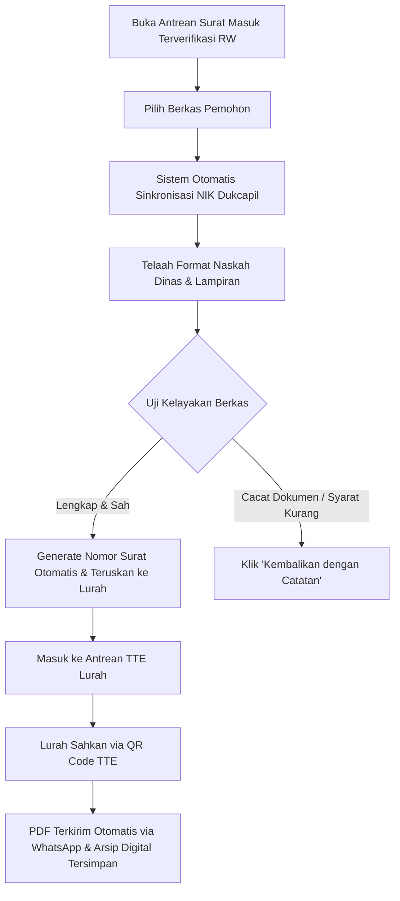

# MODUL PANDUAN PENGGUNA: ADMIN & PETUGAS PELAYANAN KELURAHAN
## SISTEM INFORMASI PELAYANAN PUBLIK DIGITAL "BUMI WARGA"
### Dokumen: USER_MODULE_ADMIN_KELURAHAN.md | Versi: 2.0 | Klasifikasi: Kedinasan Pemerintah Daerah

---

## 1. PENDAHULUAN & WEWENANG OPERASIONAL
Petugas Loket Pelayanan dan Administrator Kelurahan merupakan **Pusat Operasional Tata Naskah Dinas dan Pelayanan Publik Kelurahan**. Posisi ini bertanggung jawab meneliti keabsahan berkas yang masuk dari tingkat RW, mencocokkan data NIK dengan pangkalan data kependudukan, menerbitkan nomor surat resmi secara otomatis, mengajukan otorisasi tanda tangan kepada Lurah, dan mengelola arsip digital secara *paperless*.

---

## 2. AKSES APLIKASI & KEAMANAN AKUN KEDINASAN

### 2.1 Prosedur Masuk Sistem
1. Buka peramban resmi di komputer kerja kantor kelurahan: `https://kelurahan.bumiwarga.id`.
2. Masukkan nama pengguna resmi staf/admin (contoh: `admin.kelurahan@bumiwarga.id`).
3. Masukkan kata sandi kedinasan terenkripsi.
4. Klik tombol **"Masuk ke Portal Kelurahan"**.

### 2.2 Tanggung Jawab Keamanan Data Pribadi (Kepatuhan UU PDP)
* Admin memegang hak akses terhadap basis data kependudukan warga (NIK, KK, data keluarga, data desil).
* **DILARANG KERAS mengekspor, menyebarkan, atau memotret data pribadi warga** untuk keperluan pribadi di luar tugas kedinasan.
* Setiap aktivitas klik, buka berkas, persetujuan, dan pengubahan data dicatat secara permanen pada sistem *Audit Log* kedinasan.

---

## 3. NAVIGASI DASBOR & PANEL KERJA ADMIN KELURAHAN

1. **Dasbor Pelayanan Terpadu**:
   - Jumlah berkas masuk harian yang telah diverifikasi RT/RW.
   - Status antrean tanda tangan elektronik (TTE) Lurah.
   - Grafik capaian SLA pelayanan (< 24 jam) dan rekapitulasi surat terbit.
2. **Antrean Permohonan Surat Masuk**: Meja kerja verifikasi naskah dinas, penomoran otomatis, dan pengajuan TTE.
3. **Pangkalan Data Kependudukan Kelurahan**: Fitur pencarian NIK/KK, status domisili warga, dan pembaruan data keluarga.
4. **Pusat Verifikasi Bantuan Sosial**: Pengecekan data kemiskinan (desil 1–10) dan verifikasi calon penerima bansos.
5. **Manajemen Arsip Digital**: Pustaka penyimpanan dokumen PDF resmi bertanda TTE QR Code, lengkap dengan fitur pencarian naskah cepat dan log verifikasi keaslian.

---

## 4. PROSEDUR OPERASIONAL PENANGANAN PERMOHONAN SURAT

### Langkah demi Langkah Penanganan Loket:

#### Langkah 1: Membuka Meja Verifikasi Loket
1. Klik menu **Pelayanan Surat > Antrean Terverifikasi RW**.
2. Pilih nama pemohon dan klik **"Tinjau Berkas & Naskah"**.

#### Langkah 2: Memeriksa Sinkronisasi Data Kependudukan
1. Periksa lencana verifikasi sistem:
   - 🟢 **"NIK Valid & Terdaftar di Pangkalan Data"**: Data identitas pemohon cocok dengan data kependudukan kelurahan.
   - 🔴 **"Peringatan: Ketidaksesuaian Data Kependudukan"**: Hubungi warga atau lakukan validasi manual jika NIK tidak sinkron.
2. Periksa kejelasan berkas lampiran (KTP, KK, dan bukti pendukung lainnya).

#### Langkah 3: Penomoran Naskah Dinas Otomatis
1. Sistem secara otomatis membuat draf surat resmi lengkap dengan:
   - Kop surat resmi Kelurahan dan Lambang Daerah Pemerintah Kota/Kabupaten.
   - **Nomor Agenda Surat Otomatis** sesuai klasifikasi kode tata naskah dinas (misal: `470/142-Kel.Cbr/2026`).
   - Klausul hukum dan data diri pemohon yang tertata rapi.
2. Petugas meneliti pratinjau (*preview*) draf PDF surat untuk memastikan tidak ada kesalahan redaksional.

#### Langkah 4: Pengajuan Otorisasi TTE Lurah
* Jika seluruh isi naskah dinas telah tepat:
  - Klik tombol **"Ajukan Otorisasi TTE Lurah"**.
  - Draf surat otomatis berpindah ke antrean tanda tangan elektronik Lurah.
* Jika ditemukan berkas yang tidak memenuhi standar dinas:
  - Klik tombol **"Kembalikan dengan Catatan"**.
  - Ketikkan instruksi perbaikan yang jelas agar warga pemohon dapat memperbaikinya tanpa bingung.

#### Langkah 5: Pasca-Pengesahan Lurah (Otomatisasi Sistem)
* Begitu Lurah mengesahkan surat dengan TTE QR Code:
  - Modul gerbang pesan (*WhatsApp Gateway*) secara otomatis mengirimkan dokumen PDF resmi ke ponsel warga.
  - Surat langsung tersimpan pada tab **Arsip Surat Digital Kelurahan**, siap diakses kembali apabila ada permintaan audit administrasi dari inspektorat daerah.

---

## 5. TATA KELOLA PENYALURAN BANTUAN SOSIAL & ANTI-PUNGLI

1. Buka menu **Bantuan Sosial > Verifikasi Penyaluran**.
2. Cocokkan NIK calon penerima dengan kuota bansos yang dialokasikan:
   - Prioritas mutlak diberikan kepada keluarga pada **Desil 1 (Kemiskinan Ekstrem)** dan **Desil 2–3**.
3. Saat penyerahan bantuan di kantor kelurahan atau di lapangan:
   - Petugas memverifikasi fisik KTP asli penerima.
   - Klik tombol **"Konfirmasi Penyerahan Bantuan"**.
   - Masukkan nama petugas penyerah dan nomor bukti serah terima.
   - Sistem akan mengirimkan notifikasi WhatsApp tanda terima resmi ke penerima untuk mencegah pemotongan nilai bantuan oleh oknum.

---

## 6. HAL KRITIS YANG WAJIB DIPERHATIKAN ADMIN KELURAHAN

> [!CAUTION]
> **Poin Kritis Pengawasan Operasional Admin Kelurahan:**
> 1. **Dilarang Mengubah Nomor Surat secara Manual di Luar Sistem**: Penomoran otomatis dirancang untuk menjamin ketertiban buku agenda dan mencegah penomoran surat ganda.
> 2. **Ketelitian Redaksional Naskah**: Selalu lakukan pratinjau draf PDF sebelum diteruskan ke Lurah untuk memastikan isi keperluan surat tidak ambigu atau bertentangan dengan hukum.
> 3. **Disiplin Kepatuhan SLA (< 24 Jam)**: Permohonan yang masuk harus diproses dalam waktu kerja pada hari yang sama agar pelayanan publik kelurahan mendapat predikat prima.

