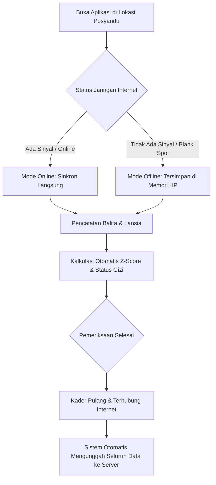

# MODUL PANDUAN PENGGUNA: KADER POSYANDU (BALITA & LANSIA)
## SISTEM INFORMASI PELAYANAN PUBLIK DIGITAL "BUMI WARGA"
### Dokumen: USER_MODULE_KADER_POSYANDU.md | Versi: 2.0 | Klasifikasi: Kader Kesehatan Masyarakat

---

## 1. PENDAHULUAN & RUANG LINGKUP KADER
Kader Posyandu merupakan **Ujung Tombak Pelayanan Kesehatan Primer di Tingkat RT dan RW**. Melalui modul kesehatan digital aplikasi **Bumi Warga**, kader Posyandu dapat mencatat data pertumbuhan balita dan pemeriksaan kesehatan lansia secara cepat, mendeteksi potensi stunting secara otomatis, dan tetap dapat bekerja mencatat data meskipun di lokasi posyandu tidak ada jaringan internet (*Fitur Offline-First PWA*).

---

## 2. AKSES APLIKASI & PEMASANGAN APLIKASI DI PONSEL (PWA)

### 2.1 Pemasangan Aplikasi Mandiri (Instalasi PWA)
Aplikasi Bumi Warga dirancang sangat ringan dan dapat dipasang langsung di layar utama (*home screen*) ponsel Android atau iPhone tanpa perlu mengunduh berkas besar dari Playstore:
1. Buka peramban Google Chrome (Android) atau Safari (iPhone) di ponsel kader.
2. Buka alamat: `https://bumiwarga.id`.
3. Tekan menu titik tiga di pojok kanan atas, lalu pilih **"Tambahkan ke Layar Utama" (Install App)**.
4. Ikon **Bumi Warga** akan muncul di layar ponsel layaknya aplikasi biasa dan dapat dibuka tanpa koneksi internet.

### 2.2 Masuk ke Akun Kader
1. Buka aplikasi Bumi Warga di ponsel.
2. Masukkan nama pengguna kader (contoh: `kader.posyandu.cibeureum@bumiwarga.id`).
3. Masukkan kata sandi terdaftar.
4. Klik tombol **"Masuk ke Posyandu Digital"**.

---

## 3. NAVIGASI MENU UTAMA KADER POSYANDU

1. **Dasbor Posyandu RW**: Ringkasan jadwal hari buka, total balita dan lansia terdaftar, serta jumlah balita berstatus stunting/gizi kurang di pos terkait.
2. **Layanan Balita**: Fitur registrasi balita baru, input pengukuran antropometri bulanan (BB/TB/LK/LiLA), dan riwayat imunisasi/vitamin A.
3. **Layanan Lansia**: Pencatatan skrining penyakit tidak menular (tekanan darah, gula darah sewaktu, asam urat, kolesterol).
4. **Indikator Mode Jaringan**: Banner indikator di bagian atas layar yang menunjukkan status **Online (Hijau)** atau **Offline (Kuning)** beserta jumlah antrean data yang belum tersinkronisasi.

---

## 4. PROSEDUR OPERASIONAL HARI BUKA POSYANDU

### 4.1 Pencatatan Pengukuran Balita (Antropometri)
1. Buka menu **Layanan Balita > Tambah Pengukuran**.
2. Cari nama balita atau masukkan NIK balita/ibu:
   - Jika data balita belum ada, klik tombol **"Daftarkan Balita Baru"** dan isi tanggal lahir, jenis kelamin, serta nama orang tua.
3. Masukkan angka hasil penimbangan dan pengukuran fisik:
   - **Berat Badan (BB)**: Gunakan timbangan digital terkalibrasi (satuan kilogram, misal: `11.45 kg`).
   - **Tinggi / Panjang Badan (TB/PB)**: Gunakan alat ukur stadiometer/infantometer (satuan sentimeter, misal: `88.5 cm`).
   - **Lingkar Kepala (LK)**: Satuan sentimeter (misal: `46.0 cm`).
   - **Lingkar Lengan Atas (LiLA)**: Satuan sentimeter (misal: `14.5 cm`).
4. Berikan centang jika balita menerima **Vitamin A**, **Obat Cacing**, atau **Imunisasi**.
5. Klik **"Simpan Data Pengukuran"**.

#### Deteksi Otomatis Status Gizi Balita:
* 🟢 **Gizi Baik / Normal**: Pertumbuhan balita sesuai grafik WHO. Berikan apresiasi kepada orang tua.
* 🟡 **Berisiko Stunting / Gizi Kurang**: Sistem langsung memunculkan lencana peringatan kuning/merah. Arahkan ibu balita untuk menerima Paket Makanan Tambahan (PMT) Posyandu dan jadwal konsultasi khusus.
* 🔴 **Stunting Akut**: Sistem secara otomatis memasukkan data balita ke dalam daftar rujukan prioritas tenaga gizi Puskesmas.

### 4.2 Pencatatan Skrining Kesehatan Lansia
1. Buka menu **Layanan Lansia > Input Pemeriksaan**.
2. Pilih nama warga lansia.
3. Masukkan data pemeriksaan kesehatan:
   - **Tekanan Darah**: Tekanan sistolik dan diastolik (contoh: `135/85 mmHg`).
   - **Indeks Massa Tubuh**: Berat badan dan tinggi badan.
   - **Pemeriksaan Laboratorium Sederhana (Strip)**: Gula Darah Sewaktu (GDS), Asam Urat, dan Kolesterol total.
4. Klik tombol **"Simpan Rekam Kesehatan"**. Sistem akan mengklasifikasikan kategori risiko kesehatan (Normal, Waspada, Hipertensi, Risiko Diabetes).

---

## 5. TATA CARA PENGGUNAAN FITUR MODE LURING (OFFLINE-FIRST)

Fitur ini dirancang khusus agar kader dapat tetap bekerja lancar meskipun lokasi posyandu berada di area yang sulit sinyal (*blank spot*) atau saat terjadi pemadaman listrik:

1. **Aplikasi Tetap Berfungsi Tanpa Kuota**:
   - Begitu gawai kehilangan sinyal, banner kuning bertuliskan **"Mode Luring Aktif (Data Tersimpan Aman di Perangkat)"** akan muncul di bagian atas layar.
   - Kader dapat terus melakukan pencarian balita, penimbangan, dan penginputan data seperti biasa.
   - Setiap data yang disimpan otomatis dicatat di memori lokal ponsel (**IndexedDB Browser**) tanpa ada risiko data tertukar atau hilang.
2. **Sinkronisasi Otomatis Saat Mendapat Sinyal (Background Flush)**:
   - Setelah kegiatan Posyandu selesai, kader tidak perlu mengetik ulang data.
   - Cukup hubungkan ponsel ke jaringan WiFi atau area berinternet.
   - Sistem secara otomatis mendeteksi koneksi dan mengunggah seluruh antrean data ke peladen kelurahan dalam hitungan detik.
   - Banner akan berubah menjadi hijau: **"Seluruh Data Telah Tersinkronisasi Sempurna"**.

---

## 6. HAL KRITIS YANG WAJIB DIPERHATIKAN KADER POSYANDU

> [!TIP]
> **Kiat Sukses dan Kepatuhan Kader Posyandu:**
> 1. **Kalibrasi Alat Timbang**: Pastikan timbangan digital menunjukkan angka `0.00` sebelum balita diletakkan di atas timbangan.
> 2. **Ketelitian Memilih Nama Balita**: Pastikan tidak salah memilih nama balita jika terdapat nama yang serupa dalam satu RT/RW (periksa kembali NIK atau nama ibu kandung).
> 3. **Jangan Hapus Riwayat Penjelajah (*Browser Cache*) Sebelum Sinkronisasi**: Jika Anda bekerja dalam mode offline, jangan melakukan *Clear History / Clear Cache* pada peramban ponsel sebelum ponsel terhubung kembali ke internet dan data terunggah sempurna.

