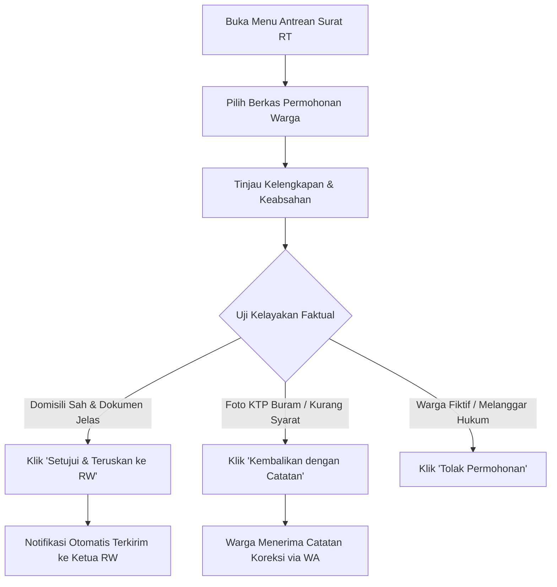

# MODUL PANDUAN PENGGUNA: KETUA RT (RUKUN TETANGGA)
## SISTEM INFORMASI PELAYANAN PUBLIK DIGITAL "BUMI WARGA"
### Dokumen: USER_MODULE_KETUA_RT.md | Versi: 2.0 | Klasifikasi: Kedinasan Lingkungan

---

## 1. PENDAHULUAN & PERAN STRATEGIS KETUA RT
Ketua Rukun Tetangga (RT) adalah **Garda Terdepan dan Verifikator Faktual Tingkat Pertama** dalam ekosistem pelayanan publik **Bumi Warga**. Sebagai figur yang paling mengenal kondisi riil warga di lapangan, Ketua RT bertanggung jawab memastikan bahwa setiap permohonan surat berasal dari warga yang sah berdomisili di lingkungannya, bebas dari manipulasi, serta sesuai dengan kondisi fakta kemasyarakatan.

---

## 2. AKSES APLIKASI & TATA KELOLA AKUN KETUA RT

### 2.1 Prosedur Masuk Sistem (Login)
1. Akses portal aplikasi melalui komputer atau ponsel: `https://bumiwarga.id`.
2. Masukkan nama pengguna resmi akun RT (contoh: `rt01.rw05@bumiwarga.id`).
3. Masukkan kata sandi kedinasan yang telah ditetapkan.
4. Klik tombol **"Masuk sebagai Pengurus Lingkungan"**.

### 2.2 Tanggung Jawab Keamanan Akun RT
* Akun Ketua RT memiliki wewenang hukum untuk menerbitkan surat pengantar resmi. **Dilarang meminjamkan akun dan kata sandi kepada pihak lain** yang tidak berwenang.
* Lakukan pergantian kata sandi secara berkala (minimal sekali dalam 90 hari).
* Pastikan selalu melakukan *Log Out* jika menggunakan gawai bersama.

---

## 3. NAVIGASI FITUR & DASBOR KERJA KETUA RT

Tampilan dasbor Ketua RT dilengkapi panel kendali khusus:
1. **Dasbor Ringkasan RT**: Menampilkan jumlah KK, jumlah jiwa di RT terkait, kartu antrean surat masuk, dan rekap aduan lingkungan.
2. **Antrean Surat Masuk RT**: Meja kerja utama untuk memeriksa, menyetujui, mengembalikan, atau menolak permohonan surat pengantar warga.
3. **Pangkalan Data Warga RT**: Buku register kependudukan digital lingkungan RT (daftar kepala keluarga, anggota keluarga, dan status domisili).
4. **Monitoring Bansos RT**: Pemantauan keluarga penerima bantuan sosial dan klasifikasi peringkat desil di wilayah RT.
5. **Pengaduan Warga RT**: Penanganan laporan masalah keamanan, kebersihan, dan ketertiban rukun tetangga.

---

## 4. PROSEDUR OPERASIONAL VERIFIKASI PERMOHONAN SURAT

### Langkah demi Langkah Pemeriksaan:

#### Langkah 1: Membuka Antrean Berkas Masuk
1. Klik menu **Antrean Surat Masuk RT**.
2. Berkas permohonan warga diurutkan berdasarkan waktu pengajuan (*First-In, First-Out*).
3. Klik tombol **"Periksa Rincian"** pada salah satu baris permohonan.

#### Langkah 2: Melakukan Pengecekan 4 Kriteria Faktual
Ketua RT wajib memeriksa 4 aspek utama sebelum mengambil keputusan:
1. **Pemeriksaan Status Domisili Nyata**:
   - Apakah nama dan NIK pemohon benar-benar warga yang bertempat tinggal secara fisik di wilayah RT Anda?
   - Jika warga adalah pengontrak/penyewa tempat tinggal, pastikan data kontrak atau surat tinggal sementaranya masih berlaku.
2. **Pemeriksaan Kejernihan Foto Dokumen**:
   - Periksa lampiran foto KTP-el dan Kartu Keluarga yang diunggah warga.
   - Pastikan teks nama, NIK, dan alamat terbaca tajam dan tidak buram/terpotong.
3. **Pemeriksaan Kesesuaian Peruntukan Surat**:
   - Periksa alasan yang dituliskan warga pada kolom keperluan.
   - Contoh: Permohonan SKCK harus disertai keterangan instansi tujuan (misal: *"Untuk melamar pekerjaan di PT Bintang Kejora"*).
4. **Pemeriksaan Khusus untuk Kasus Kematian & SKTM**:
   - **Surat Kematian**: Pastikan warga yang bersangkutan benar-benar telah meninggal dunia (cek kesesuaian tanggal, jam, dan lokasi meninggal).
   - **SKTM (Keterangan Tidak Mampu)**: Pastikan pemohon memang keluarga prasejahtera yang layak menerima keringanan. Jangan memberikan pengantar SKTM kepada keluarga mampu demi menjaga asas keadilan.

#### Langkah 3: Mengambil Tindakan pada Tombol Keputusan
* **1. SETUJUI & TERUSKAN KE RW (Tombol Hijau)**:
  - Dipilih apabila seluruh kriteria terpenuhi 100%.
  - Sistem secara otomatis meneruskan permohonan ke meja digital Ketua RW.
  - Standar SLA verifikasi RT: **Maksimal 4 Jam Kerja**.
* **2. KEMBALIKAN DENGAN CATATAN (Tombol Oranye)**:
  - Dipilih apabila foto KTP buram, kurang syarat surat, atau penulisan keperluan tidak jelas.
  - Ketikkan instruksi perbaikan yang ramah dan jelas pada kotak catatan.
  - *Contoh catatan*: *"Foto Kartu Keluarga buram dan terpotong. Mohon difoto ulang di tempat terang agar nomor KK terlihat jelas."*
* **3. TOLAK PERMOHONAN (Tombol Merah)**:
  - Dipilih jika permohonan diajukan oleh oknum fiktif, bukan warga RT setempat, atau peruntukan surat terindikasi melanggar hukum.
  - Berikan alasan penolakan yang tegas dan lugas.

---

## 5. TATA KELOLA PENGADUAN LINGKUNGAN RT

1. Buka menu **Pengaduan Warga RT**.
2. Tinjau foto laporan warga terkait fasilitas lingkungan (misal: saluran got mampet, tumpukan sampah, atau lampu jalan mati).
3. Lakukan koordinasi penanganan:
   - Jika dapat diselesaikan secara swadaya tingkat RT (misal kerja bakti warga), buat pengumuman agenda lingkungan di aplikasi.
   - Jika membutuhkan penanganan alat berat atau petugas teknis pemda, klik tombol **"Eskalasi Laporan ke Kelurahan"**.
4. Setelah penanganan selesai, unggah foto bukti perbaikan dan ubah status laporan menjadi **"Selesai"**.

---

## 6. HAL KRITIS YANG WAJIB DIPERHATIKAN KETUA RT

> [!WARNING]
> **Poin Pengawasan Ketat bagi Ketua RT:**
> * **Larangan Memberikan Persetujuan Berkas Fiktif**: Menyetujui permohonan warga yang tidak berdomisili nyata di RT Anda merupakan pelanggaran tata tertib administrasi kependudukan.
> * **Kecepatan Respon (SLA 4 Jam)**: Keterlambatan verifikasi di tingkat RT akan menghambat seluruh rantai proses di tingkat RW dan Kelurahan.
> * **Pencegahan Gratifikasi & Pungli**: Seluruh proses persetujuan surat pengantar RT pada aplikasi Bumi Warga adalah **gratis tanpa biaya apa pun**. Dilarang memungut biaya tidak resmi di luar iuran rukun tetangga yang sah.

