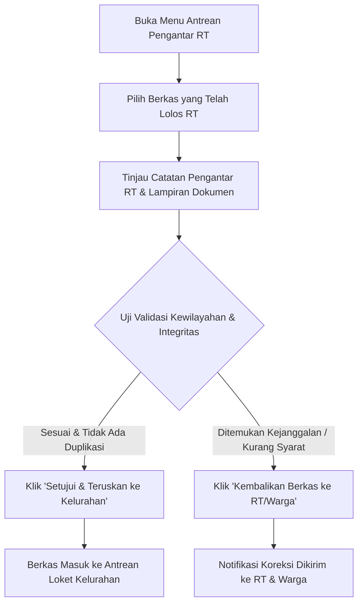

# MODUL PANDUAN PENGGUNA: KETUA RW (RUKUN WARGA)
## SISTEM INFORMASI PELAYANAN PUBLIK DIGITAL "BUMI WARGA"
### Dokumen: USER_MODULE_KETUA_RW.md | Versi: 2.0 | Klasifikasi: Kedinasan Lingkungan

---

## 1. PENDAHULUAN & WEWENANG TINGKAT RW
Ketua Rukun Warga (RW) memegang fungsi strategis sebagai **Koordinator Kewilayahan dan Verifikator Berjenjang Tingkat Kedua**. Posisi Ketua RW bertindak sebagai penjamin kesesuaian batas administrasi lingkungan antara unit-unit RT di wilayahnya dengan kantor kelurahan, serta memastikan penyaluran bantuan sosial dan kegiatan Posyandu RW terpantau secara transparan dan akuntabel.

---

## 2. AKSES APLIKASI & KEAMANAN AKUN KETUA RW

### 2.1 Prosedur Masuk Sistem
1. Buka peramban di komputer atau ponsel: `https://bumiwarga.id`.
2. Masukkan nama pengguna kedinasan RW (contoh: `rw05@bumiwarga.id`).
3. Masukkan kata sandi terdaftar.
4. Klik tombol **"Masuk sebagai Pengurus RW"**.

### 2.2 Kebijakan Keamanan Akun RW
* Akun RW membawahi banyak unit RT. Jaga kerahasiaan kata sandi dan jangan pernah menyimpan kredensial pada gawai umum yang dapat diakses sembarang orang.
* Gunakan fitur verifikasi ganda apabila diaktifkan oleh pengelola sistem kota.

---

## 3. NAVIGASI FITUR & DASBOR KOORDINASI RW

1. **Dasbor Ringkasan Kewilayahan RW**:
   - Total jumlah RT di bawah koordinasi RW.
   - Agregat jumlah penduduk, KK, dan persentase keluarga prasejahtera.
   - Indikator antrean surat masuk terusan dari para Ketua RT.
2. **Antrean Surat Terverifikasi RT**: Meja kerja validasi naskah pengantar sebelum diteruskan ke tingkat kelurahan.
3. **Pusat Monitoring Bantuan Sosial RW**: Matriks pemantauan penerima bansos per RT dan persebaran desil kemiskinan.
4. **Supervisi Posyandu RW**: Pemantauan jadwal hari buka posyandu, rekapitulasi balita berisiko stunting, dan partisipasi lansia di lingkungan RW.
5. **Pusat Eskalasi Pengaduan Lingkungan**: Penanganan aduan lintas RT atau laporan mendesak yang memerlukan koordinasi kelurahan.

---

## 4. PROSEDUR OPERASIONAL VERIFIKASI PERMOHONAN TINGKAT RW

### Langkah demi Langkah Operasional:

#### Langkah 1: Memeriksa Antrean Surat Terusan RT
1. Klik menu **Pelayanan Surat > Antrean Pengantar RT**.
2. Pada tabel antrean, perhatikan kolom **"RT Pengusul"** dan **"Waktu Persetujuan RT"**.
3. Klik tombol **"Tinjau Permohonan"** untuk membuka lembar kerja dokumen.

#### Langkah 2: Evaluasi 3 Parameter Kritis Tingkat RW
1. **Validasi Batas Kewilayahan RT**:
   - Pastikan nomor RT pengusul memang berada di bawah naungan wilayah RW Anda.
   - Cegah permohonan warga salah pilih RW saat mengisi formulir mandiri.
2. **Pengecekan Duplikasi Pengajuan (Anti-Duplicate Request)**:
   - Periksa apakah pemohon yang sama telah mengajukan permohonan serupa dalam kurun waktu 7 hari terakhir.
   - Apabila terdeteksi ada pengajuan ganda dengan isi yang sama, batalkan salah satu pengajuan untuk mencegah penerbitan nomor surat ganda di kelurahan.
3. **Integritas Berkas Persyaratan**:
   - Pastikan lampiran KTP dan KK yang telah diperiksa RT memang benar-benar terbaca jelas dan tidak ada halaman berkas yang hilang.

#### Langkah 3: Eksekusi Keputusan Validasi
* **SETUJUI & TERUSKAN KE KELURAHAN (Tombol Hijau)**:
  - Berkas langsung berpindah ke antrean loket administrasi kelurahan.
  - Standar SLA validasi RW: **Maksimal 4 Jam Kerja**.
* **KEMBALIKAN DENGAN CATATAN (Tombol Oranye)**:
  - Gunakan jika ada keraguan pada dokumen lampiran atau peruntukan surat yang perlu diperjelas oleh RT pengusul.

---

## 5. TATA KELOLA BANTUAN SOSIAL & SUPERVISI POSYANDU RW

### 5.1 Pengawasan Bantuan Sosial Berbasis Desil
1. Buka menu **Bantuan Sosial > Monitoring Wilayah RW**.
2. Periksa rekapitulasi penerima manfaat per RT:
   - Pastikan bantuan PKH, BPNT, dan Beras diprioritaskan bagi warga **Desil 1 (Kemiskinan Ekstrem)** dan **Desil 2–3**.
   - Laporkan ke Lurah/Kasi Kesos Kelurahan jika terdapat ketidaksesuaian data warga mampu yang terdaftar menerima bantuan.

### 5.2 Supervisi Kegiatan Posyandu RW
1. Buka menu **Supervisi Posyandu**.
2. Tinjau jadwal hari buka posyandu di pos-pos RW Anda.
3. Pantau indikator stunting balita di wilayah RW. Dorong Ketua RT setempat untuk menggerakkan orang tua balita dengan status *kuning/merah* agar aktif hadir pemeriksaan rutin dan menerima makanan tambahan (PMT).

---

## 6. HAL KRITIS YANG WAJIB DIPERHATIKAN KETUA RW

> [!IMPORTANT]
> **Hal Penting dalam Tata Kelola RW:**
> * **Kecepatan Tindak Lanjut (SLA 4 Jam)**: Jangan biarkan antrean menumpuk di meja RW agar dokumen warga dapat diproses oleh kelurahan pada hari kerja yang sama.
> * **Netralitas dan Keadilan Lingkungan**: Memastikan seluruh usulan bantuan dan pelayanan warga dari setiap RT diperlakukan secara setara, transparan, dan bebas dari pertimbangan subjektif/nepotisme.

