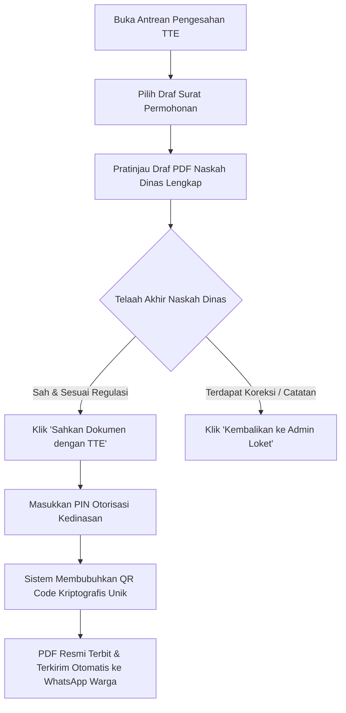

# MODUL PANDUAN PENGGUNA: KEPALA KELURAHAN / LURAH
## SISTEM INFORMASI PELAYANAN PUBLIK DIGITAL "BUMI WARGA"
### Dokumen: USER_MODULE_LURAH.md | Versi: 2.0 | Klasifikasi: Eksekutif Kedinasan

---

## 1. PENDAHULUAN & KEDUDUKAN EKSEKUTIF LURAH
Kepala Kelurahan (Lurah) memegang posisi pimpinan eksekutif tertinggi di wilayah kelurahan dengan **Wewenang Pengesahan Akhir atas Seluruh Naskah Dinas dan Dokumen Pelayanan Publik**. Melalui aplikasi **Bumi Warga**, Lurah memiliki instrumen pengesahan modern berbasis **Tanda Tangan Elektronik (TTE) QR Code Kriptografis** yang sah di mata hukum, sekaligus dasbor monitoring strategis untuk memantau kemiskinan, penurunan stunting, dan kualitas birokrasi kelurahan secara *real-time*.

---

## 2. AKSES APLIKASI & KEAMANAN OTORISASI TTE

### 2.1 Akses Fleksibel Lintas Gawai
Lurah dapat mengakses aplikasi melalui:
- Komputer kerja kantor kelurahan: `https://kelurahan.bumiwarga.id`.
- Ponsel pintar (*smartphone*) atau tablet kedinasan (menggunakan peramban web atau aplikasi PWA Bumi Warga).

### 2.2 Prosedur Keamanan Otorisasi Kedinasan
* Akun Lurah dilengkapi tingkat proteksi keamanan tertinggi.
* Setiap penandatanganan surat dilindungi oleh **PIN Otorisasi Rahasia / Kata Sandi Kedinasan**.
* **DILARANG KERAS membagikan PIN Otorisasi kepada staf atau pihak mana pun**, karena TTE memiliki kekuatan hukum yang setara dengan tanda tangan basah dan stempel dinas resmi negara.

---

## 3. NAVIGASI DASBOR EKSEKUTIF LURAH

1. **Dasbor Eksekutif Kelurahan**:
   - Indikator kepatuhan batas waktu pelayanan (*SLA Monitor*).
   - Antrean dokumen yang menunggu otorisasi tanda tangan Lurah.
   - Indikator kepuasan masyarakat (IKM) atas pelayanan kelurahan.
2. **Meja Pengesahan Surat (Antrean TTE)**: Daftar draf surat naskah dinas yang telah siap disahkan.
3. **Analitik Kemiskinan & Bantuan Sosial**: Peta sebaran warga miskin (Desil 1 s.d. 10) dan pengawasan kuota bansos.
4. **Dasbor Kesehatan Masyarakat & Stunting**: Pemantauan balita gizi kurang/stunting dan capaian imunisasi per RW.
5. **Log Audit & Validasi Dokumen**: Rekam jejak seluruh naskah yang pernah ditandatangani beserta riwayat pemindaian keaslian QR Code oleh pihak luar (Bank, Polisi, BPJS).

---

## 4. PROSEDUR OPERASIONAL PENGESAHAN TTE QR CODE

### Langkah demi Langkah Pengesahan:

#### Langkah 1: Membuka Antrean Surat
1. Buka menu **Pengesahan Surat > Antrean TTE**.
2. Dokumen yang tampil pada antrean ini telah melewati tiga lapis verifikasi: **Ketua RT -> Ketua RW -> Petugas Loket Kelurahan**.
3. Klik nama pemohon untuk membuka lembar pratinjau dokumen.

#### Langkah 2: Menelaah Pratinjau Naskah Dinas
Periksa parameter naskah dinas:
- Kesesuaian kop surat resmi kelurahan dan nomor surat agenda dinas.
- Kejelasan data pemohon dan peruntukan surat yang dinyatakan.
- Riwayat persetujuan RT dan RW yang tertera pada catatan sistem.

#### Langkah 3: Eksekusi Tanda Tangan Elektronik
1. Klik tombol hijau **"Sahkan Dokumen (TTE)"**.
2. Sistem akan menampilkan dialog konfirmasi pengesahan. Masukkan **PIN Otorisasi TTE Lurah**.
3. Klik **"Konfirmasi & Bubuhkan Segel Digital"**.
4. Dalam hitungan detik:
   - Segel digital **QR Code Kriptografis** tersemat pada bagian bawah naskah dinas.
   - Dokumen berstatus **"SELESAI"**.
   - Berkas PDF resmi langsung meluncur otomatis ke nomor WhatsApp warga tanpa perlu dicetak fisik.

#### Langkah 4: Penanganan Koreksi Naskah
* Jika ditemukan kesalahan ketik pada peruntukan surat atau nomor klasifikasi:
  - Klik tombol **"Kembalikan ke Admin Loket"**.
  - Masukkan catatan koreksi yang harus diperbaiki staf loket.

---

## 5. INSTRUMEN KEBIJAKAN & PENGAWASAN STRATEGIS LURAH

### 5.1 Pengawasan Mutu Pelayanan Publik (SLA < 24 Jam)
* Pantau kartu analitik SLA di dasbor utama:
  - Jika ada permohonan yang tertahan lebih dari 4 jam di tingkat RT atau RW, Lurah dapat menindaklanjuti pengurus lingkungan terkait.
  - Memastikan kelurahan mempertahankan predikat zona hijau pelayanan prima.

### 5.2 Pengawasan Ketepatan Sasaran Bansos (Anti-Manipulasi Data)
1. Buka menu **Analitik Kemiskinan & Bansos**.
2. Evaluasi daftar alokasi bantuan sosial:
   - Seluruh keluarga pada **Desil 1 (Kemiskinan Ekstrem)** wajib terakomodasi dalam bantuan beras dan bansos tunai daerah.
   - Mengawasi agar tidak ada pemotongan bantuan atau penyelewengan di lapangan melalui pencocokan tanda terima digital sistem.

### 5.3 Program Intervensi Penurunan Stunting
1. Buka menu **Dasbor Stunting Kelurahan**.
2. Identifikasi pos-pos Posyandu yang memiliki balita berisiko stunting tinggi.
3. Instruksikan Tim Pendamping Keluarga (TPK) dan Kader Posyandu untuk mengintensifkan pemberian makanan tambahan (PMT) serta rujukan ke Puskesmas.

---

## 6. HAL KRITIS YANG WAJIB DIPERHATIKAN LURAH

> [!IMPORTANT]
> **Hal Penting dalam Kepemimpinan Digital Kelurahan:**
> * **Tanggung Jawab Otorisasi**: Setiap pembubuhan TTE QR Code membawa tanggung jawab administratif dan hukum penuh sebagai pejabat negara.
> * **Kecepatan Pengesahan Fleksibel**: Mengingat aplikasi dapat diakses melalui ponsel pintar di mana pun, pengesahan surat dapat dilakukan sewaktu-waktu tanpa harus menunggu keberadaan fisik di kantor, sehingga warga tidak perlu menunggu berhari-hari.

