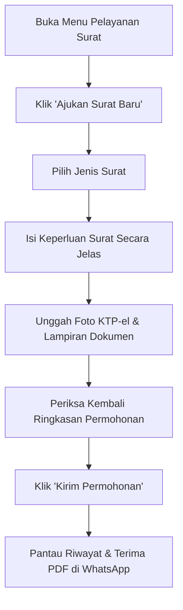

# MODUL PANDUAN PENGGUNA: WARGA (PEMOHON PELAYANAN MANDIRI)
## SISTEM INFORMASI PELAYANAN PUBLIK DIGITAL "BUMI WARGA"
### Dokumen: USER_MODULE_WARGA.md | Versi: 2.0 | Klasifikasi: Publik

---

## 1. PENDAHULUAN & TUJUAN MODUL
Modul ini disusun sebagai panduan teknis dan operasional praktis bagi seluruh warga masyarakat dalam memanfaatkan aplikasi **Bumi Warga**. Modul ini dirancang agar warga dapat mengurus berbagai kebutuhan administrasi kependudukan, memantau bantuan sosial, memeriksa data kesehatan keluarga di Posyandu, serta berpartisipasi aktif dalam ketertiban lingkungan tanpa perlu datang dan mengantre di kantor kelurahan.

---

## 2. AKSES APLIKASI & KEAMANAN AKUN

### 2.1 Cara Mengakses Aplikasi
1. Buka peramban web pada ponsel pintar (*smartphone*) atau komputer: `https://bumiwarga.id` (atau buka aplikasi PWA yang telah terpasang di layar utama ponsel Anda).
2. Masukkan **Nomor Induk Kependudukan (NIK)** (16 digit) sebagai nama pengguna.
3. Masukkan kata sandi terdaftar.
4. Klik tombol **"Masuk ke Layanan"**.

### 2.2 Kebijakan Keamanan Akun Warga
* **Wajib Ganti Kata Sandi Awal**: Saat pertama kali login dengan kata sandi awal yang diberikan oleh pengurus RT/RW, sistem secara otomatis mengunci layar dan mewajibkan pembuatan kata sandi baru.
* **Kriteria Kata Sandi Kuat**:
  - Panjang minimal 8 karakter.
  - Mengandung kombinasi huruf besar, huruf kecil, dan angka.
  - Jangan gunakan tanggal lahir atau kombinasi angka yang mudah ditebak (seperti `12345678`).
* **Kerahasiaan Akun**: Jangan pernah membagikan kata sandi atau kode OTP kepada siapa pun, termasuk oknum yang mengatasnamakan pengurus RT, RW, atau petugas kelurahan.

---

## 3. NAVIGASI MENU UTAMA (USER INTERFACE)

Pada tampilan beranda warga, terdapat 5 menu utama:
1. **Dasbor Warga**: Ringkasan status permohonan aktif, pengumuman penting lingkungan RT/RW, dan tombol pintas layanan kilat.
2. **Pelayanan Surat**: Formulir pengajuan surat administrasi baru, riwayat berkas, dan unduhan surat resmi format PDF.
3. **Bantuan Sosial (Bansos)**: Informasi status kelayakan bantuan sosial, desil kemiskinan keluarga, dan transparansi penyaluran bantuan.
4. **Kesehatan Keluarga (Posyandu)**: Grafik tumbuh kembang balita (berat/tinggi badan) dan catatan pemeriksaan kesehatan lansia (tensi darah, gula darah).
5. **Pengaduan & Aspirasi Lingkungan**: Ruang partisipasi warga untuk melaporkan insiden lingkungan (kebersihan, keamanan, infrastruktur rusak) disertai bukti foto.

---

## 4. PANDUAN PENGGUNAAN FITUR LANGKAH DEMI LANGKAH

### 4.1 Mengajukan Permohonan Surat Administrasi Kependudukan

#### Langkah-langkah Detail:
1. Klik menu **Pelayanan Surat > Ajukan Surat Baru**.
2. Pilih jenis surat yang dibutuhkan:
   - **Surat Pengantar SKCK**: Untuk keperluan melamar pekerjaan, pendaftaran kedinasan, atau perpanjangan izin.
   - **Surat Keterangan Usaha (SKU)**: Untuk pengajuan pinjaman modal usaha ke perbankan atau legalitas UMKM.
   - **Surat Keterangan Domisili**: Untuk keterangan tempat tinggal sementara bagi warga pendatang.
   - **Surat Keterangan Belum Menikah**: Untuk persyaratan pernikahan KUA atau administrasi kerja.
   - **Surat Keterangan Tidak Mampu (SKTM)**: Khusus peruntukan keringanan biaya pendidikan (beasiswa) atau jaminan kesehatan (Jamkesda).
   - **Surat Keterangan Kematian**: Pelaporan warga meninggal dunia.
   - **Surat Pengantar Nikah (Formulir N1–N4)**.
3. Pada kolom **"Keperluan Surat"**, ketikkan alasan pengajuan secara spesifik, jujur, dan santun. Contoh: *"Persyaratan kelengkapan administrasi melamar pekerjaan di PT Angkasa Pura"*.
4. **Unggah Dokumen Lampiran**:
   - Unggah foto KTP-el pemohon.
   - Unggah foto Kartu Keluarga (KK).
   - Unggah berkas syarat khusus (misal: foto ruko/tempat usaha untuk SKU, atau surat pengantar RS untuk kematian).
5. Klik **"Kirim Permohonan"**. Sistem akan memunculkan tanda notifikasi hijau dan memberikan nomor lacak tiket.

### 4.2 Memantau Status Permohonan & Mengunduh Surat Selesai
1. Masuk ke menu **Pelayanan Surat > Riwayat Permohonan**.
2. Perhatikan lencana status (*status badge*):
   - 🟡 **Menunggu Verifikasi RT**: Permohonan sedang diteliti oleh Ketua RT setempat.
   - 🔵 **Menunggu Validasi RW**: Telah disetujui RT, kini menunggu verifikasi Ketua RW.
   - 🟣 **Proses Loket Kelurahan**: Sedang divalidasi naskah dinas dan menunggu otorisasi TTE Lurah.
   - 🔴 **Perlu Perbaikan (Dikembalikan)**: Permohonan dikembalikan karena ada berkas yang buram atau kurang. Klik kartu permohonan untuk membaca catatan perbaikan, lalu unggah ulang dokumen yang diminta.
   - 🟢 **Selesai**: Dokumen resmi telah disahkan oleh Lurah.
3. Saat status **Selesai**, berkas surat format PDF resmi bertanda tangan elektronik (TTE QR Code) akan:
   - Terkirim secara otomatis ke nomor WhatsApp warga.
   - Tersedia tombol **"Unduh Dokumen PDF Resmi"** di aplikasi untuk diunduh dan dicetak kapan saja.

### 4.3 Mengecek Bantuan Sosial (Bansos)
1. Buka menu **Bantuan Sosial**.
2. Masukkan NIK Kepala Keluarga.
3. Sistem akan menampilkan:
   - Klasifikasi desil ekonomi keluarga (Desil 1 s.d. 10).
   - Status terdaftar sebagai penerima program bantuan (PKH, BPNT, Beras Cadangan Pangan Pemerintah, atau Bantuan Khusus Kelurahan).
   - Riwayat penerimaan bantuan yang telah diserahkan lengkap dengan tanggal dan jam penyerahan.

### 4.4 Melihat Catatan Posyandu Balita & Lansia
1. Buka menu **Kesehatan Keluarga**.
2. Pilih nama anak balita untuk melihat grafik pertumbuhan (berat badan terhadap umur, status gizi dari Posyandu).
3. Pilih nama orang tua/lansia untuk melihat riwayat tekanan darah, kadar gula darah, kolesterol, dan rekomendasi pola hidup sehat dari kader Posyandu.

### 4.5 Mengirim Laporan Pengaduan Lingkungan
1. Buka menu **Pengaduan Warga > Buat Laporan Baru**.
2. Pilih kategori masalah:
   - **Ketertiban & Keamanan**: Keributan malam hari, aktivitas mencurigakan.
   - **Kebersihan & Lingkungan**: Tumpukan sampah liar, saluran drainase tersumbat.
   - **Infrastruktur**: Lampu penerangan jalan umum (PJU) padam, jalan berlubang parah.
   - **Bencana Alam**: Pohon tumbang, luapan banjir, tanah longsor.
3. Lampirkan foto kondisi nyata di lapangan dan tuliskan titik lokasi yang jelas (contoh: *"Depan pos ronda RT 03 samping musholla"*).
4. Klik **"Kirim Pengaduan"**. Anda akan menerima kabar pembaruan penanganan dari Ketua RT/RW.

---

## 5. HAL-HAL KRITIS YANG WAJIB DIPERHATIKAN OLEH WARGA

> [!IMPORTANT]
> **Checklist Kualitas Dokumen agar Permohonan Tidak Ditolak:**
> 1. **Kejernihan Foto KTP-el**: Ambil foto di ruangan yang cukup terang. Pastikan seluruh 16 digit NIK, Nama Lengkap, dan Tanggal Lahir terbaca sangat tajam. Hindari pantulan kilau lampu (*glare*) pada plastik KTP.
> 2. **Foto Tidak Terpotong**: Keempat sudut fisik kartu KTP-el atau Kartu Keluarga harus masuk ke dalam bingkai foto.
> 3. **Nomor WhatsApp Selalu Aktif**: Surat resmi PDF hanya dikirimkan ke nomor WhatsApp yang terdaftar pada profil akun Anda.
> 4. **Keaslian Berkas**: Jangan pernah mencoba mengunggah berkas hasil rekayasa atau editan palsu. Sistem mencatat seluruh riwayat unggahan secara permanen pada log audit kelurahan.

---

## 6. PANDUAN PEMECAHAN MASALAH (TROUBLESHOOTING)

| Kendala yang Dialami | Kemungkinan Penyebab | Solusi Tindakan Warga |
|---|---|---|
| Gagal Login / NIK Tidak Ditemukan | NIK belum terdata di basis data kelurahan atau salah ketik. | Periksa kembali 16 digit NIK pada e-KTP. Jika tetap gagal, hubungi Ketua RT untuk pembaruan data kependudukan. |
| Lupa Kata Sandi | Salah memasukkan kata sandi lebih dari 3 kali. | Klik menu *"Lupa Kata Sandi"* pada halaman login untuk menerima tautan reset kata sandi melalui WhatsApp terdaftar. |
| Gagal Mengunggah Berkas KTP/KK | Ukuran berkas foto terlalu besar (> 2 MB) atau format tidak didukung. | Kompres ukuran foto atau ubah format foto menjadi JPG/PNG/PDF sebelum mengunggah. |
| Belum Menerima Surat di WhatsApp | Nomor ponsel belum terdaftar di WhatsApp atau sinyal seluler lemah. | Buka aplikasi Bumi Warga secara langsung, masuk ke menu *Pelayanan Surat > Riwayat*, dan klik tombol unduh manual. |

